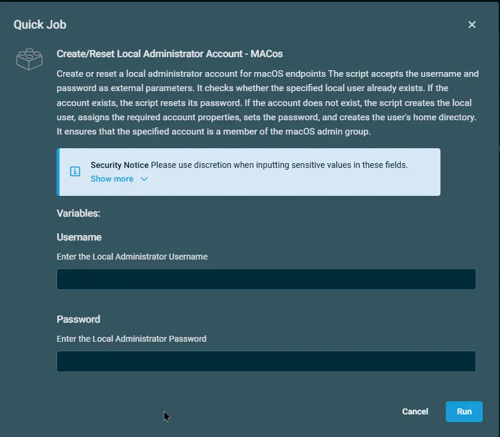

## Overview

Create or resets a local administrator account for macOS endpoints

The script accepts the username and password as external parameters. It checks whether the specified local user already exists. If the account exists, the script resets its password.

If the account does not exist, the script creates the local user, assigns the required account properties, sets the password, and creates the user's home directory.

It ensures that the specified account is a member of the macOS admin group.

## Implementation  

1. Download the component `Create/Reset Local Administrator Account - macOS` from the attachments.

2. After downloading the attached file, click on the `Import` button

3. Select the component just downloaded and add it to the Datto RMM interface.  
 

4. After Importing the component to the Datto RMM, make sure to add the component to the `Proval` Group always.  
    - Steps to Add the component under `Proval` Group.  
    i. Click on `Drop Down Icon`.  
    ii. Click on `Add to Group`.  
      
    iii. Select the group as `Proval`  
    

## Sample Run

To execute the `Create/Reset Local Administrator Account - macOS` over a specific machine, follow these steps:  

1. Select the machine you want to run the `Create/Reset Local Administrator Account - macOS` on from the Datto RMM.  

2. Click on the `Quick Job` button.  
  

3. Search the component `Create/Reset Local Administrator Account - macOS` and click on `Select`
 

4. 

## Datto Variables

| Variable Name | Type | Default | Description |
| ------------- | ---- | ------- | ----------- |
| Username | String | -- | Enter the Local Administrator Username |
| Password | String | -- | Enter the Local Administrator Password |

## Output

- Activity Logs

## Attachments  

[Create/Reset Local Administrator Account - macOS](../../../static/attachments/create-reset-local-administrator-account-macos.cpt)

## Changelog
 
### 2026-08-20

- Initial version of the document
