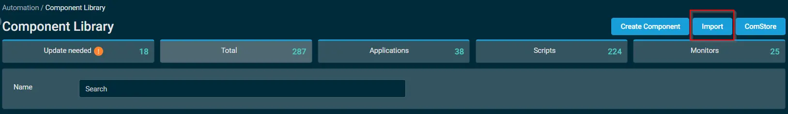
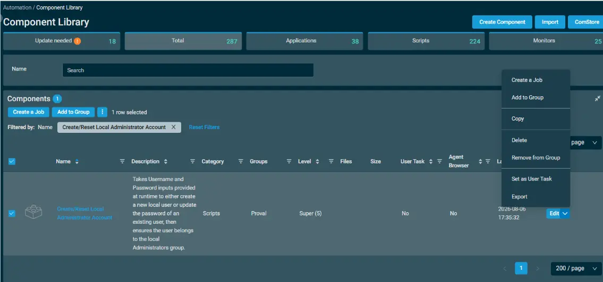
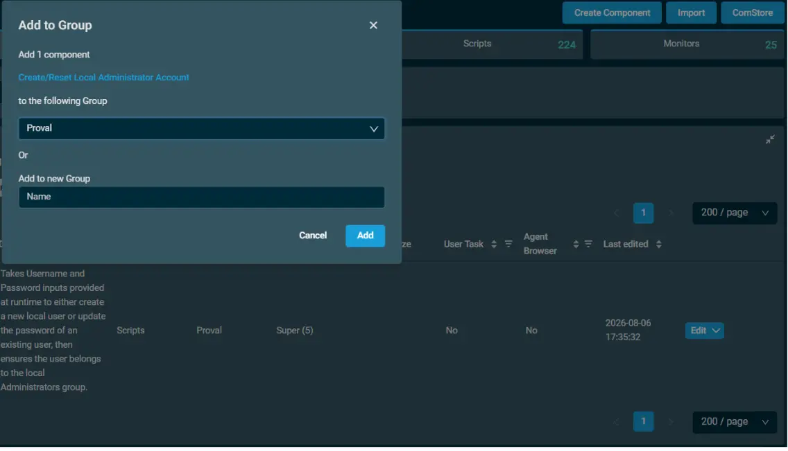
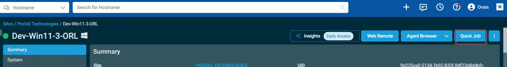
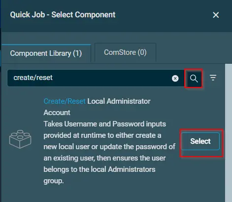
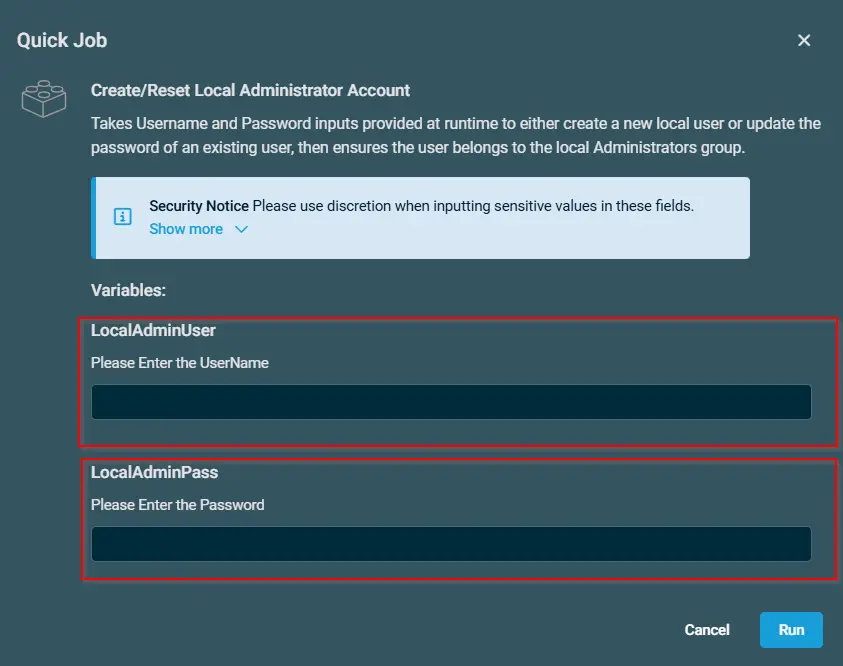

## Overview

Takes Username and Password inputs provided at runtime to either create a new local user or update the password of an existing user, then ensures the user belongs to the local Administrators group.

## Implementation  

1. Download the component `Create/Reset Local Administrator Account` from the attachments.

2. After downloading the attached file, click on the `Import` button
3. Select the component just downloaded and add it to the Datto RMM interface.  
  
4. After Importing the component to the Datto RMM, make sure to add the component to the `Proval` Group always.  
    - Steps to Add the component under `Proval` Group.  
    i. Click on `Drop Down Icon`.  
    ii. Click on `Add to Group`.  
      
    iii. Select the group as `Proval`  
    

## Sample Run

To execute the `Create/Reset Local Administrator Account` over a specific machine, follow these steps:  

1. Select the machine you want to run the `Create/Reset Local Administrator Account` on from the Datto RMM.  

2. Click on the `Quick Job` button.  
  

3. Search the component `Create/Reset Local Administrator Account` and click on `Select`
 

4. 

## Datto Variables

| Variable Name | Type | Default | Description |
| ------------- | ---- | ------- | ----------- |
| LocalAdminUser | String | -- | Please Enter the UserName |
| LocalAdminPass | String | -- | Please Enter the Password |

## Output

- Activity Logs

## Attachments  

[Create Reset Local Administrator Account](../../../static/attachments/create-reset-local-administrator-account.cpt)

## Changelog
 
### 2026-08-06
 
- Initial version of the document.
