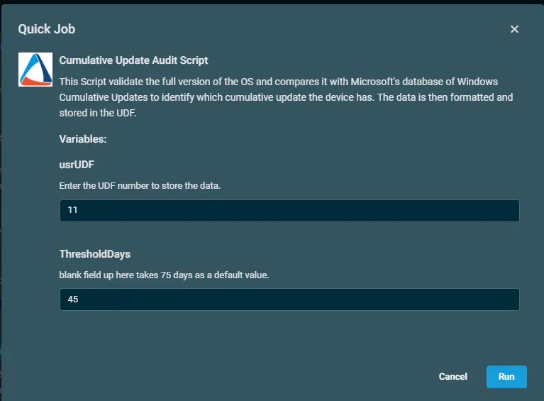
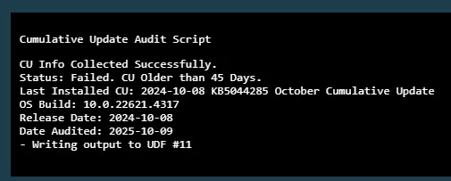
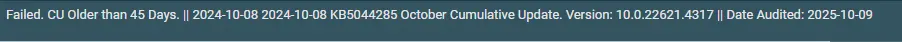

## Overview  
This Script validate the full version of the OS and compares it with Microsoft's database of Windows Cumulative Updates to identify which cumulative update the device has. The data is then formatted and stored in the UDF.
  
## Dependency  
[Get-LatestInstalledCU](/docs/67416ac2-2311-43c4-8fbf-c5b0c9a48e71)

## Implementation  

1. Download the component [Cumulative Update Audit Script](../../../static/attachments/Cumulative%20Update%20Audit%20Script.cpt) from the attachments.

2. After downloading the attached file, click on the `Import` button
3. Select the component just downloaded and add it to the Datto RMM interface.  
  

## Sample Run

To execute the `component` over a specific machine, follow these steps:  

1. Select the machine you want to run the `component` on from the Datto RMM.  

2. Click on the `Quick Job` button.  
  

3. Search the component `Cumulative Update Audit Script` and click on `Select`
 

4. After selecting the component, enter the UDF number and the threshold days.

5. Click on `Run` to initiate the component.  

## Datto Variables

| Variable Name | Type | Default | Description |
| ------------- | ---- | ------- | ----------- |
|usrUDF|String|Enter the UDF number|Enter the UDF number to store the data.|
|ThresholdDays|String|Enter the days|blank field up here takes 75 days as a default value.|

## Output  
A job status of `Success` is expected.  
`Activity Log`  

  

`UDF`  

`StdErr`  
StdErr is not expected.

## Attachments  
[Cumulative Update Audit Script](../../../static/attachments/Cumulative%20Update%20Audit%20Script.cpt)