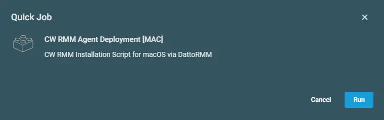
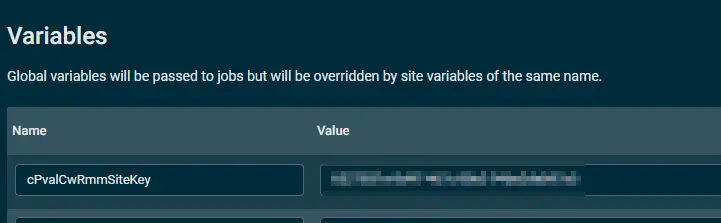
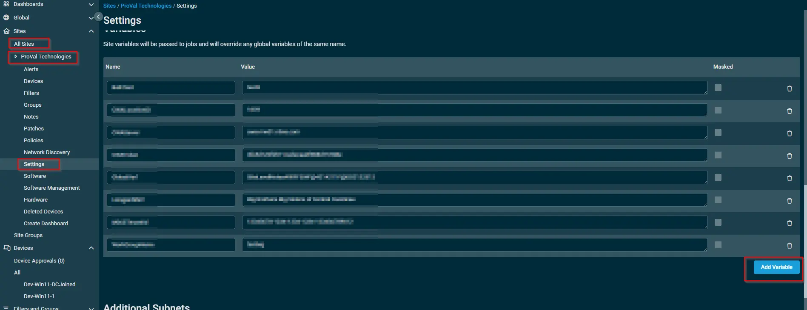

## Overview

This script deploys ConnectWise Asio Platform agents to the Datto RMM MAC endpoints.

## Implementation  

1. Download the component [CW RMM Agent Deployment](../../../static/attachments/cw-rmm-agent-deployment-mac.cpt) from the attachments.

2. After downloading the attached file, click on the `Import` button

3. Select the component just downloaded and add it to the Datto RMM interface.  
  

## Sample Run

To execute the `component` over a specific machine, follow these steps:  

1. Select the machine you want to run the `component` on, from the Datto RMM.  

2. Click on the `Quick Job` button.  
  

3. Search the component `CW RMM Agent Deployment [MAC]` and click on `Select`
 

4. Click `Run` to initiate the component
 

## Global Settings

- Go to `Setup` > `Global Settings` > `Variables`  
- Create the below global Variable

| Name | Value | Description |
| ---- | ------- | ----------- |
| cPvalCwRmmSiteKey | `71918cbc-981e-465d-9cb4-627e2883a10b` | CW RMM Agent token. |

 

**Note** : To override the global settings, create the variable with same name under  
`Site` > `All Sites` > `Select the site` > `Settings`  > `Variables` > `Add Variable`

 

## Output

- stdOut  
- stdError  

## Attachments

[CW RMM Agent Deployment [MAC]](../../../static/attachments/cw-rmm-agent-deployment-mac.cpt)
