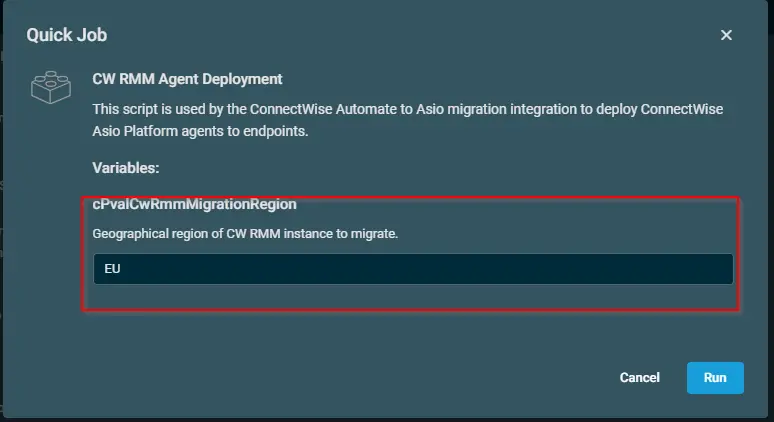

## Overview
This script deploys ConnectWise Asio Platform agents to windows endpoints.

## Implementation  

1. Download the component [CW RMM Agent Deployment](../../../static/attachments/cw-rmm-agent-deployment.cpt) from the attachments.

2. After downloading the attached file, click on the `Import` button

3. Select the component just downloaded and add it to the Datto RMM interface.  
  

## Sample Run

To execute the `component` over a specific machine, follow these steps:  

1. Select the machine you want to run the `component` on from the Datto RMM.  

2. Click on the `Quick Job` button.  
  

3. Search the component `CW RMM Agent Deployment` and click on `Select`
 

4. Change the geographical region if required, and click on RUN
 

## Global Settings

Go to "Setup>Global Settings>Variables"
Create the below global Variable

| Name | Value | Description |
| ---- | ------- | ----------- |
| cPvalCwRmmSiteKey | `71918cbc-981e-465d-9cb4-627e2883a10b` | CW RMM Agent token. |

 

**Note : To override the global settings, create the variable with same name under Site>All Sites>Select the site>Settings>Variables>Add Variable

 

## Datto Variables

| Variable Name              | Type   | Default | Valid entries                                   | Description                                      |
|----------------------------|--------|---------|-------------------------------------------------|--------------------------------------------------|
| cPvalCwRmmMigrationRegion  | String | EU      | <ul><li>NA</li><li>EU</li><li>AU</li></ul>      | Geographical region of CW

**Note: Set this variable while importing the script according to the partners Geographical region of CW

## Output
- stdOut  
- stdError  

## Attachments

[CW RMM Agent Deployment](../../../static/attachments/cw-rmm-agent-deployment.cpt)