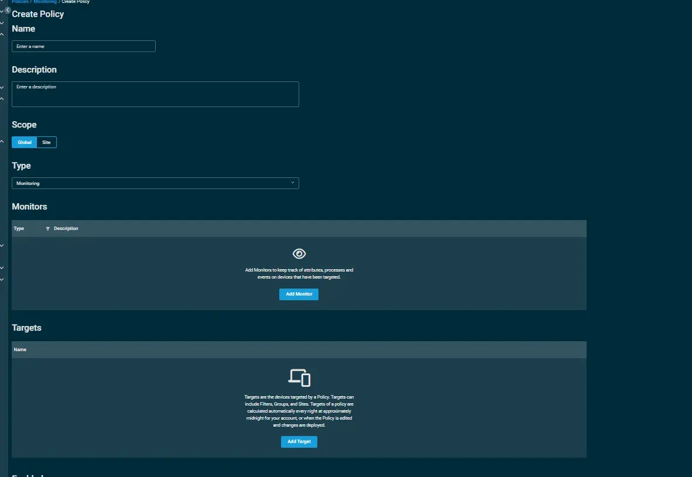
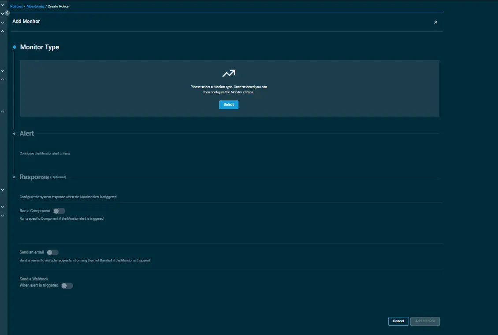
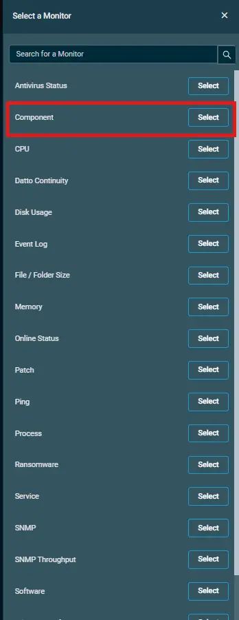
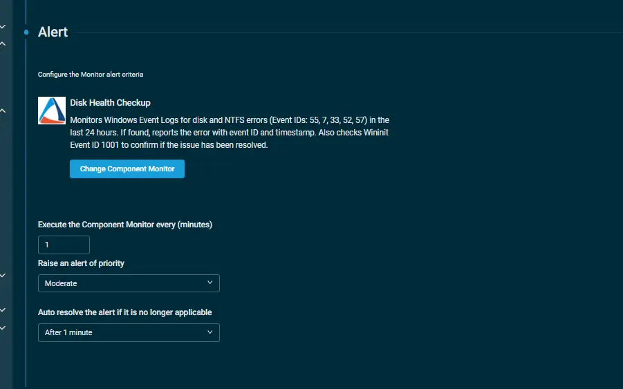

## Overview  
Monitors Windows Event Logs for disk and NTFS errors (Event IDs: 55, 7, 33, 52, 57) in the last 24 hours. If found, reports the error with event ID and timestamp. Also checks Wininit Event ID 1001 to confirm if the issue has been resolved.  

Note: This Component is a monitoring component and can only be able to execute through a monitoring policy.

## Implementation  

1. Download the component [Disk Health Checkup](../../../static/attachments/Disk%20Health%20Checkup.cpt) from the attachments.

2. After downloading the attached file, click on the `Import` button
3. Select the component just downloaded and add it to the Datto RMM interface.  
  

## Sample Run

1. To implement the `component` over a policy, follow these steps:  

2. Under the `Policies> Monitoring` section, click on create policy.  

    i. State the name of the policy.  
    ii. Provide the description.  
    iii. State the Scope of the policy.  
      

    iv. Within the Monitors section, click on `Add Monitor`.  
    .  

    v.Under the Monitor Type, click on `Select` and then select the `Component`option.  

    .  

    vi. Inorder to configure your `component` via alerting, follow the below steps:-  
        a.Click on `Select a Component Monitor` and then select  
           the component from the search bar.  
        b. Set the interval to `execute the component monitor`.  
        c. Select the `priority to raise an alert`.  
        d. Select the time to `auto resolve the alert`.
        .   
        e. Click on `Add Monitor`.  

3. Click on `Add Target` to provide the targeted machines.  
4. Click on `Save and Deploy Now` to save the policy.

## Output  
- stdOut  
- stdError  

## Attachments  
[Disk Health Checkup](../../../static/attachments/Disk%20Health%20Checkup.cpt)