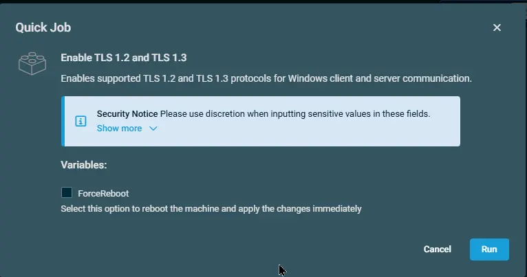

## Overview

Enables supported TLS 1.2 and TLS 1.3 protocols for Windows client and server communication.

## Implementation  

1. Download the component from the [`datto-rmm` repository](https://github.com/ProVal-Tech/datto-rmm):
   [Enable TLS 1.2 and TLS 1.3](https://github.com/ProVal-Tech/datto-rmm/blob/main/components/enable-tls-12-and-tls-13.cpt)

2. After downloading the file, click on the `Import` button in the Datto RMM interface.

3. Select the component just downloaded and add it to the Datto RMM interface.  
  

4. After Importing the component to the Datto RMM, make sure to add the component to the `PVAL` Group always.  
    - Steps to Add the component under `PVAL` Group.  
    i. Click on `Drop Down Icon`.  
    ii. Click on `Add to Group`.  
      
    iii. Select the group as `PVAL`  
    

## Sample Run

To execute the `component` over a specific machine, follow these steps:  

1. Select the machine you want to run the `component` on from the Datto RMM.  

2. Click on the `Quick Job` button.  
  

3. Search the component `Enable TLS 1.2 and TLS 1.3` and click on `Select`
 

4. Click on `Run` to execute the script:  

## Datto Variables

| Variable Name | Type | Default | Description |
| ------------- | ---- | ------- | ----------- |
| ForceReboot | Boolean | False | Select this option to reboot the machine and apply the changes immediately |

## Output

- stdOut  
- stdError

## Attachments  

- [Enable TLS 1.2 and TLS 1.3](https://github.com/ProVal-Tech/datto-rmm/blob/main/components/enable-tls-12-and-tls-13.cpt)

## Changelog
 
### 2026-09-16
 
- Initial version of the document