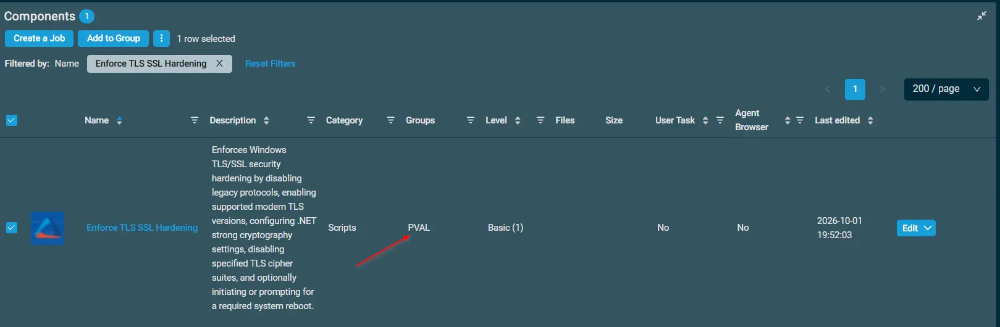
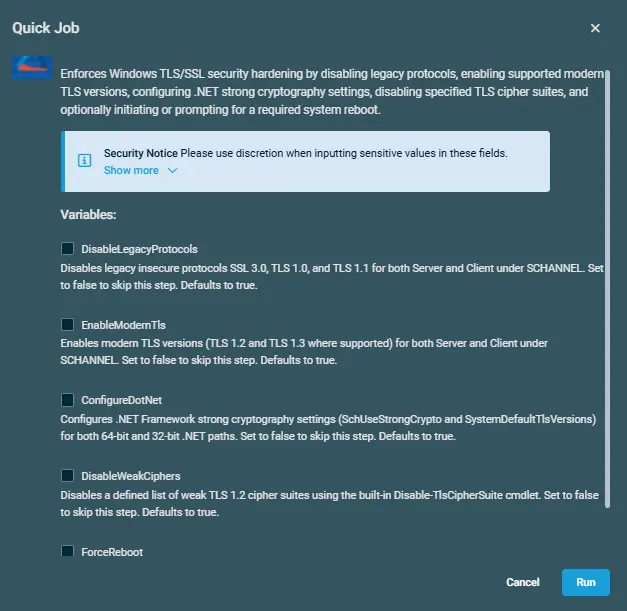

## Overview

Enforces Windows TLS/SSL security hardening by disabling legacy protocols, enabling supported modern TLS versions, configuring .NET strong cryptography settings, disabling specified TLS cipher suites, and optionally initiating or prompting for a required system reboot.

## Implementation  

1. Download the component from the [`datto-rmm` repository](https://github.com/ProVal-Tech/datto-rmm):

   [Enforce TLS SSL Hardening](https://github.com/ProVal-Tech/datto-rmm/blob/main/components/enforce-tls-ssl-hardening.cpt)

2. After downloading the file, click on the `Import` button in the Datto RMM interface.

3. Select the component just downloaded and add it to the Datto RMM interface.  
  

4. After Importing the component to the Datto RMM, make sure to add the component to the `PVAL` Group always.  
    - Steps to Add the component under `PVAL` Group.  
    i. Click on `Drop Down Icon`.  
    ii. Click on `Add to Group`.  
      
    iii. Select the group as `PVAL`  
    

## Sample Run

To execute the `Enforce TLS SSL Hardening` over a specific machine, follow these steps:  

1. Select the machine you want to run the `Enforce TLS SSL Hardening` on from the Datto RMM.  

2. Click on the `Quick Job` button.  
  

3. Search the component `Enforce TLS SSL Hardening` and click on `Select`
 

4. Click on `Run` to execute the script:  

## Datto Variables

| Variable Name | Type | Default | Description |
| ------------- | ---- | ------- | ----------- |
| `DisableLegacyProtocols` | `Boolean` | `False` | Set to true to disable SSL 3.0, TLS 1.0, TLS 1.1 |
| `EnableModernTls` | `Boolean` | `False` | Set to true to enable TLS 1.2 and TLS 1.3 |
| `ConfigureDotNet` | `Boolean` | `False` | Set to true to configure .NET strong crypto |
| `DisableWeakCiphers` | `Boolean` | `False` | Set to true to disable weak cipher suites |
| `ForceReboot` | `Boolean` | `False` | Select this option to reboot the machine and apply the changes immediately |

## Output

- stdOut  
- stdError

## Attachments  

- [Enforce TLS SSL Hardening](https://github.com/ProVal-Tech/datto-rmm/blob/main/components/enforce-tls-ssl-hardening.cpt)

## Changelog

### 2026-10-02

- Added environment variables to independently control protocol, TLS, .NET, cipher, and reboot settings, along with improved OS detection and execution output.
 
### 2026-09-16
 
- Initial version of the document

