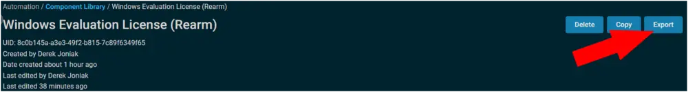
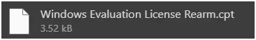
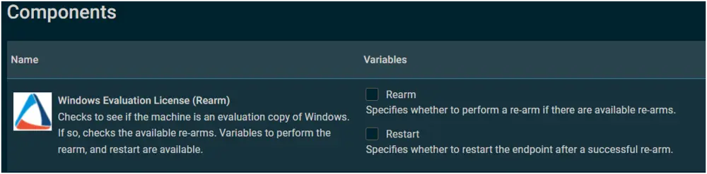

## Summary

This document checks if the machine is an evaluation copy of Windows. If so, it checks the available re-arms. Variables to perform the rearm and restart are available.

## Implementation

1. Export the component from ProVal's Datto RMM instance:  
   **Name:** Windows Evaluation License (Rearm)  
     
   The export will download the necessary component (cpt) file.  
     
   
2. Import this component file into the partner's Datto RMM instance:  
     

**Proval Plug & Play:** This component requires no configuration once imported.

## Usage

The component will prompt for two variables during a job:  
  

- **Rearm:** Specifies whether to perform a rearm if there are available re-arms.  
- **Restart:** Specifies whether to restart the endpoint after a successful rearm