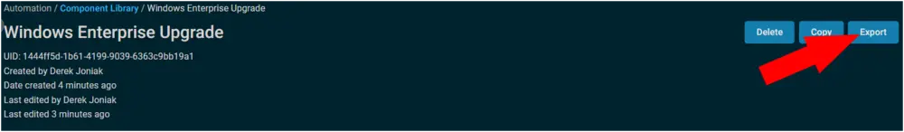
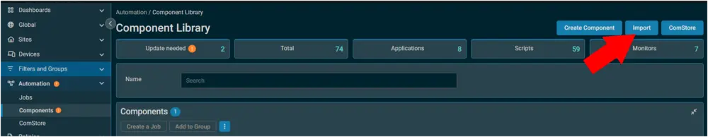
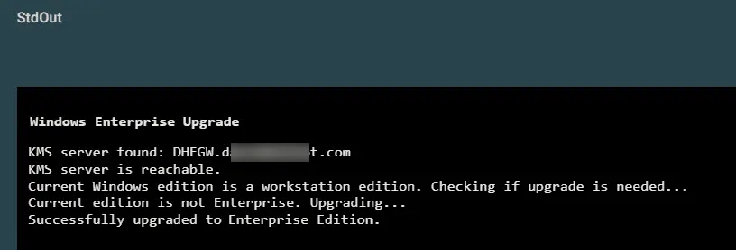
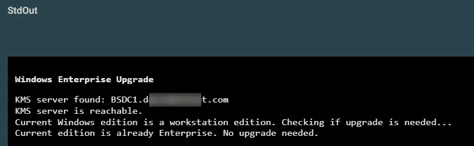

## Summary

This document updates the Windows edition for Windows 10/11 workstations to Enterprise.

## Dependencies

  
The partner must have a KMS host setup; otherwise, this component will not function.  
Refer the partner to [How to create a KMS Host](https://learn.microsoft.com/en-us/windows-server/get-started/kms-create-host) if no KMS host exists.

## Implementation

Export the component from ProVal's Datto RMM instance.  
**Name:** Windows Enterprise Upgrade  

  

The export will download the necessary component (cpt) file.  

  

Import this component file into the partner's Datto RMM instance.  

  

Proval Plug & Play: This component requires no configuration once imported.

## Output

A job status of Success is expected.  

  

**StdOut**  
  
  

**StdErr**  
StdErr is not expected.