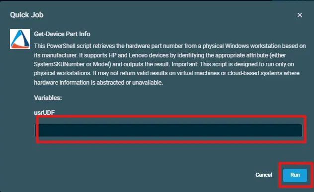

## Overview  

This PowerShell script retrieves the hardware part number from a physical Windows workstation based on its manufacturer. `It supports HP and Lenovo devices by identifying the appropriate attribute` (either SystemSKUNumber or Model) and outputs the result.  

**Important:** 
- This script is designed to run only on HP and Lenovo devices. 
- It may not return valid results on virtual machines or cloud-based systems where hardware information is abstracted or unavailable.  

## Dependencies  

Create a filter that includes manufacturer as `HP` OR `Lenovo` to get a better view over the machines.

## Implementation  

1. Download the `component` [Get-Device Part Info](../../../static/attachments/get-device-part-info.cpt) from attachments.

2. After downloading the attached file, click on the `Import` button
3. Select the component just downloaded and add it to the Datto RMM interface.   
  

## Sample Run

To execute the `component` over a specific machine, follow these steps:  

1. Select the machine you want to run the `component` on from the Datto RMM.  

2. Click on the `Quick Job` button.  
  

3. Search the component within the search bar `Get-Device Part Info` and click on `Select`  
   

 4. After selecting the `component`, you will notice a below pop-up to define a UDF.  

 5. Input the `ID of the UDF` to populate the data upon, and then click on `Run`.

## Datto Variables

| Variable Name | Type | Default | Description |
| ------------- | ---- | ------- | ----------- |
| usrUDF | String |  | Enter the UDF ID to store the Output |

## Output

- stdOut  
- stdError  

## Attachments

[Get-Device Part Info](../../../static/attachments/get-device-part-info.cpt)