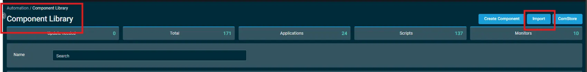

## Overview  

This PowerShell script retrieves the hardware part number from a physical Windows workstation based on its manufacturer. `It supports HP and Lenovo devices by identifying the appropriate attribute` (either SystemSKUNumber or Model) and outputs the result.  

Important:  
This script is designed to run only on physical workstations. It may not return valid results on virtual machines or cloud-based systems where hardware information is abstracted or unavailable.  

## Dependencies  

Create a filter to include manufacturer as `HP` OR `Lenovo` to get a better view over the machines.

## Implementation  

1. Import the `component` [Get-Device Part Info](../../../static/attachments/Get-Device%20Part%20Info.cpt).  

2. After downloading the attached file > Click on the `Import` button > Select the component to add to the Datto RMM interface.  
  

## Datto Variables

| Variable Name | Type | Default | Description |
| ------------- | ---- | ------- | ----------- |
| usrUDF | String | 0 | Enter the UDF ID to store the Secure Boot Check Status |

## Output

- stdOut  
- stdError  

## Attachments

[Get-Device Part Info](../../../static/attachments/Get-Device%20Part%20Info.cpt)