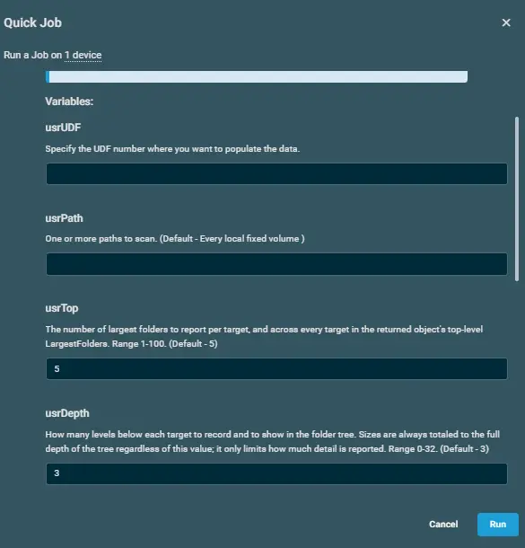
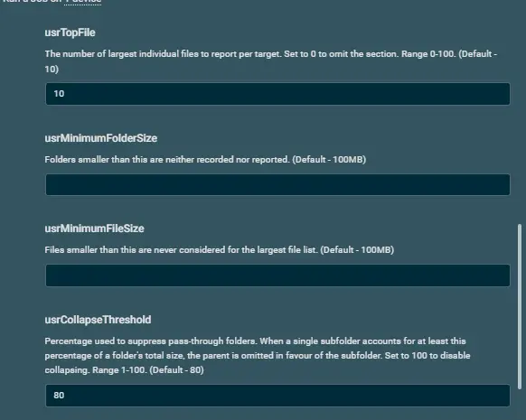
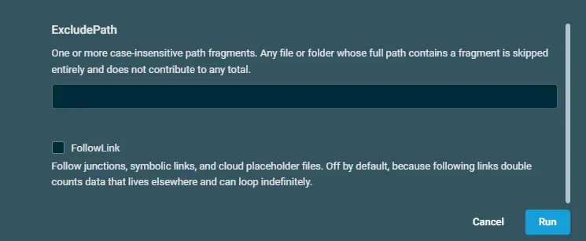

## Overview  

Reports disk usage per folder and file, in the style of TreeSize. Returns the result as an object and writes a human readable report to Get-DiskUsage-result.txt, beside the log.

The point of the script is to answer "what is filling this disk up?" without remoting into the machine. It rolls the size of every file up into a total for each folder, so each folder reports the size of everything beneath it rather than just the files it directly contains, then reports the biggest offenders.

Because it names the exact folders consuming the space, it is well suited to spotting a runaway process, for example Dell SupportAssist repeatedly writing backups, or a log directory that has grown without limit.

Everything is self-contained: the script runs its own logic in the session it is launched in, and writes nothing to the endpoint except its report and log. Every value that shapes the report is a parameter with a default, so the same script covers whole-machine triage and a narrow drill-down into one folder.

## Implementation  

1. Download the component [Get-DiskUsage](https://github.com/ProVal-Tech/datto-rmm/blob/main/components/get-diskusage.cpt)

2. After downloading the file, click on the `Import` button in the Datto RMM interface.

3. Select the component just downloaded and add it to the Datto RMM interface.  
  

4. After Importing the component to the Datto RMM, make sure to add the component to the `PVAL` Group always.  
    - Steps to Add the component under `PVAL` Group.  
    i. Click on `Drop Down Icon`.  
    ii. Click on `Add to Group`.  
      
    iii. Select the group as `PVAL`  
    

## Sample Run

To execute the `component` over a specific machine, follow these steps:  

1. Select the machine you want to run the `component` on from the Datto RMM.  

2. Click on the `Quick Job` button.  
  

3. Search the component `Get-DiskUsage` and click on `Select`  
 

4. Following are the variables which will appear during the execution of the `component`.  
  
  
  

## Datto Variables

| Variable Name | Type | Default | Description |
| ------------- | ---- | ------- | ----------- |
|usrUDF|String||Specify the UDF number where you want to populate the data.|
|usrPath|String||One or more paths to scan. (Default - Every local fixed volume )|
|usrTop|String|5|The number of largest folders to report per target, and across every target in the returned object's top-level LargestFolders. Range 1-100. (Default - 5)|
|usrDepth|String|3|How many levels below each target to record and to show in the folder tree. Sizes are always totaled to the full depth of the tree regardless of this value; it only limits how much detail is reported. Range 0-32. (Default - 3)|
|usrTopFile|String|10|The number of largest individual files to report per target. Set to 0 to omit the section. Range 0-100. (Default - 10)|
|usrMinimumFolderSize|String||Folders smaller than this are neither recorded nor reported. (Default - 100MB)|
|usrMinimumFileSize|String||Files smaller than this are never considered for the largest file list. (Default - 100MB)|
|usrCollapseThreshold|String|80|Percentage used to suppress pass-through folders. When a single subfolder accounts for at least this percentage of a folder's total size, the parent is omitted in favour of the subfolder. Set to 100 to disable collapsing. Range 1-100. (Default - 80)|
|usrExcludePath|String||One or more case-insensitive path fragments. Any file or folder whose full path contains a fragment is skipped entirely and does not contribute to any total.|
|usrFollowLink|Boolean|False|Follow junctions, symbolic links, and cloud placeholder files. Off by default, because following links double counts data that lives elsewhere and can loop indefinitely.|

## Output  
- stdOut  
- stdError

## Attachments  

- [Get-DiskUsage](https://github.com/ProVal-Tech/datto-rmm/blob/main/components/get-diskusage.cpt)

## Changelog
 
### 2026-08-26
 
- Initial version of the document
