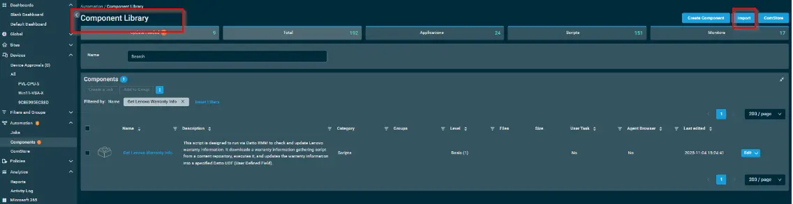
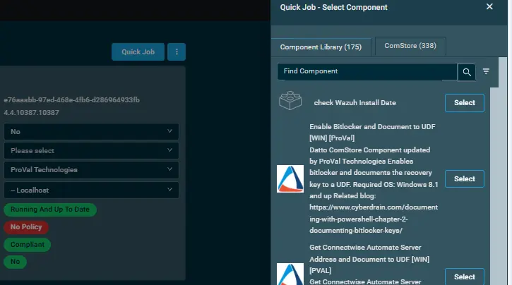
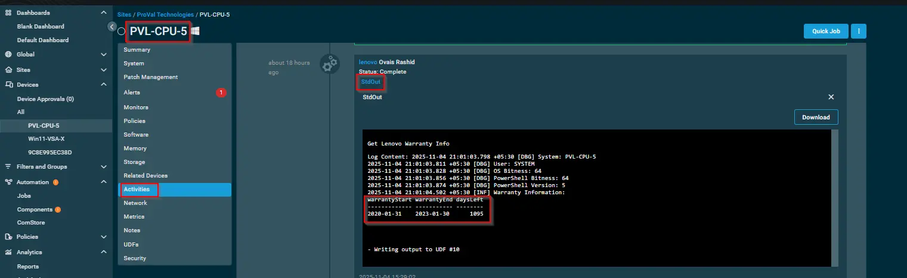

## Overview

 This script is designed to run via Datto RMM to check and update Lenovo warranty information. It downloads the 'Get-LenovoWarrantyInfo' agnostic script from a content repository, executes it, and updates the warranty information into a specified Datto UDF (User Defined Field).

 ## Dependencies

 - [Agnostic Script - Get-LenovoWarrantyInfo](/docs/79f777ee-3d90-43c9-a6dd-8e28444a260a)

## Implementation  

1. Download the component [Get Lenovo Warranty Info](../../../static/attachments/Get%20Lenovo%20Warranty%20Info.cpt) from the attachments.

2. After downloading the attached file, click on the `Import` button
  

3. Select the component just downloaded and add it to the Datto RMM interface.  

## Sample Run

To execute the `component` over a specific machine, follow these steps:  

1. Select the machine you want to run the `component` on from the Datto RMM.  

2. Click on the `Quick Job` button.  
  

3. Search the component `Get Lenovo Warranty Info` and click on `Select`
 

4. Sample Run:

**Note:** The UDF variable number may vary depending on the organization. In our VSA instance, the UDF number is 16; however, this number may differ in other RMM environments.
Please also rename that UDF With `Warranty Expiration`

## Datto Variables

| Variable Name | Type | Default | Description |
| ------------- | ---- | ------- | ----------- |
|usrUDF| String||  | Enter the UDF number where the warranty information will be stored.|  

## Output

- UDFs Update [Warranty Expiration]

- stdOut

- stdError

## Attachments

[Get Lenovo Warranty Info](../../../static/attachments/Get%20Lenovo%20Warranty%20Info.cpt)