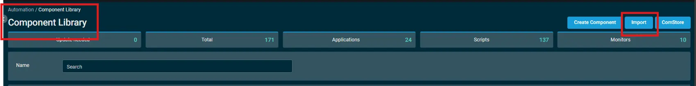

## Overview  
This script is used to get the local admin data from each machine and output it over a UDF

## Implementation  

1. Download the component [Get Local Admin [CF]](../../../static/attachments/Get%20Local%20Admin%20CF.cpt) from the attachments.

2. After downloading the attached file, click on the `Import` button
3. Select the component just downloaded and add it to the Datto RMM interface.  
  

## Sample Run

To execute the `component` over a specific machine, follow these steps:  

1. Select the machine you want to run the `component` on from the Datto RMM.  

2. Click on the `Quick Job` button.  
  

3. Search the component `Get Local Admin [CF]` and click on `Select`
 

4. After selecting the component, you will notice a below popup window to specify the UDF number over which the data will get populated.  

5. After inputting the UDF number, click on `Run` to execute the component.

## Datto Variables

| Variable Name | Type | Default | Description |
| ------------- | ---- | ------- | ----------- |
|usrUDF| String||Enter the UDF ID to store the Secure Boot Check Status|  

## Output  
- stdOut  
- stdError  

## Attachments  
[Get Local Admin [CF]](../../../static/attachments/Get%20Local%20Admin%20CF.cpt)