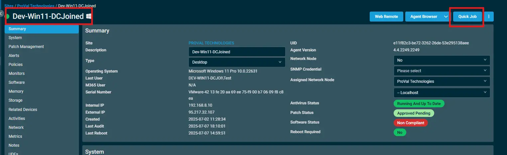

## Overview  
This script manages the visibility of the Windows Update page in the Settings app at the machine level.

## Implementation  

1. Download the `component` [Hide-Unhide Windows Update](../../../static/attachments/Hide-Unhide%20Windows%20Update.cpt) from the attachments.

2. After downloading the attached file, click on the `Import` button
3. Select the component just downloaded and add it to the Datto RMM interface.  
  

## Sample Run

To execute the `component` over a specific machine, follow these steps:  

1. Select the machine you want to run the `component` on from the Datto RMM.  

2. Click on the `Quick Job` button.  
  

3. Search the component `Hide-Unhide Windows Update` and click on `Select`
 

4. After selecting the `component`, you will notice a below pop-up with a checkbox option.

5. By default, the `component` is set to `Hide` Windows Update.  
 

## Datto Variables

| Variable Name | Type | Default | Description |
| ------------- | ---- | ------- | ----------- |
| HIDE_WINDOWSUPDATE | Boolean | True | by default, set to True to hide. |  

## Output  
- stdOut  
- stdError  

## Attachments  
[Hide-Unhide Windows Update](../../../static/attachments/Hide-Unhide%20Windows%20Update.cpt)