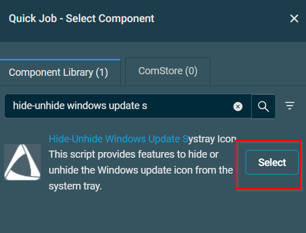
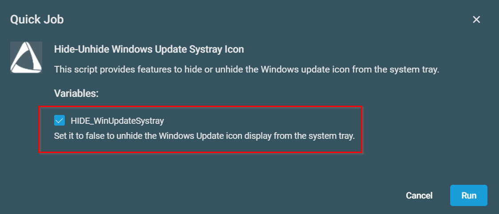

## Overview

This script provides features to hide or unhide the Windows update icon from the system tray.
Enable the variable `HIDE_WinUpdateSystray` to hide the Windows Update icon from the system tray and disable it to unhide it. By default this component will hide the Windows Update icon.

## Dependencies

## Implementation  

1. Download the `component` [Hide-Unhide Windows Update Systray Icon](../../../static/attachments/hide-unhide-windows-update-systray-icon.cpt) from the attachments.

2. After downloading the attached file, click on the `Import` button
3. Select the component just downloaded and add it to the Datto RMM interface.  
  

## Sample Run

To execute the `component` over a specific machine, follow these steps:  

1. Select the machine you want to run the `component` on from the Datto RMM.  

2. Click on the `Quick Job` button.  
  

3. Search the component `hide-unhide windows update systray icon` and click on `Select`
 

4. After selecting the `component`, you will notice a below pop-up with a checkbox option.

5. By default, the `component` is set to `Hide` Windows Update.  
 

## Datto Variables

| Variable Name | Type | Default | Description |
| ------------- | ---- | ------- | ----------- |
| HIDE_WinUpdateSystray | Boolean | True | Set it to false to unhide the Windows Update icon display from the system tray. |

## Output

- stdOut
- stdError
- 
## Attachments

[Hide-Unhide Windows Update Systray Icon](../../../static/attachments/hide-unhide-windows-update-systray-icon.cpt)