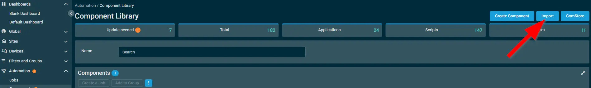
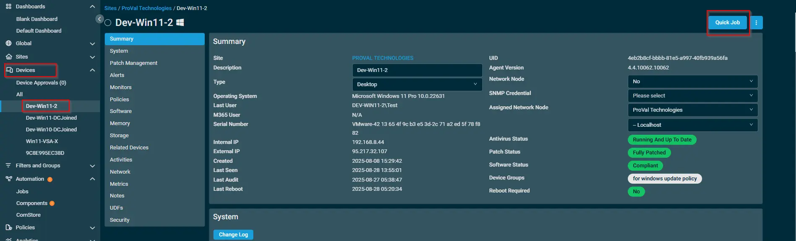
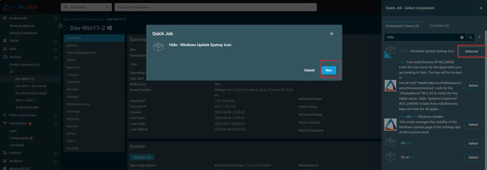
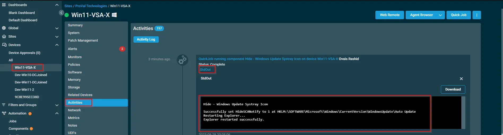

## Overview

This script is used to hide windows update icon under the systray.

## Dependencies

None

## Implementation  

1. Export the procedure from Datto Environment.

2. After downloading the attached file, login into the client environment and go to `automation ---> Components` click on the `Import` button

## Sample Run

To execute the `component` over a specific machine, follow these steps:  

1. Select the machine you want to run the `component` on from the Datto RMM.  

2. Click on the `Quick Job` button.  

  

3. Search the component `Hide - Windows Update Systray Icon` and click on `Select`

## Output

