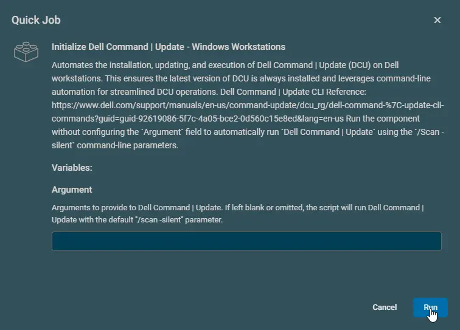
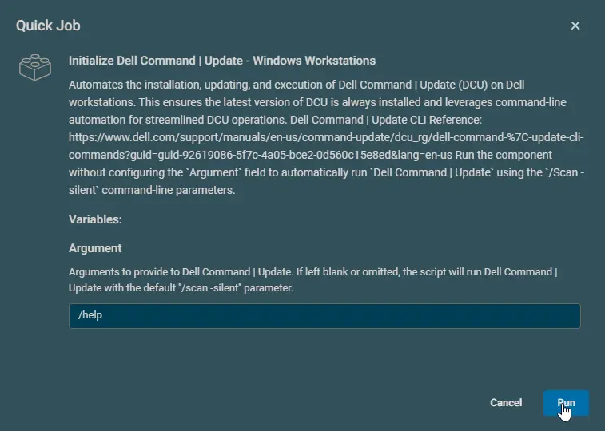
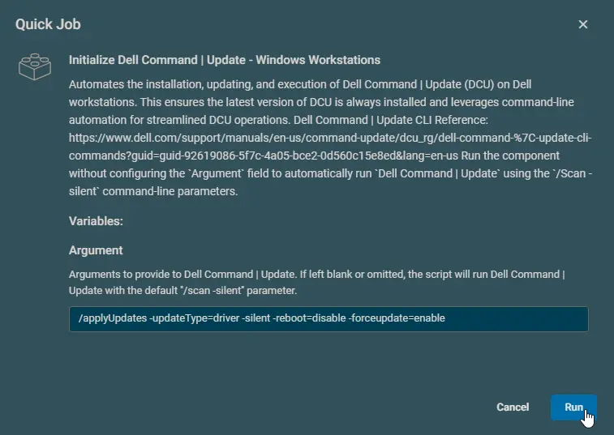

## Overview

Automates the installation, updating, and execution of Dell Command | Update (DCU) on Dell workstations. This ensures the latest version of DCU is always installed and leverages command-line automation for streamlined DCU operations. This component serves as the Datto RMM integration of the agnostic script [Initialize-DellCommandUpdate](/docs/aa963f3d-f149-4bfa-8fdc-30f12c21ce7f)

**Notes:**

- [Dell Command | Update CLI Reference](https://www.dell.com/support/manuals/en-us/command-update/dcu_rg/dell-command-%7C-update-cli-commands?guid=guid-92619086-5f7c-4a05-bce2-0d560c15e8ed&lang=en-us)
- Run the component without configuring the `Argument` field to automatically run `Dell Command | Update` using the `/Scan -silent` command-line parameters.

## Dependencies

[Initialize-DellCommandUpdate](/docs/aa963f3d-f149-4bfa-8fdc-30f12c21ce7f)

## Implementation  

1. Download the component [Initialize Dell Command | Update - Windows Workstations](../../../static/attachments/initialize-dell-command-update-windows-workstations.cpt) from the attachments.

2. After downloading the attached file, click on the `Import` button
3. Select the component just downloaded and add it to the Datto RMM interface.  
  

## Sample Run

### Example 1

**Performing Scan Operation:**  

### Example 2

**Running help command to return supported arguments:**  
**Argument:** `/help`  

### Example 3

**Installing available driver updates forcefully:**  
**Argument:** `/applyUpdates -updateType=driver -silent -reboot=disable -forceupdate=enable`  

**Caution:** It is recommended to restart the computer at the earliest convenience after using the `-forceupdate=enable` switch, as this switch updates active drivers as well. An active driver that requires a restart for the update may malfunction if the update is installed without rebooting the computer.

### Example 4

**Installing available firmware, and bios updates:**  
**Argument:** `/applyUpdates -updateType=bios,firmware -silent -reboot=disable`  

## Datto Variables

| Name     | Example | Required | Type | Default | Description |
|----------|---------|----------|----- | ------- | ----------- |
| Argument | <ul><li>`/version`</li><li>`/scan`</li><li>`/scan -updateType=bios,firmware,driver`</li><li>`/applyUpdates -updateType=bios,firmware -silent -reboot=disable`</li><li>`/applyUpdates -updateType=driver -silent -reboot=disable -forceupdate=enable`</li><li>`/driverInstall -silent -reboot=disable`</li></ul> | False | String | | Arguments to provide to `Dell Command \| Update`. If left blank or omitted, the script will run `Dell Command \| Update` with the default `/scan -silent` parameter.   **Reference:** [Supported commands/arguments reference](https://www.dell.com/support/manuals/en-us/command-update/dcu_rg/dell-command-%7C-update-cli-commands?guid=guid-92619086-5f7c-4a05-bce2-0d560c15e8ed&lang=en-us) |

## Output

- stdOut
- stdError

## Attachments

- [Initialize Dell Command | Update - Windows Workstations](../../../static/attachments/initialize-dell-command-update-windows-workstations.cpt)
