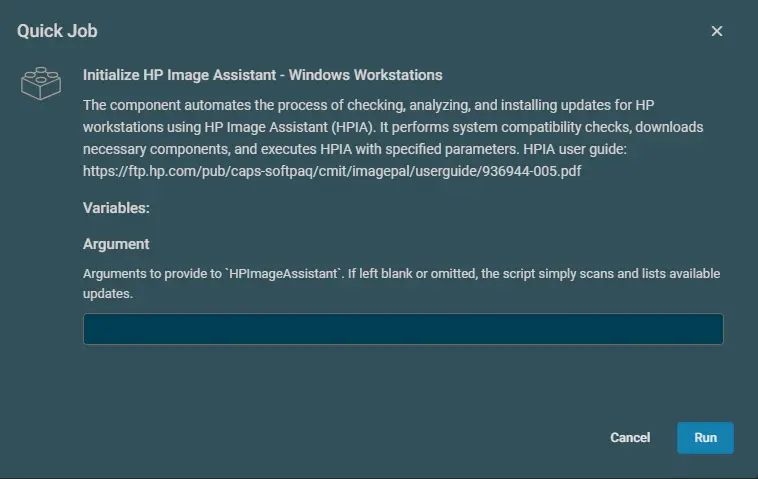
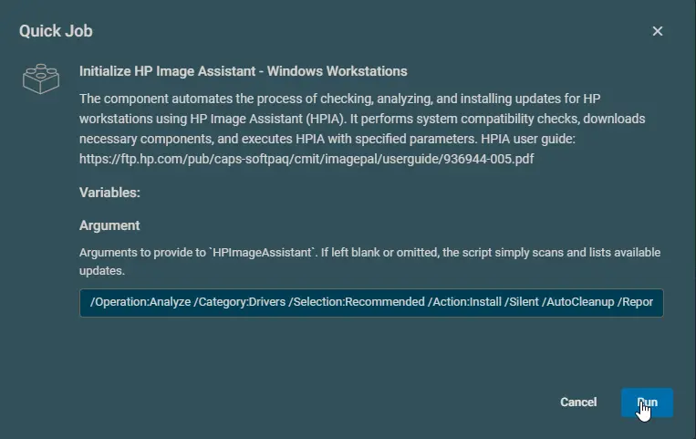
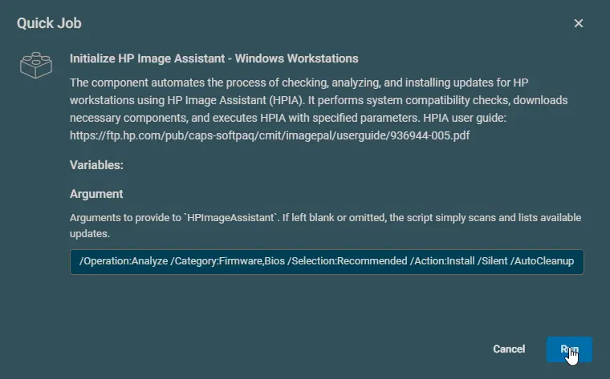

## Overview

The component automates the process of checking, analyzing, and installing updates for HP workstations using HP Image Assistant (HPIA). It performs system compatibility checks, downloads necessary components, and executes HPIA with specified parameters. This component serves as the Datto RMM integration of the agnostic script [Initialize-HPImageAssistant](/docs/92b749f0-2e30-4d4d-8916-fb5f30d85bff)

**Notes:**

- [HP Image Assistant User Guide](https://ftp.hp.com/pub/caps-softpaq/cmit/imagepal/userguide/936944-005.pdf)
- Run the component without configuring the `Argument` field to scan and return all available recommended updates.

## Dependencies

[Initialize-HPImageAssistant](/docs/92b749f0-2e30-4d4d-8916-fb5f30d85bff)

## Implementation  

1. Download the component [Initialize HP Image Assistant - Windows Workstations](../../../static/attachments/initialize-hp-image-assistant-windows-workstations.cpt) from the attachments.

2. After downloading the attached file, click on the `Import` button
3. Select the component just downloaded and add it to the Datto RMM interface.  
  

## Sample Run

### Example 1

**Performing Scan Operation:**  

### Example 2

**To perform silent install of recommended driver updates and store the result to C:\ProgramData\_Automation\App\HPImageAssistant\InstallReport.json:**  
**Argument:** `/Operation:Analyze /Category:Drivers /Selection:Recommended /Action:Install /Silent /AutoCleanup /ReportFilePath:"C:\ProgramData\_Automation\App\HPImageAssistant\InstallReport"`  

### Example 3

**To perform silent install of recommended bios and firmware updates and store the result to C:\ProgramData\_Automation\App\HPImageAssistant\InstallReport.json:**  
**Argument:** `/Operation:Analyze /Category:Firmware,Bios /Selection:Recommended /Action:Install /Silent /AutoCleanup /ReportFilePath:"C:\ProgramData\_Automation\App\HPImageAssistant\InstallReport"`  

### Example 4

**To perform silent install of all available updates:**  
**Argument:** `/Operation:Analyze /Category:All /Selection:All /Action:Install /Silent /AutoCleanup`  

## Datto Variables

| Name     | Example | Required | Type | Default | Description |
|----------|---------|----------|----- | ------- | ----------- |
| Argument | <ul><li>`/Operation:Analyze /Category:Drivers /Selection:Recommended /Action:Install /Silent /AutoCleanup /ReportFilePath:"C:\ProgramData\_Automation\App\HPImageAssistant\InstallReport"`</li><li>`/Operation:Analyze /Category:Firmware /Selection:Recommended /Action:Install /Silent /AutoCleanup /ReportFilePath:"C:\ProgramData\_Automation\App\HPImageAssistant\InstallReport"`</li><li>`/Operation:Analyze /Category:Firmware,Bios /Selection:Recommended /Action:Install /Silent /AutoCleanup`</li><li>`/Operation:Analyze /Category:All /Selection:All /Action:Install /Silent /AutoCleanup /ReportFilePath:"C:\ProgramData\_Automation\App\HPImageAssistant\InstallReport"`</li></ul> | False | String | | Arguments to provide to `HPImageAssistant`. If left blank or omitted, the script simply scans and lists available updates.   **Reference:** [Supported commands/arguments reference](https://ftp.hp.com/pub/caps-softpaq/cmit/imagepal/userguide/936944-005.pdf) |

## Output

- stdOut
- stdError

## Attachments

- [Initialize HP Image Assistant - Windows Workstations](../../../static/attachments/initialize-hp-image-assistant-windows-workstations.cpt)
