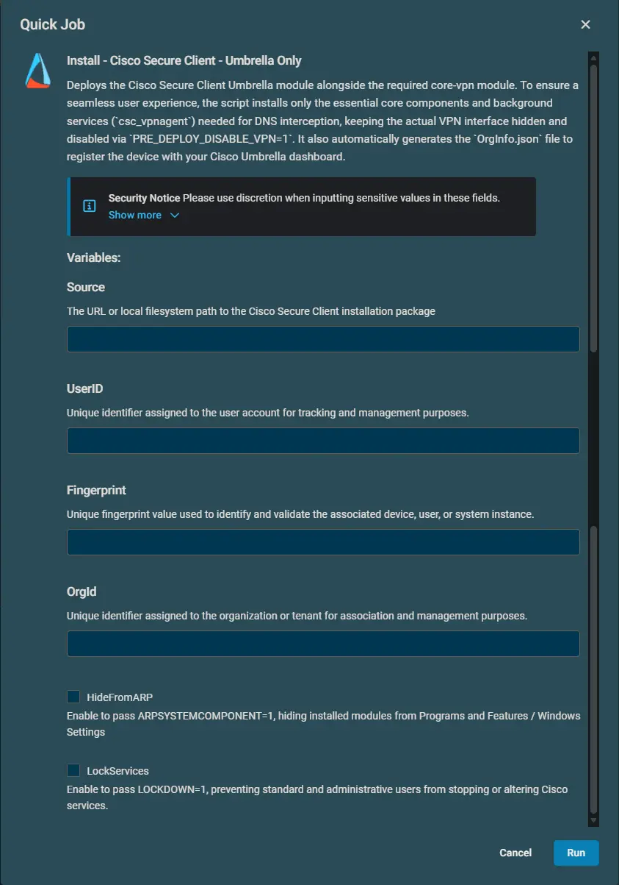

## Overview

This component deploys the Cisco Secure Client Umbrella Roaming Security module to target Windows endpoints.

Every Cisco Secure Client module requires the Core/VPN module (`core-vpn`) to establish the low-level system drivers and background services (`csc_vpnagent`) necessary to intercept DNS traffic. This script automatically deploys the Core components in hidden mode (`PRE_DEPLOY_DISABLE_VPN=1`) so that the VPN interface and tray icons remain hidden from end users while the underlying Umbrella protection functions normally. It also provisions the mandatory `OrgInfo.json` configuration file prior to running the Umbrella MSI.

## Dependencies

- [Install-CiscoSecureClient](/docs/fc6bcac9-770a-46dc-902c-7176cb1d73ea)

## Implementation  

1. Download the [Install - Cisco Secure Client - Umbrella](https://github.com/ProVal-Tech/datto-rmm/blob/main/components/install-cisco-secure-client-umbrella-only.cpt) component.

2. After downloading the file, click on the `Import` button in the Datto RMM interface.

3. Select the component just downloaded and add it to the Datto RMM interface.  
  

4. After Importing the component to the Datto RMM, make sure to add the component to the `Proval` Group always.  
   - Steps to Add the component under `Proval` Group:  
     i. Click on `Drop Down Icon`.  
     ii. Click on `Add to Group`.  
       
     iii. Select the group as `Proval`.  
     

## Sample Run

To execute the `component` over a specific machine, follow these steps:  

1. Select the machine you want to run the `component` on from the Datto RMM.  

2. Click on the `Quick Job` button.  
  

3. Search the component `Install - Cisco Secure Client - Umbrella` and click on `Select`.  

4. Configure the required site/job variables and execute the job:  

## Datto Variables

| Variable Name | Type | Default | Description |
| :--- | :--- | :--- | :--- |
| **`Source`** | String | *None* | **Required.** Direct HTTPS download URL or local file path to the Cisco Secure Client installer package (e.g., `wininstall.zip`). |
| **`UserID`** | String | *None* | **Required.** Umbrella User ID token obtained from your Cisco Umbrella dashboard or `OrgInfo.json`. |
| **`Fingerprint`** | String | *None* | **Required.** Umbrella Fingerprint authentication string obtained from your Cisco Umbrella dashboard or `OrgInfo.json`. |
| **`OrgId`** | String | *None* | **Required.** Umbrella Organization ID obtained from your Cisco Umbrella dashboard or `OrgInfo.json`. |
| **`HideFromARP`** | Boolean | Disabled | **Optional.** When enabled, passes `ARPSYSTEMCOMPONENT=1` to hide the installed Cisco Secure Client modules from the Windows Add/Remove Programs list and inventory scans. |
| **`LockServices`** | Boolean | Disabled | **Optional.** When enabled, passes `LOCKDOWN=1` to prevent Cisco Secure Client services from being modified, stopped, or disabled (applies to administrators as well). |

## Output

The script outputs status information directly to the Datto RMM execution `stdout` log and stores persistent logs on the local endpoint:

- **Log File:** `C:\ProgramData\_Automation\Script\Install-CiscoSecureClient\Install-CiscoSecureClient-log.txt`
- **Error Log File (if failure occurs):** `C:\ProgramData\_Automation\Script\Install-CiscoSecureClient\Install-CiscoSecureClient-error.txt`
- **Configuration Profile:** `C:\ProgramData\Cisco\Cisco Secure Client\Umbrella\OrgInfo.json`

**Exit Codes & Reboots:**

- **Exit Code 0:** Successful installation.
- **Exit Code 3010:** Installation successful, but a system reboot is required to finalize driver registration. The script logs this as a successful completion notice.

## Attachments  

- [Install - Cisco Secure Client - Umbrella Only](https://github.com/ProVal-Tech/datto-rmm/blob/main/components/install-cisco-secure-client-umbrella-only.cpt)

## Changelog

### 2026-08-27

- Initial version of the document.
