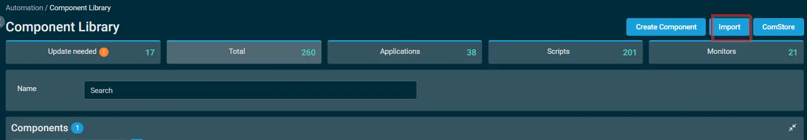
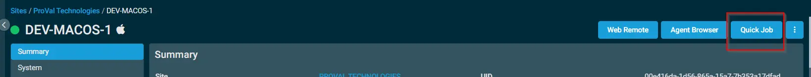
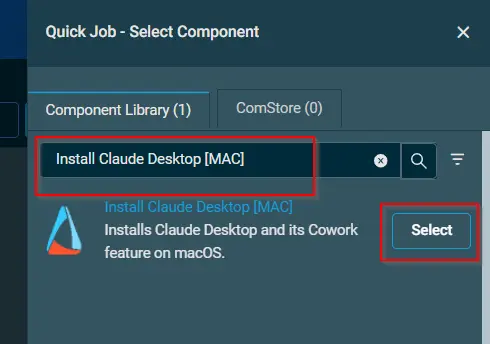

## Overview

This script downloads and installs Claude Desktop from the official Anthropic universal PKG installer. On macOS, the Cowork feature is included automatically with the Claude Desktop installation and requires no additional prerequisites.

## Implementation  

1. Download the component `Install Claude Desktop [MAC]` from the attachments.

2. After downloading the attached file, click on the `Import` button

3. Select the component just downloaded and add it to the Datto RMM interface.  
 

## Sample Run

To execute the `Install Claude Desktop [MAC]` over a specific machine, follow these steps:  

1. Select the machine you want to run the `Install Claude Desktop [MAC]` on from the Datto RMM.  

2. Click on the `Quick Job` button.  
  

3. Search the component `Install Claude Desktop [MAC]` and click on `Select`
 

## Output

Activity logs.

## Attachments  

[Install Claude Desktop - MAC](../../../static/attachments/install-claude-desktop-mac.cpt)

## Changelog
 
### 2026-23-06
 
- Initial version of the document
