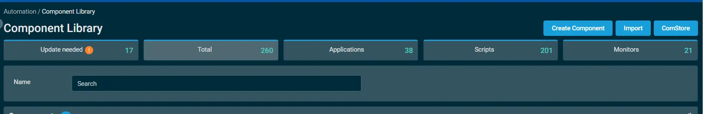
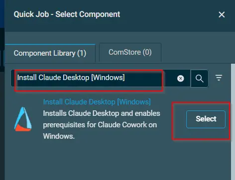

## Overview
This script automates the deployment of Claude Desktop for all users on a Windows endpoint and configures the system prerequisites required for the Claude Cowork feature.

## Implementation  

1. Download the component `Install Claude Desktop [Windows]` from the attachments.

2. After downloading the attached file, click on the `Import` button

3. Select the component just downloaded and add it to the Datto RMM interface.
 

## Sample Run

To execute the `Install Claude Desktop [Windows]` over a specific machine, follow these steps:

1. Select the machine you want to run the `Install Claude Desktop [Windows]` on from the Datto RMM.  

2. Click on the `Quick Job` button.  
  

3. Search the component `Install Claude Desktop [Windows]` and click on `Select`
 

## Output

Activity logs.

## Attachments  

[Install Claude Desktop - Windows](../../../static/attachments/install-claude-desktop-windows.cpt)

## Changelog
 
### 2026-23-06
 
- Initial version of the document
