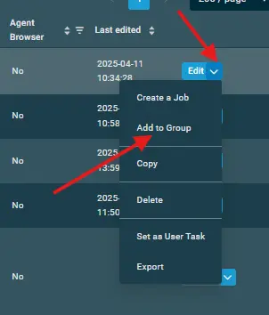
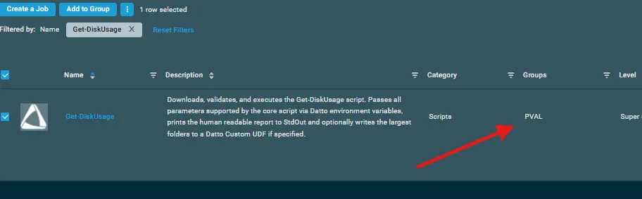
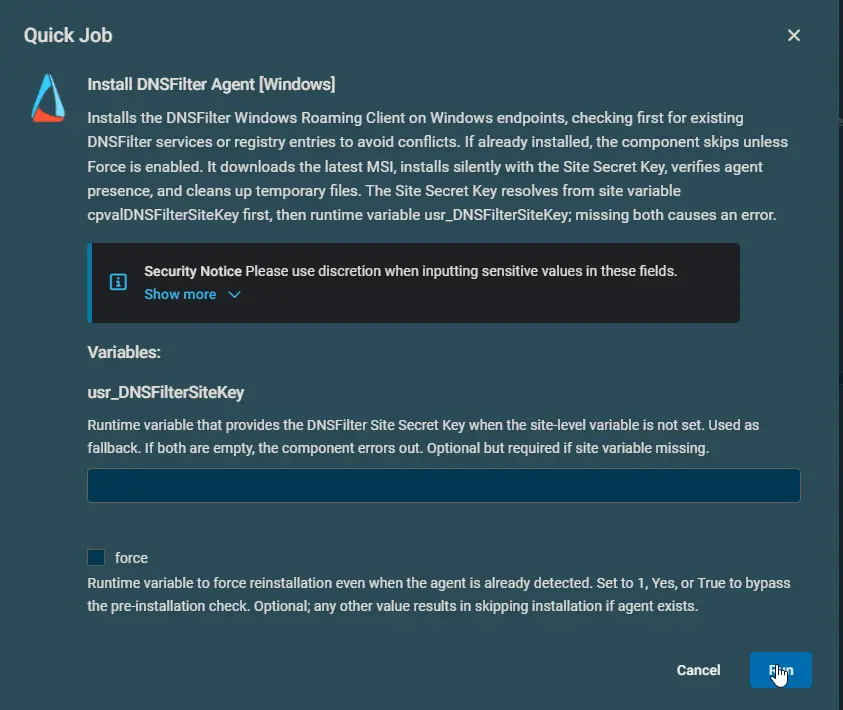

## Overview

The script securely deploys the DNSFilter Windows Roaming Client. It first checks for an existing installation by looking for DNSFilter-related services or uninstall registry entries to prevent conflicts. If the agent is already present, the script exits unless the `force` variable is supplied. 

When installation proceeds, the script downloads the latest MSI, installs it silently using the site secret key, and then verifies the installation by again checking for the agent service or registry entry. The implementation is designed for automated deployment and helps ensure endpoints are onboarded to the DNSFilter platform without causing agent conflicts.

## Dependencies

- Internet connectivity to download the latest DNSFilter agent package.
- A valid DNSFilter Site Secret Key.

## Implementation  

1. Download the component `Install DNSFilter Agent [Windows]` from the [attachments](#attachments).

2. After downloading the attached file, click on the `Import` button
3. Select the component just downloaded and add it to the Datto RMM interface.  
  
4. After Importing the component to the Datto RMM, make sure to add the component to the `Proval` Group always.  
    - Steps to Add the component under `Proval` Group.  
    i. Click on `Drop Down Icon`.  
    ii. Click on `Add to Group`.  
      
    iii. Select the group as `Proval`  
    
5. Create the Site Variables mentioned in the document.

## Site Variables

- Go to `Site` > `All Sites` > `Select the site` > `Settings` > `Variables` > `Add Variable`
- Create the below Site Variable

| Name | Example | Description |
| ---- | ------- | ---------- |
| DNSFilterSiteKey | `a1b2c3d4e5f6g7h8i9j0` | The unique Site Secret Key required to register the DNSFilter Roaming Client to your portal. |

## Datto Variables

| Variable Name | Type | Default | Description |
| ------------- | ---- | ------- | ----------- |
| usr_DNSFilterSiteKey | String | *(Empty)* | Fallback runtime variable for the DNSFilter Site Secret Key. Used only if the `DNSFilterSiteKey` Site Variable is not populated. |
| force | String / Boolean | `False` | Bypasses the pre-installation check and forces reinstallation even if the DNSFilter agent is already detected. Accepts `1`, `Yes`, or `True`. |

## Sample Run

## Output

- Activity log indicating `[PASS]`, `[INFO]`, or `[FAIL]` statuses.
- Success message: `Success: DNSFilter Agent installed and verified successfully.` or `Success: DNSFilter Agent already installed. No action taken.`
- stdout
- stderr

## Attachments  

[Install DNSFilter Agent [Windows]](../../../static/attachments/install-dnsfilter-agent-windows.cpt)

## Changelog

### 2026-08-14

- Initial version of the document
