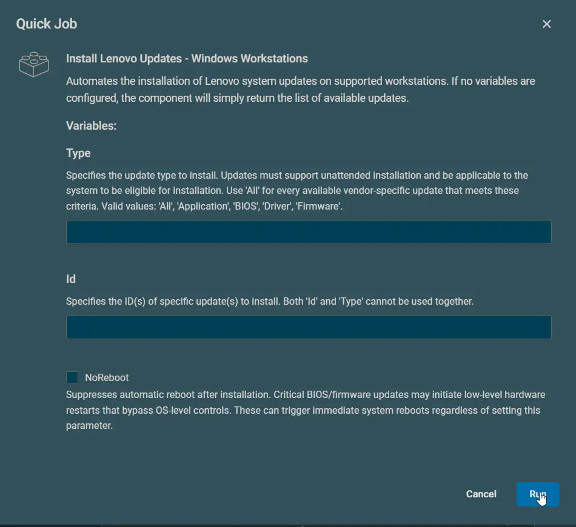
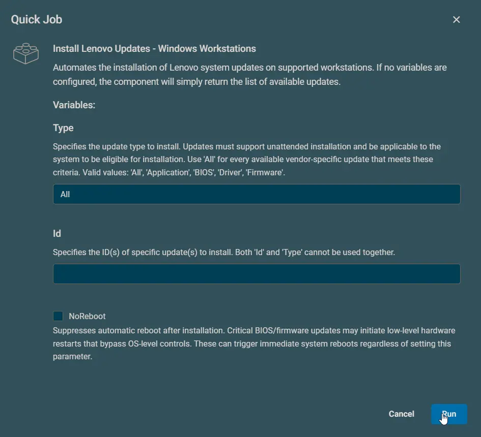
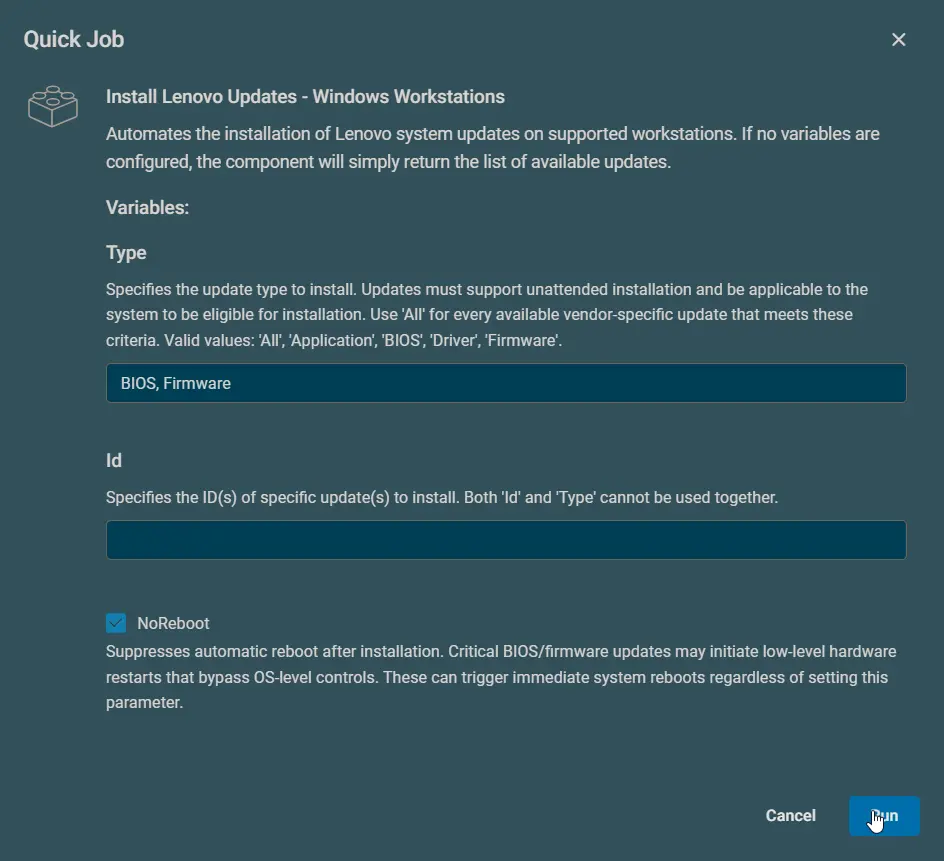
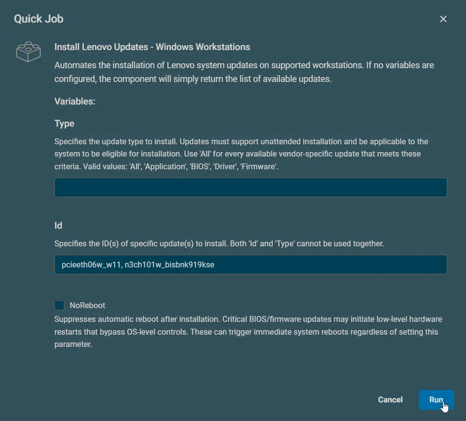
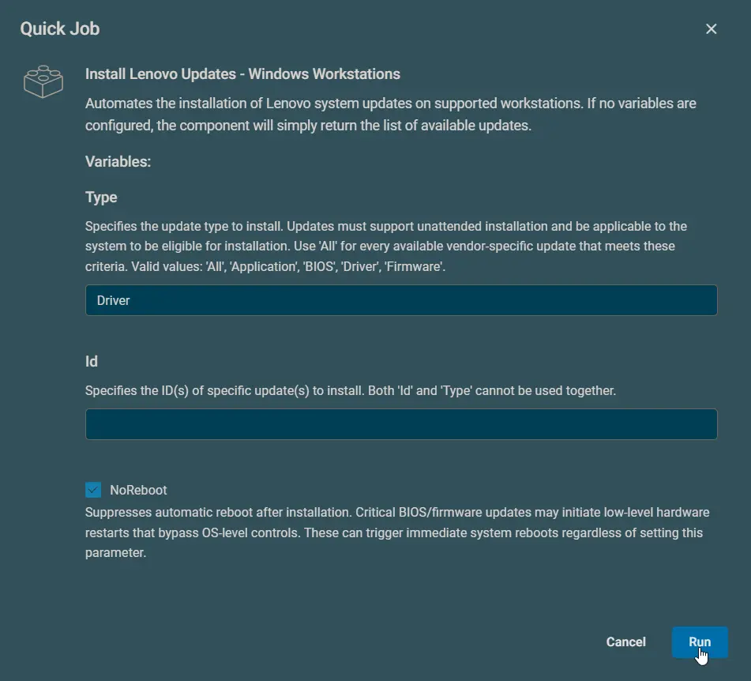

## Overview

Automates the installation of Lenovo system updates on supported workstations. If no variables are configured, the component will simply return the list of available updates.

### Important Notes

- **Forceful reboots**: BIOS/firmware updates initiate hardware-level restarts that bypass `-NoReboot` parameter controls
- **Maintenance windows**: Schedule updates during planned downtime to avoid disruption
- **Power continuity**: Ensure uninterrupted power supply during firmware updates
- **Unattended requirement**: Type-based installations only process updates supporting silent installation
- **ID exceptions**: Updates installed by ID ignore unattended installation requirements

## Dependencies

[Install-LenovoUpdates](/docs/3640e534-d089-4304-89ba-68d3bc113978)

## Implementation  

1. Download the component `[Install Lenovo Updates - Windows Workstations](../../../static/attachments/install-lenovo-updates-windows-workstations.cpt)` from the attachments.

2. After downloading the attached file, click on the `Import` button
3. Select the component just downloaded and add it to the Datto RMM interface.  
  

## Sample Run

### Example 1

**Discovers and lists all available updates without installation.**  

### Example 2

**Installs all available updates that support unattended installation and are applicable to the system. Automatically reboots if required.**  

### Example 3

**Installs available BIOS and Firmware updates that support unattended installation and are applicable to the system. Suppresses automatic reboot (manual reboot required if pending).**  

### Example 4

**Installs specific updates by their IDs regardless of unattended support status. Automatically reboots if required.**  

### Example 5

**Attempts to install only driver updates that support unattended installation. Suppresses automatic reboot (manual reboot required if pending).**  

## Datto Variables

| Variable Name | Example | Type | Default | Description |
| ------------- | ------- | ---- | ------- | ----------- |
| Type | <ul><li>All</li><li>'Application', 'BIOS', 'Driver'</li><li>'Firmware', 'BIOS'</li><li>Driver</li><li>Firmware</li><li>BIOS</li></ul> | String | | Specifies the update type to install. Updates must support unattended installation and be applicable to the system to be eligible for installation. Use 'All' for every available vendor-specific update that meets these criteria. Valid values: 'All', 'Application', 'BIOS', 'Driver', 'Firmware'. | 
| Id | <ul><li>pcieeth06w_w11</li><li>'pcieeth06w_w11', 'n3ch101w_bisbnk919kse' | String | | Specifies the ID(s) of specific update(s) to install. Both 'Id' and 'Type' cannot be used together. |
| NoReboot | | Boolean | False | Suppresses automatic reboot after installation. Critical BIOS/firmware updates may initiate low-level hardware restarts that bypass OS-level controls. These can trigger immediate system reboots regardless of setting this parameter. |

## Output

stdOut & stdError

## Attachments

[Install Lenovo Updates - Windows Workstations](../../../static/attachments/install-lenovo-updates-windows-workstations.cpt)
