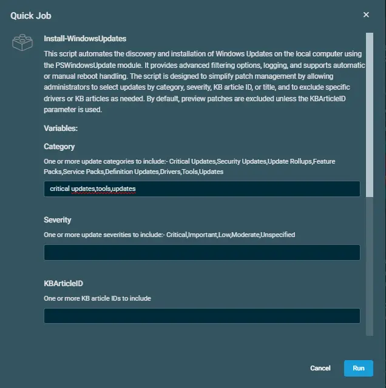
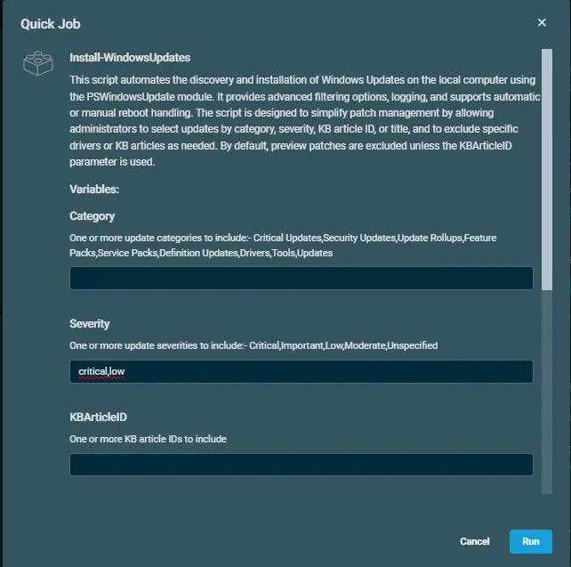
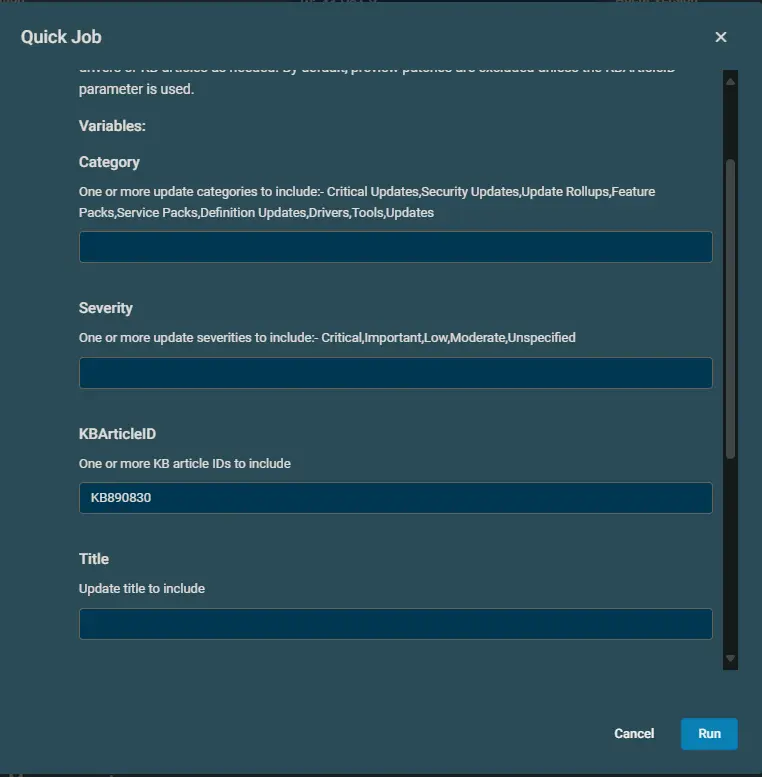
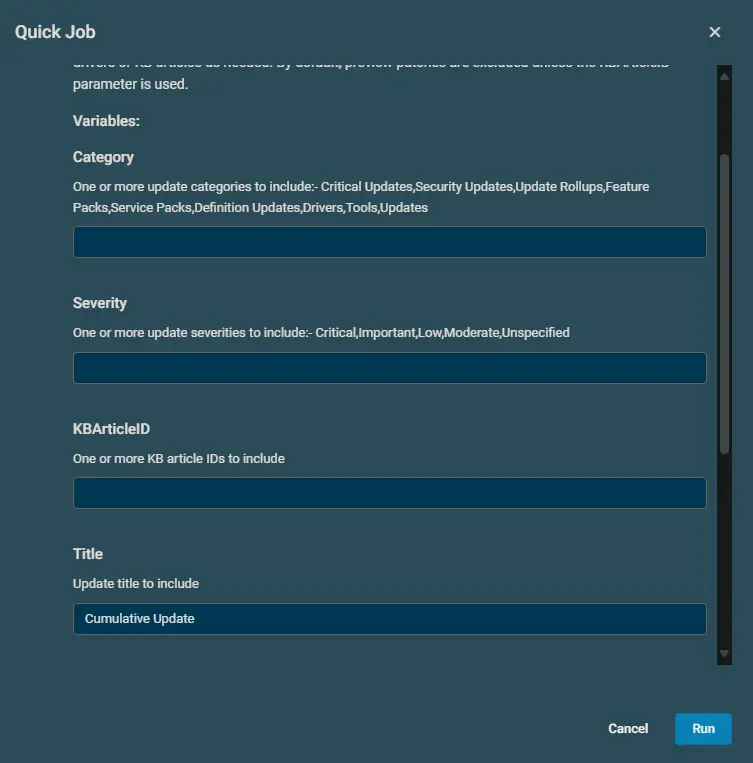

## Overview

This script automates the discovery and installation of Windows Updates on the local computer using the PSWindowsUpdate module. It provides advanced filtering options, logging, and supports automatic or manual reboot handling. The script is designed to simplify patch management by allowing administrators to select updates by category, severity, KB article ID, or title, and to exclude specific drivers or KB articles as needed. By default, preview patches are excluded unless the KBArticleID parameter is used. It is Datto RMM implementation of the agnostic script [Install-WindowsUpdates](/docs/3ccc8542-1961-4d3f-a54b-4a1bb9a78edd)

## Sample Run

### Example 1

Installing patches for multiple categories

### Example 2

Installing patches for multiple severites

### Example 3

Installing with KBArticleID

### Example 4

Installing with Title

## Implementation

Import the [attached component](../../../static/attachments/Install-WindowsUpdates.cpt) into Datto RMM.

## Dependencies

[Install-WindowsUpdates](/docs/3ccc8542-1961-4d3f-a54b-4a1bb9a78edd)

## Usage

In the Datto RMM script component “Install-WindowsUpdates,” we have defined a total of seven variables to customize the Windows update process. The core logic is structured to accept only one primary filter at a time— Category or Severity etc. If both fields or more than one fields are populated simultaneously, the script will throw an error, as updates should be filtered based on a single selection criterion to maintain consistency and avoid ambiguity.

If no values are entered for any of the variables, the script defaults to performing a full update scan on the machine and proceeds to install all available Windows updates. The reboot behavior is managed independently by the -AllowReboot variable, which is set to False by default—meaning the system will not reboot automatically unless this setting is explicitly changed.

Additionally, the script provides flexibility to exclude specific KBs by using the ExcludeKBArticleID variable. This is helpful when certain KB patches are known to cause issues and should not be installed. Similarly, the ExcludeDrivers variable allows you to skip driver-related updates from being installed, giving you more control over what gets pushed to endpoints.

## Datto Variables

| Variable Name | Type | Default | Description |
| ------------- | ---- | ------- | ----------- |
| Category | String | | One or more update categories to include:- Critical Updates,Security Updates,Update Rollups,Feature Packs,Service Packs,Definition Updates,Drivers,Tools,Updates |
| Severity | String | | One or more update severities to include:- Critical,Important,Low,Moderate,Unspecified |
| KBArticleID | String | | One or more KB article IDs to include |
| Title | String |  | Update title to include |
| ExcludeDrivers | Selection | False | Excludes updates in the 'Drivers' category |
| ExcludeKBArticleID | String | | One or more KB article IDs to exclude from installation |
| AllowReboot | Selection | False | Allows the computer to reboot automatically if required after updates |

## Output

- stdOut
- stdError

## Attachments

[Install-WindowsUpdates](../../../static/attachments/Install-WindowsUpdates.cpt)
