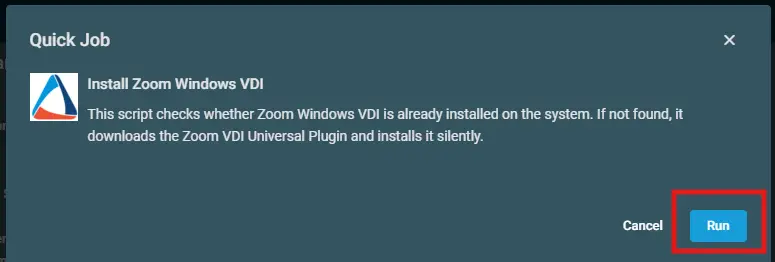

## Overview  

This script checks whether Zoom Windows VDI is already installed on the system. If not found, it downloads the Zoom VDI Universal Plugin and installs it silently.

## Implementation  

1. Download the component [Install Zoom Windows VDI](../../../static/attachments/Install%20Zoom%20Windows%20VDI.cpt) from the attachments.

2. After downloading the attached file, click on the `Import` button
3. Select the component just downloaded and add it to the Datto RMM interface.  
  

## Sample Run

To execute the `component` over a specific machine, follow these steps:  

1. Select the machine you want to run the `component` on from the Datto RMM.  

2. Click on the `Quick Job` button.  
  

3. Search the component `Install Zoom Windows VDI` and click on `Select`
 

4. After selecting the compoment you'll receive a popup.
5. Click on `Run` to execute it.  

## Output  
A job status of `Success` is expected.  
- `Activity Log`  

- `StdErr`  
 StdErr is not expected.

## Attachments  

[Install Zoom Windows VDI](../../../static/attachments/Install%20Zoom%20Windows%20VDI.cpt)