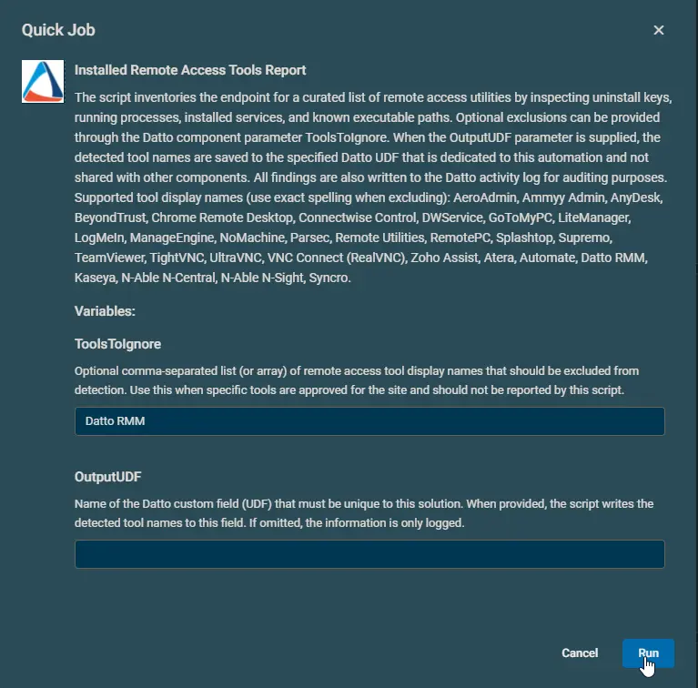
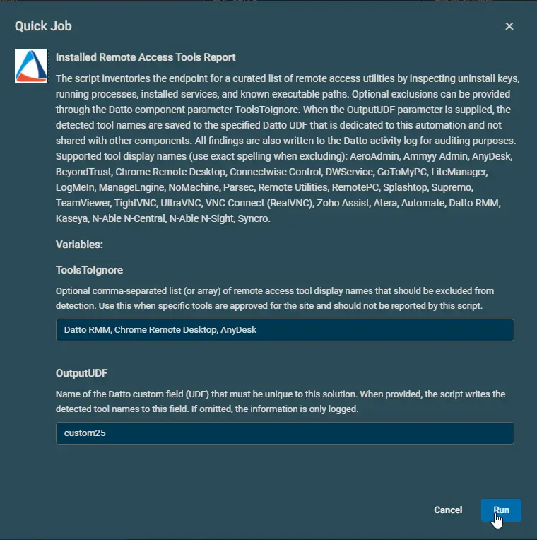

## Overview

The script inventories the endpoint for a curated list of remote access utilities by inspecting uninstall keys, running processes, installed services, and known executable paths. Optional exclusions can be provided through the Datto component parameter ToolsToIgnore. When the OutputUDF parameter is supplied, the detected tool names are saved to the specified Datto UDF that is dedicated to this automation and not shared with other components. All findings are also written to the Datto activity log for auditing purposes.

Supported tool display names (use exact spelling when excluding): 

- `AeroAdmin`
- `Ammyy Admin`
- `AnyDesk`
- `BeyondTrust`
- `Chrome Remote Desktop`
- `Connectwise Control`
- `DWService`
- `GoToMyPC`
- `LiteManager`
- `LogMeIn`
- `ManageEngine`
- `Ninja RMM`
- `NoMachine`
- `Parsec`
- `Remote Utilities`
- `RemotePC`
- `Splashtop`
- `Supremo`
- `TeamViewer`
- `TightVNC`
- `UltraVNC`
- `VNC Connect (RealVNC)`
- `Zoho Assist`
- `Atera`
- `Automate`
- `Datto RMM`
- `Kaseya`
- `N-Able N-Central`
- `N-Able N-Sight`
- `Syncro`

## Implementation  

1. Download the component [Installed Remote Access Tools Report](../../../static/attachments/installed-remote-access-tools-report.cpt) from the attachments.

2. After downloading the attached file, click on the `Import` button
3. Select the component just downloaded and add it to the Datto RMM interface.  
  

## Sample Run

To execute the `component` over a specific machine, follow these steps:  

1. Select the machine you want to run the `component` on from the Datto RMM.  

2. Click on the `Quick Job` button.  
  

3. Search the component `Installed Remote Access Tools Report` and click on `Select`
 

4.
    - Example 1: Fetching the information of all installed remote access tools except 'Datto RMM'. Data will not be stored to UDF.  
    

    - Example 2: Fetching the information of all installed remote access tools except 'Datto RMM', 'Chrome Remote Desktop', and 'AnyDesk'. Detected names will be stored the User Data Field 25.  
    

## Datto Variables

| Variable Name | Example | Type | Default | Mandatory | Description |
| ------------- | ------- | ---- | ------- | --------- | ----------- |
| ToolsToIgnore | <ul><li>`Datto RMM, Chrome Remote Desktop, AnyDesk`</li><li>`Datto RMM`</li></ul> | String | `Datto RMM` | False | Optional comma-separated list (or array) of remote access tool display names that should be excluded from detection. Use this when specific tools are approved for the site and should not be reported by this script. |
| OutputUDF | `custom25` | String | | False | Name of the Datto custom field (UDF) that must be unique to this solution. When provided, the script writes the detected tool names to this field. If omitted, the information is only logged. |

## Output

- UDF
  

- StdOut

    ```PlainText
    Installed Remote Access Tools Report
    Detected 3 remote access tool(s). Full details:


    Name              : Connectwise Control
    Installed         : Yes
    CurrentlyRunning  : Yes
    HasRunningService : Yes
    UninstallString   : 
    ExePath           : 

    Name              : Automate
    Installed         : Yes
    CurrentlyRunning  : No
    HasRunningService : No
    UninstallString   : 
    ExePath           : C:\Windows\LTSvc\LTSvc.exe

    Name              : Kaseya
    Installed         : Yes
    CurrentlyRunning  : Yes
    HasRunningService : Yes
    UninstallString   : "C:\Program Files (x86)\Kaseya\XXXXXXXXXXXXXXXXXXXX\KASetup.exe" /r /g XXXXXXXXXXXXXXXXXXXX /l 
                        "%TEMP%\kasetup.log"
    ExePath           : 


    custom25     : Connectwise Control, Automate, Kaseya
    PSPath       : Microsoft.PowerShell.Core\Registry::HKEY_LOCAL_MACHINE\SOFTWARE\CentraStage
    PSParentPath : Microsoft.PowerShell.Core\Registry::HKEY_LOCAL_MACHINE\SOFTWARE
    PSChildName  : CentraStage
    PSDrive      : HKLM
    PSProvider   : Microsoft.PowerShell.Core\Registry

    Recorded the active remote access tool list in Datto UDF 'custom25'.
    ```

- StdErr

## Attachments

[Installed Remote Access Tools Report](../../../static/attachments/installed-remote-access-tools-report.cpt)
