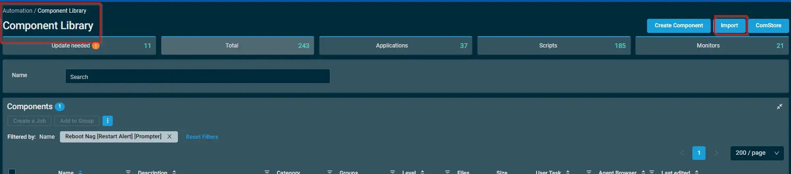
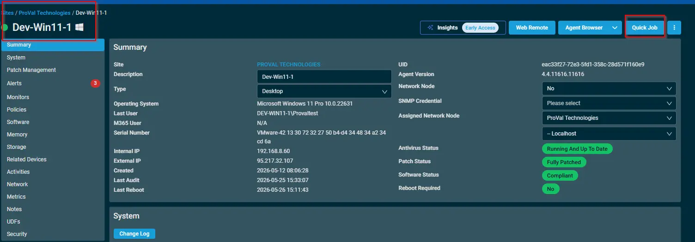
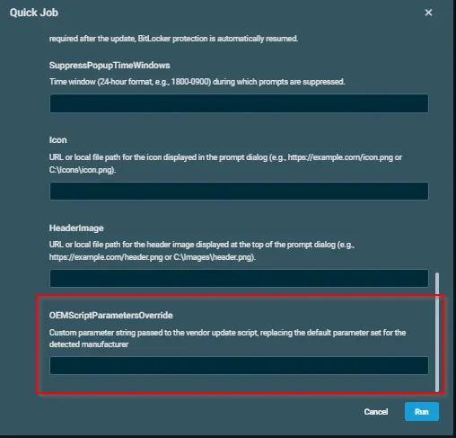
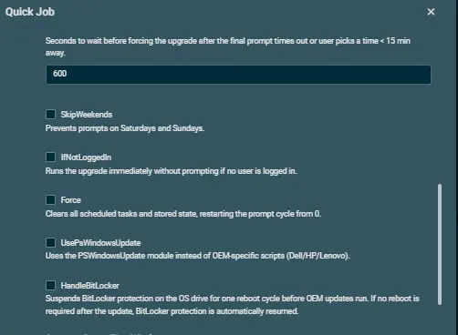
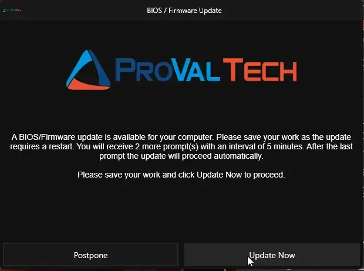
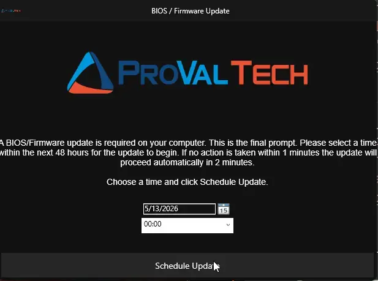
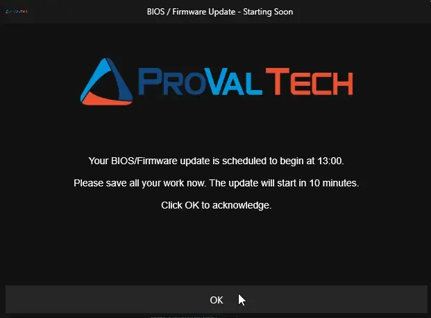
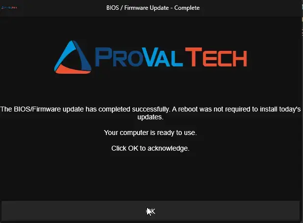

## Overview

Manages prompting end users before OEM BIOS and Firmware upgrades on Windows 10/11 devices. Solves the problem of unattended BIOS/Firmware updates that restart a device without warning, causing data loss and user frustration. The script gives users the ability to postpone the upgrade up to a configurable number of times, then forces the upgrade after all postponements are exhausted.

Designed for RMM platforms (ConnectWise, NinjaRMM, Datto, etc.) that run scripts as SYSTEM. The RMM only needs to deploy and execute the script once; subsequent prompt cycles are handled automatically via self-rescheduling Windows Scheduled Tasks.

Prompt messages and button labels are automatically displayed in Dutch when the logged-in user's Windows display language is set to `nl-NL` or `nl-BE`. All other languages default to English.

## Dependencies

 - [Agnostic Script - Invoke-OEMUpdateWithPrompt](/docs/52c50165-38d5-4793-b751-97260ab31f72)

## Implementation  

1. Download the component `OEM Update With Prompt` from the attachments.

2. After downloading the attached file, click on the `Import` button
3. Select the component just downloaded and add it to the Datto RMM interface.  

      

## Sample Run

To execute the `OEM Update With Prompt` over a specific machine, follow these steps:  

1. Select the machine you want to run the `OEM Update With Prompt` on from the Datto RMM.  

2. Click on the `Quick Job` button.  

      

3. Search the component `OEM Update With Prompt` and click on `Select`

    

## Examples

`**Scenario 1: Runtime Override for OEM Script Parameters**`

Custom parameter string passed to the vendor update script, replacing the default parameter set for the detected manufacturer.

  

  - Example: -Category @('Drivers','Tools') -Description '(?i).*BIOS.*|.*Firmware.*|.*UEFI.*' -AllowReboot for PSWindowsUpdate

  - Example:'/applyUpdates -updateType=bios -silent'

`**Scenario 2: Runtime Override for UsePsWindowsUpdate**`

Run with user parameter UsePsWindowsUpdate = True.

Expected output:

- UsePsWindowsUpdate is enabled for this run even if the default is False.
- Update execution path uses Install-WindowsUpdates flow.

`**Scenario 3: Runtime Override for IfNotLoggedIn**`

Run with user parameter IfNotLoggedIn = True.

Expected output:

If no user session is active, update starts without prompting.
If a user is logged in, normal prompt workflow continues.

`**Scenario 4: Runtime Override for HandleBitLocker**`

Run with user parameter HandleBitLocker = True.

Expected output:

- BitLocker is suspended before update execution for one reboot cycle.
- If no reboot is needed, BitLocker is resumed at completion.

`**Scenario 5: Force Restart of Prompt Cycle**`

Run with user parameter Force = True.

Expected output:

- Existing OEM prompt scheduled tasks are removed.
- Stored prompt state is reset.
- Prompt workflow starts again from the beginning.

`**Scenario 6: Skip Weenends**`

Run with user parameter Skip Weekends = True.

Expected output:

- There will be no popup get generated on the users machine during weekend.
- Will is usefull as user will not miss any popup during weekends.

 

## Sample Prompts

- The First prompt that will get generated on the user machine.
  

- This prompt is shown while the update needs to be schedule on particular time.
  

- The prompt shows the confirmation that update is scheduled and will start on the particular time and need aknowledgement.
  

- The prompt shows the confirmation that update has been completed and reboot is required.
  

## Datto Variables

| Variable Name | Default | Type | Description |
| --- | --- | --- | --- |
| `MaxPostpone` | `5` | String | Maximum number of times the upgrade can be postponed before the final prompt is shown. Total prompts = MaxPostpone + 1 (final). |
| `IntervalMinutes` | `240` | String | Minutes between each prompt. After postpone or miss, a SYSTEM scheduled task re-runs the script at this interval. |
| `RegularPromptTimeout` | `600` | String | Seconds before a regular prompt auto-closes and counts as missed. |
| `FinalPromptTimeout` | `900` | String | Seconds before the final prompt times out and the upgrade is forced. |
| `DelayAfterFinalPrompt` | `600` | String | Seconds to wait before forcing the upgrade after the final prompt times out or user picks a time < 15 min away. |
| `SkipWeekends` | `False` | Boolean | Prevents prompts on Saturdays and Sundays. |
| `IfNotLoggedIn` | `False` | Boolean | Runs the upgrade immediately without prompting if no user is logged in. |
| `Force` | `False` | Boolean | Clears all scheduled tasks and stored state, restarting the prompt cycle from 0. |
| `UsePsWindowsUpdate` | `False` | Boolean | Uses the PSWindowsUpdate module instead of OEM-specific scripts (Dell/HP/Lenovo). |
| `HandleBitLocker` | `False` | Boolean | Suspends BitLocker protection on the OS drive for one reboot cycle before OEM updates run. If no reboot is required after the update, BitLocker protection is automatically resumed. |
| `SuppressPopupTimeWindows` |  | String | Time window (24-hour format, e.g., `1800-0900`) during which prompts are suppressed. |
| `Icon` |  | String | URL or local file path for the icon displayed in the prompt dialog (e.g., `https://example.com/icon.png` or `C:\Icons\icon.png`). |
| `HeaderImage` |  | String | URL or local file path for the header image displayed at the top of the prompt dialog (e.g., `https://example.com/header.png` or `C:\Images\header.png`). |
| `OEMScriptParametersOverride` |  | String | Custom parameter string passed to the vendor update script, replacing the default parameter set for the detected manufacturer (e.g., `'/applyUpdates -updateType=bios -silent'` for Dell DCU or `-Category 'Drivers','Tools' -AllowReboot` for PSWindowsUpdate). |

## Output

Activity Log

## Attachments  

[OEM Update With Prompt](../../../static/attachments/oem%20update%20with%20prompt.cpt)

## Changelog
 
### 2026-05-29
 
- Initial version of the document
