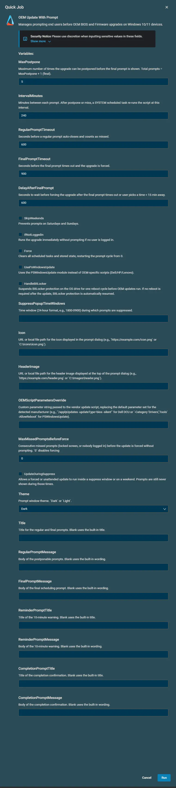
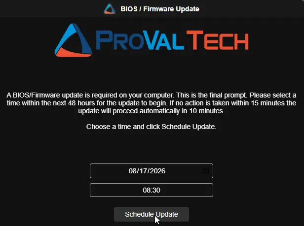
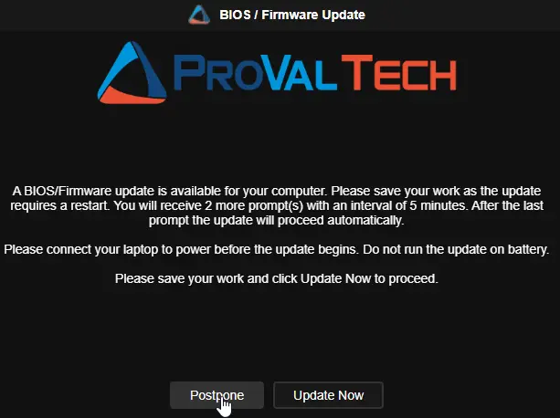
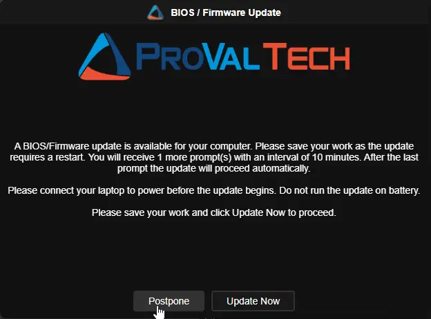
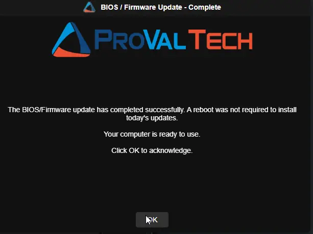
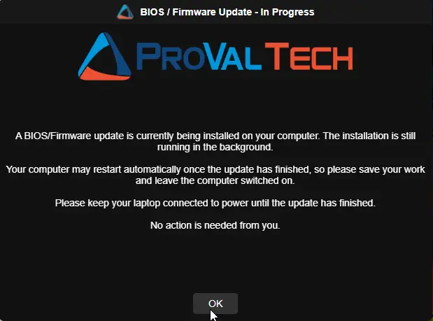
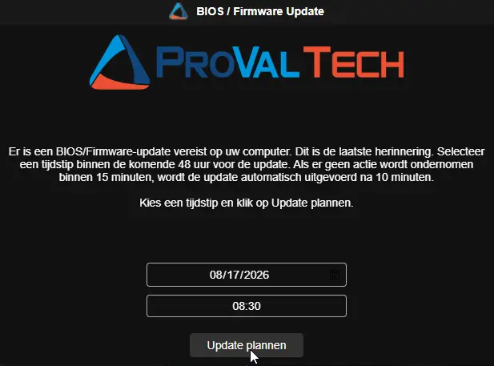
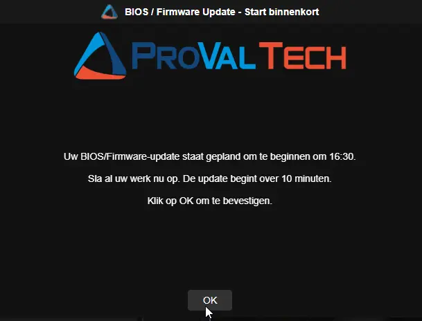
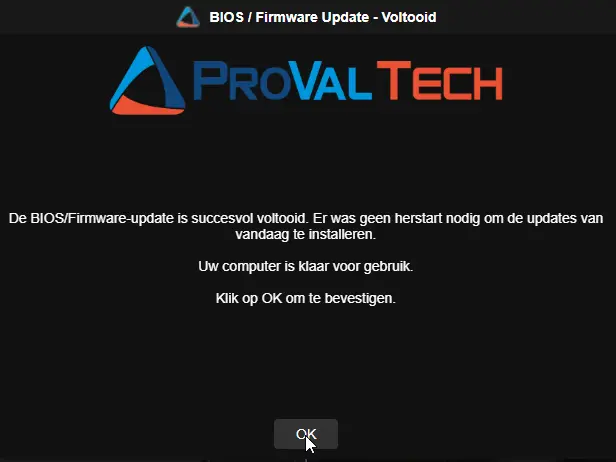
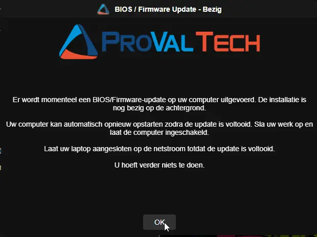

## Overview

This is a Datto implementation of the agnostic [Invoke-OEMUpdateWithPrompt](/docs/52c50165-38d5-4793-b751-97260ab31f72)

The script prompts logged-in users before BIOS and firmware updates, allows postponement for a configured number of cycles, and then enforces the update. It is designed for a single deployment from Datto RMM, then continues through scheduled task re-runs on the endpoint.

While the update installs, an optional on-screen notification keeps the user informed — either repeated at an interval or kept on screen for the whole update. Prompts can also carry your own branding through the `Icon` and `HeaderImage` variables, which accept a web URL, local path, or UNC share and are staged locally by the script before use.

## Dependencies

- [Invoke-OEMUpdateWithPrompt](/docs/52c50165-38d5-4793-b751-97260ab31f72)

## Implementation

1. Download the component [OEM Update With Prompt](https://github.com/ProVal-Tech/datto-rmm/blob/main/components/oem-update-with-prompt.cpt) from the attachments.  
2. After downloading the attached file, click on the `Import` button.  
3. Select the component just downloaded and add it to the Datto RMM interface.  


## Sample Run



## Examples

### Scenario 1: OEMScriptParametersOverride

Custom parameter string passed to the vendor update script, replacing the default parameter set for the detected manufacturer.

- For PSWindowsUpdate, set `OEMScriptParametersOverride` = `-Category 'Drivers' -Description '(?i)(BIOS|Firmware|UEFI)' -AllowReboot`
- For Dell DCU, set `OEMScriptParametersOverride` = `/applyUpdates -updateType=bios -silent`

### Scenario 2: UsePsWindowsUpdate

Run with user parameter `UsePsWindowsUpdate = True`.

Expected output:

- Update execution path uses Install-WindowsUpdates flow.
- This runs Windows update instead of vendor-specific updates

### Scenario 3: IfNotLoggedIn

Run with user parameter `IfNotLoggedIn = True`.

Expected output:

- If no user session is active, update starts without prompting.
- If a user is logged in, normal prompt workflow continues.

### Scenario 4: HandleBitLocker

Run with user parameter `HandleBitLocker = True`.

Expected output:

- BitLocker is suspended before update execution for one reboot cycle.
- If no reboot is needed, BitLocker is resumed at completion.

### Scenario 5: Force

Run with user parameter `Force = True`.

Expected output:

- Existing OEM prompt scheduled tasks are removed.
- Stored prompt state is reset.
- Prompt workflow starts again from the beginning.

### Scenario 6: SkipWeekends

Run with user parameter `SkipWeekends = True`.

Expected output:

- No popup is generated on the user's machine during weekends.
- This is useful because the user will not miss any popup during weekends.

### Scenario 7: ShowProgressPrompt (Interval Mode)

Run with user parameters `ShowProgressPrompt = True`, `ProgressPromptInterval = 10`, `ProgressPromptTimeout = 300`.

Expected output:

- While the update installs, a notice appears on the user's desktop for 5 minutes every 10 minutes.
- The notice closes itself and repeats at the next interval until the update finishes.
- The notice only appears while a user is logged in and the machine is unlocked; on a locked or logged-off machine the interval simply passes without a notification.

### Scenario 8: KeepProgressPromptVisible (Stay Mode)

Run with user parameter `KeepProgressPromptVisible = True`.

Expected output:

- The notice appears as soon as the update starts and stays on the desktop for the whole update.
- Clicking its OK button only hides it until the next check brings it back.
- `ShowProgressPrompt` is not needed, because `KeepProgressPromptVisible` implies it. When both are set, stay mode wins and the interval settings are ignored.

### Scenario 9: PromptDisplayRetryCount

Run with user parameters `PromptDisplayRetryCount = 2`, `PromptDisplayRetryDelay = 60`.

Expected output:

- A prompt that fails to display is retried up to two extra times, a minute apart.
- A failed attempt does not consume one of the user's postponements; a prompt the user simply ignored is handled as missed rather than retried.
- If every attempt fails, the script cleans up its tasks and reschedules itself for the next interval, preserving all prompt state.

### Scenario 10: Icon and HeaderImage

Run with user parameters `Icon = https://example.com/icon.png` and `HeaderImage = \\fileserver\share\header.png`.

Expected output:

- Both values are passed through unchanged; the script stages verified local copies in its prompt working directory and runs every prompt with those local paths.
- The logged-in user never needs access to the original sources, and a failed refresh keeps the last good copy.

## While the Update Runs

Firmware installs can take a long time with nothing visible on screen. Two optional modes keep the user informed; both are off by default:

- **Interval mode (`ShowProgressPrompt = True`):** every `ProgressPromptInterval` minutes a notice appears for `ProgressPromptTimeout` seconds, closes itself, and repeats until the update finishes. Set `ProgressPromptInterval` to `0` to turn the interval notices off.
- **Stay mode (`KeepProgressPromptVisible = True`):** the notice appears as soon as the update starts and stays on screen until the update finishes. Clicking its OK button only hides it until the next check brings it back — intentional, so nobody power-cycles a machine they think is stuck.

Stay mode wins when both are configured, and `KeepProgressPromptVisible` implies `ShowProgressPrompt`, so the two never need to be enabled together. The notice only appears while a user is logged in and the machine is unlocked, and it is closed and cleaned up as soon as the update finishes. A reboot triggered by the update closes it too, and the leftover task is removed on the next run.

## Prompt Display Retry

A prompt that fails to display — the scheduled task never reached the prompt application, or its output matched no known button caption — is retried up to `PromptDisplayRetryCount` extra times, `PromptDisplayRetryDelay` seconds apart. A failed attempt never consumes one of the user's postponements, and a prompt the user simply ignored is still handled as a missed prompt rather than retried. When every attempt fails, the script cleans up its tasks and reschedules itself for the next interval, preserving all prompt state so the cycle resumes where it left off instead of starting over.

## Customize the Prompt Text

Leave the message variables empty and users see the built-in wording in their own language (English or Dutch). Enter your own text and it is used instead, exactly as written.

Titles and messages both have Datto variables, so no change to the component is needed to reword a prompt.

### Default messages

These are the messages users see when the text parameters are left empty. Wording follows the display language of the logged-in user.

Names such as `PromptsLeft`, `ScheduledUpdateTime`, and `UpdateElapsedMinutes` are replaced with live values before the prompt appears. `\n` produces a line break.

#### Titles

| Parameter | English | Dutch |
| --- | --- | --- |
| `Title` | BIOS / Firmware Update | BIOS / Firmware Update |
| `ReminderPromptTitle` | BIOS / Firmware Update - Starting Soon | BIOS / Firmware Update - Start binnenkort |
| `CompletionPromptTitle` | BIOS / Firmware Update - Complete | BIOS / Firmware Update - Voltooid |
| `ProgressPromptTitle` | BIOS / Firmware Update - In Progress | BIOS / Firmware Update - Bezig |

#### Messages

**Regular prompt** — `RegularPromptMessage`

*English*

```text
A BIOS/Firmware update is available for your computer. Please save your work as the update requires a restart. You will receive PromptsLeft more prompt(s) with an interval of PromptIntervalMinutes minutes. After the last prompt the update will proceed automatically.\n\nPlease save your work and click Update Now to proceed.
```

*Dutch*

```text
Er is een BIOS/Firmware-update beschikbaar voor uw computer. Sla uw werk op, want de update vereist een herstart. U ontvangt nog PromptsLeft herinnering(en) met een interval van PromptIntervalMinutes minuten. Na de laatste herinnering wordt de update automatisch uitgevoerd.\n\nSla uw werk op en klik op Nu bijwerken om door te gaan.
```

**Final prompt** — `FinalPromptMessage`

*English*

```text
A BIOS/Firmware update is required on your computer. This is the final prompt. Please select a time within the next 48 hours for the update to begin. If no action is taken within FinalTimeoutMinutes minutes the update will proceed automatically in DelayAfterFinalMinutes minutes.\n\nChoose a time and click Schedule Update.
```

*Dutch*

```text
Er is een BIOS/Firmware-update vereist op uw computer. Dit is de laatste herinnering. Selecteer een tijdstip binnen de komende 48 uur voor de update. Als er geen actie wordt ondernomen binnen FinalTimeoutMinutes minuten, wordt de update automatisch uitgevoerd na DelayAfterFinalMinutes minuten.\n\nKies een tijdstip en klik op Update plannen.
```

**Reminder prompt** — `ReminderPromptMessage`

*English*

```text
Your BIOS/Firmware update is scheduled to begin at ScheduledUpdateTime.\n\nPlease save all your work now. The update will start in MinutesUntilUpdate minute(s).\n\nClick OK to acknowledge.
```

*Dutch*

```text
Uw BIOS/Firmware-update staat gepland om te beginnen om ScheduledUpdateTime.\n\nSla al uw werk nu op. De update begint over MinutesUntilUpdate minuten.\n\nKlik op OK om te bevestigen.
```

**Completion prompt** — `CompletionPromptMessage`

*English*

```text
The BIOS/Firmware update has completed successfully. A reboot was not required to install today's updates.\n\nYour computer is ready to use.\n\nClick OK to acknowledge.
```

*Dutch*

```text
De BIOS/Firmware-update is succesvol voltooid. Er was geen herstart nodig om de updates van vandaag te installeren.\n\nUw computer is klaar voor gebruik.\n\nKlik op OK om te bevestigen.
```

**In-progress notice** — `ProgressPromptMessage`

*English*

```text
A BIOS/Firmware update is currently being installed on your computer. The installation is still running in the background.\n\nYour computer may restart automatically once the update has finished, so please save your work and leave the computer switched on.\n\nNo action is needed from you.
```

*Dutch*

```text
Er wordt momenteel een BIOS/Firmware-update op uw computer uitgevoerd. De installatie is nog bezig op de achtergrond.\n\nUw computer kan automatisch opnieuw opstarten zodra de update is voltooid. Sla uw werk op en laat de computer ingeschakeld.\n\nU hoeft verder niets te doen.
```

#### Extra line on laptops

On laptops, notebooks, and tablets the following line is added before the closing sentence of these four prompts. Desktops do not see it.

| Prompt | English | Dutch |
| --- | --- | --- |
| Regular prompt | Please connect your laptop to power before the update begins. Do not run the update on battery. | Sluit uw laptop aan op de netstroom voordat de update begint. Voer de update niet uit op accustroom. |
| Final prompt | Please make sure your laptop is connected to power at the time you select. | Zorg ervoor dat uw laptop op het gekozen tijdstip op de netstroom is aangesloten. |
| Reminder prompt | Please make sure your laptop is connected to power now. | Zorg ervoor dat uw laptop nu op de netstroom is aangesloten. |
| In-progress notice | Please keep your laptop connected to power until the update has finished. | Laat uw laptop aangesloten op de netstroom totdat de update is voltooid. |

### Insert live values

Type any of these names into your message as a plain word. The real value is filled in before the prompt appears.

| Name | Shows |
| --- | --- |
| `PromptsToSend` | Total prompts the user will receive |
| `PromptsSent` | Prompts shown so far, including this one |
| `PromptsLeft` | Prompts still to come after this one |
| `PromptIntervalMinutes` / `PromptIntervalHours` | Time between prompts |
| `RegularTimeoutSeconds` / `RegularTimeoutMinutes` | Regular prompt timeout |
| `FinalTimeoutSeconds` / `FinalTimeoutMinutes` | Final prompt timeout |
| `DelayAfterFinalSeconds` / `DelayAfterFinalMinutes` | Grace period after the final prompt |
| `ScheduledUpdateTime` | Time the user picked (reminder prompt only) |
| `MinutesUntilUpdate` | Minutes until the update starts (reminder prompt only) |
| `ProgressIntervalMinutes` | Minutes between in-progress notices |
| `ProgressTimeoutSeconds` / `ProgressTimeoutMinutes` | How long each in-progress notice stays on screen |
| `UpdateElapsedMinutes` | Minutes the update has been running (in-progress notice only) |
| `ComputerName` | Machine name |
| `UserName` | Logged-in username |

Use `\n` for a line break.

**Example:**

```text
A firmware update is pending on ComputerName. You have PromptsLeft reminder(s) left, one every PromptIntervalHours hour(s).\n\nSave your work and click Update Now.
```

**Example with the in-progress notice:**

```text
IT is updating the firmware on ComputerName. This has been running for UpdateElapsedMinutes minute(s).\n\nPlease leave the machine switched on.
```

### Things to know

* These names are reserved words. If a message needs the literal word `ComputerName`, reword it.
* Button labels always follow the user's language and cannot be changed.
* The in-progress notice always carries an OK button. In stay mode, clicking it only hides the notice until the next check brings it back.
* Custom text is not translated and does not receive the automatic connect-to-power line shown on laptops. Include that wording yourself if your fleet has laptops.

### Sample Prompts - English

**Desktops:**

  
  
  

**Laptops:**

  
  
  


### Completion Acknowledgement Prompt (No Reboot Pending) - English

  

### Update In Progress Notification - English

  

### Sample Prompts - Dutch

  
  
  

#### Completion Acknowledgement Prompt (No Reboot Pending) - Dutch

  

#### Update In Progress Notification - Dutch

  

## Datto Variables

| Variable Name | Default | Type | Description |
| --- | --- | --- | --- |
| `MaxPostpone` | `5` | String | Maximum number of times the upgrade can be postponed before the final prompt is shown. Total prompts = MaxPostpone + 1 (final). |
| `IntervalMinutes` | `240` | String | Minutes between each prompt. After postpone or miss, a SYSTEM scheduled task re-runs the script at this interval. |
| `RegularPromptTimeout` | `600` | String | Seconds before a regular prompt auto-closes and counts as missed. |
| `FinalPromptTimeout` | `900` | String | Seconds before the final prompt times out and the upgrade is forced. |
| `DelayAfterFinalPrompt` | `600` | String | Seconds to wait before forcing the upgrade after the final prompt times out without a user selection. |
| `PromptDisplayRetryCount` | `1` | String | Extra attempts to display a prompt when it fails to appear or returns unreadable output. `0` gives each prompt a single attempt. A failed attempt never consumes a postponement. |
| `PromptDisplayRetryDelay` | `30` | String | Seconds to wait between prompt display attempts, giving a transient condition a chance to clear. |
| `SkipWeekends` | `False` | Boolean | Prevents prompts on Saturdays and Sundays. |
| `IfNotLoggedIn` | `False` | Boolean | Runs the upgrade immediately without prompting if no user is logged in. |
| `Force` | `False` | Boolean | Clears all scheduled tasks and stored state, restarting the prompt cycle from 0. |
| `UsePsWindowsUpdate` | `False` | Boolean | Uses the PSWindowsUpdate module instead of OEM-specific scripts (Dell/HP/Lenovo). |
| `HandleBitLocker` | `False` | Boolean | Suspends BitLocker protection on the OS drive for one reboot cycle before OEM updates run. If no reboot is required after the update, BitLocker protection is automatically resumed. |
| `SuppressPopupTimeWindows` |  | String | Time window (24-hour format, e.g., `1800-0900`) during which prompts are suppressed. |
| `Icon` |  | String | URL, local path, or UNC share path for the icon displayed in the prompt dialog (e.g., `https://example.com/icon.png` or `\\server\share\icon.png`). Passed through unchanged; the script stages a verified local copy and runs every prompt with that path. |
| `HeaderImage` |  | String | URL, local path, or UNC share path for the header image displayed at the top of the prompt dialog. Passed through unchanged and staged locally in the same way as `Icon`. |
| `OEMScriptParametersOverride` |  | String | Custom parameter string passed to the vendor update script, replacing the default parameter set for the detected manufacturer (e.g., `'/applyUpdates -updateType=bios -silent'` for Dell DCU or `-Category 'Drivers','Tools' -AllowReboot` for PSWindowsUpdate). |
| `MaxMissedPromptsBeforeForce` | `0` | String | Consecutive missed prompts (locked screen, or nobody logged in) before the update is forced without prompting. `0` disables forcing. |
| `UpdateDuringSuppress` | `False` | Boolean | Allows a forced or unattended update to run inside a suppress window or on a weekend. Prompts are still never shown during those times. |
| `ShowProgressPrompt` | `False` | Boolean | Shows a notice on the user's desktop while the update installs, repeating every `ProgressPromptInterval` minutes for `ProgressPromptTimeout` seconds. |
| `ProgressPromptInterval` | `10` | String | Minutes between in-progress notices. `0` turns the interval notices off. Ignored when `KeepProgressPromptVisible` is enabled. |
| `ProgressPromptTimeout` | `300` | String | Seconds each in-progress notice stays on screen before it closes on its own. Ignored when `KeepProgressPromptVisible` is enabled. |
| `KeepProgressPromptVisible` | `False` | Boolean | Keeps the in-progress notice on the desktop for the whole update and brings it back if dismissed. Overrides the interval settings and implies `ShowProgressPrompt`. |
| `Theme` | `Dark` | Selection | Prompt window theme. `Dark` or `Light`. |
| `Title` |  | String | Title for the regular and final prompts. Blank uses the built-in title. |
| `RegularPromptMessage` |  | String | Body of the postponable prompts. Blank uses the built-in wording. |
| `FinalPromptMessage` |  | String | Body of the final scheduling prompt. Blank uses the built-in wording. |
| `ReminderPromptTitle` |  | String | Title of the 10-minute warning. Blank uses the built-in title. |
| `ReminderPromptMessage` |  | String | Body of the 10-minute warning. Blank uses the built-in wording. |
| `CompletionPromptTitle` |  | String | Title of the completion confirmation. Blank uses the built-in title. |
| `CompletionPromptMessage` |  | String | Body of the completion confirmation. Blank uses the built-in wording. |
| `ProgressPromptTitle` |  | String | Title of the in-progress notice shown while the update installs. Blank uses the built-in title. |
| `ProgressPromptMessage` |  | String | Body of the in-progress notice. Blank uses the built-in wording. |

## Output

Activity Log

## Attachments  

- [OEM Update With Prompt](https://github.com/ProVal-Tech/datto-rmm/blob/main/components/oem-update-with-prompt.cpt)

## Changelog

### 2026-09-24

- Added the optional **update in progress notification**: new `ShowProgressPrompt`, `ProgressPromptInterval`, `ProgressPromptTimeout`, `KeepProgressPromptVisible`, `ProgressPromptTitle`, and `ProgressPromptMessage` variables keep the user informed while the update installs. Stay mode keeps the notice on screen for the whole update and wins when both modes are configured.
- Added `PromptDisplayRetryCount` and `PromptDisplayRetryDelay`. A prompt that fails to display is retried and never consumes a postponement; when every attempt fails, the script reschedules itself for the next interval with the stored prompt state untouched.
- `Icon` and `HeaderImage` now accept a web URL, local path, or UNC share and are passed through unchanged; the script stages verified local copies in its prompt working directory, so the component no longer pre-downloads image files.
- Picks up the agnostic script improvements for prompt task start detection and reschedule-on-failure. See the [agnostic script changelog](/docs/52c50165-38d5-4793-b751-97260ab31f72#changelog).

### 2026-09-14

- Every prompt title and message is now a Datto variable, so wording can be changed per job without editing the component.
- Added a `Theme` variable to switch the prompt window between dark and light.
- Added `MaxMissedPromptsBeforeForce` and `UpdateDuringSuppress` variables, which the component did not previously expose.
- Picks up the agnostic script fixes for missed prompts and prompt counting. See the [agnostic script changelog](/docs/52c50165-38d5-4793-b751-97260ab31f72#changelog).

### 2026-08-17

- Documentation

### 2026-06-01

- Initial version of the document
