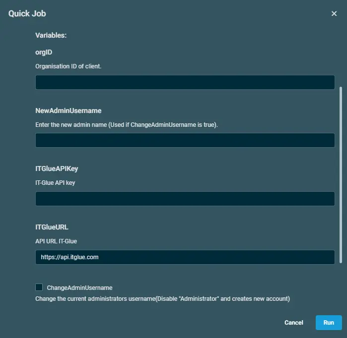
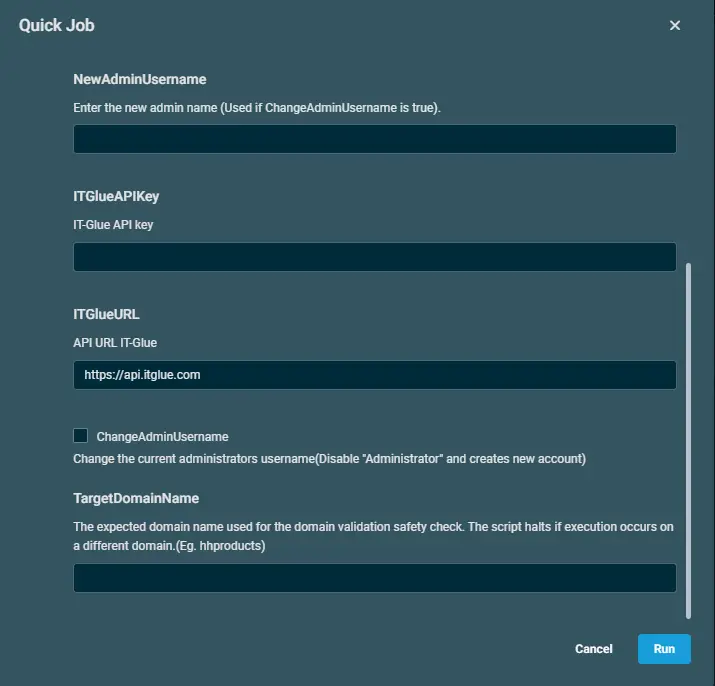

## Overview  
This automated script rotates or creates a specified Domain Administrator account password on the target endpoint, enforces security compliance, and securely documents the credentials directly into IT Glue.  

## Implementation  

1. Download the component from the [ITG - Domain Admin Password Management](https://github.com/ProVal-Tech/datto-rmm/blob/main/components/itg-domainadminpasswordmanagement.cpt)

2. After downloading the file, click on the `Import` button in the Datto RMM interface.

3. Select the component just downloaded and add it to the Datto RMM interface.  
  

4. After Importing the component to the Datto RMM, make sure to add the component to the `PVAL` Group always.  
    - Steps to Add the component under `PVAL` Group.  
    i. Click on `Drop Down Icon`.  
    ii. Click on `Add to Group`.  
      
    iii. Select the group as `PVAL`  
     

`Note - In order to get the script working, the machine must have installed Nuget onto the devices which can be done through Datto's Comstore - Enable NuGet PowerShell Provider [WIN]`

## Sample Run

To execute the `component` over a specific machine, follow these steps:  

1. Select the machine you want to run the `component` on from the Datto RMM.  

2. Click on the `Quick Job` button.  
  

3. Search the component `ITG - Domain Admin Password Management` and click on `Select`
 

4. Sample Run:  
  
  

`NOTE` - Please add all the respective details from the IT Glue portal.

## Datto Variables

| Variable Name | Type | Default | Description |
| ------------- | ---- | ------- | ----------- |
|orgID|String||Organisation ID of client.|
|NewAdminUsername|String||Enter the new admin name (Used if ChangeAdminUsername is true).|
|ITGlueAPIKey|String||IT-Glue API key|
|ITGlueURL|String|https://api.itglue.com|API URL IT-Glue|
|ChangeAdminUsername|Boolean|False|Change the current administrators username(Disable "Administrator" and creates new account)|
|TargetDomainName|String||The expected domain name used for the domain validation safety check. The script halts if execution occurs on a different domain.(Eg. hhproducts)|

## Output  
- stdOut  
- stdError  
 

## Attachments  

- [ITG - Domain Admin Password Management](https://github.com/ProVal-Tech/datto-rmm/blob/main/components/itg-domainadminpasswordmanagement.cpt)

## Changelog
 
### 2026-09-08
 
- Initial version of the document
