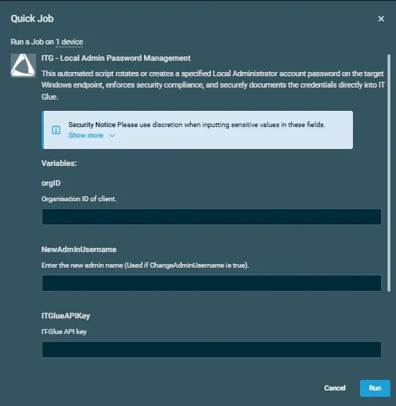
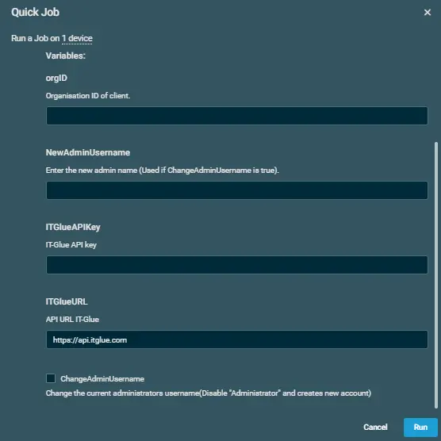

## Overview  

This automated script rotates or creates a specified Local Administrator account password on the target Windows endpoint, enforces security compliance, and securely documents the credentials directly into IT Glue.

## Implementation  

1. Download the component `ITG - Local Admin Password Management` from the attachments.

2. After downloading the attached file, click on the `Import` button
3. Select the component just downloaded and add it to the Datto RMM interface.  
  
4. After Importing the component to the Datto RMM, make sure to add the component to the `Proval` Group always.  
    - Steps to Add the component under `Proval` Group.  
    i. Click on `Drop Down Icon`.  
    ii. Click on `Add to Group`.  
      
    iii. Select the group as `Proval`  
    

## Sample Run

To execute the `component` over a specific machine, follow these steps:  

1. Select the machine you want to run the `component` on from the Datto RMM.  

2. Click on the `Quick Job` button.  
  

3. Search the component `ITG - Local Admin Password Management` and click on `Select`  
 

4. Sample Run:  
   
    
`NOTE` - Please add all the respective details from the CW portal.

## Datto Variables

| Variable Name | Type | Default | Description |
| ------------- | ---- | ------- | ----------- |
|orgID|String||Organisation ID of client.|
|NewAdminUsername|String||Enter the new admin name (Used if ChangeAdminUsername is true).|
|ITGlueAPIKey|String||IT-Glue API key|
|ITGlueURL|String|https://api.itglue.com|API URL IT-Glue|
|ChangeAdminUsername|Boolean|False|Change the current administrators username(Disable "Administrator" and creates new account)|

## Output

- stdOut  
- stdError  
 
## Attachments  

[ITG - Local Admin Password Management](../../../static/attachments/ITG%20-%20Local%20Admin%20Password%20Management.cpt)
## Changelog
 
### 2026-07-23
 
- Initial version of the document
