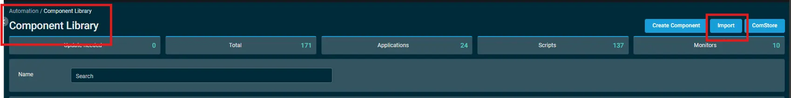
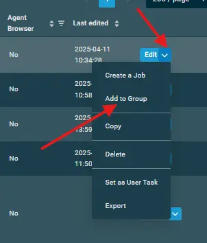
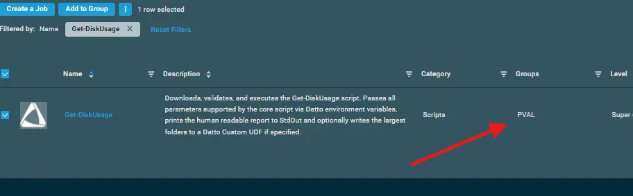
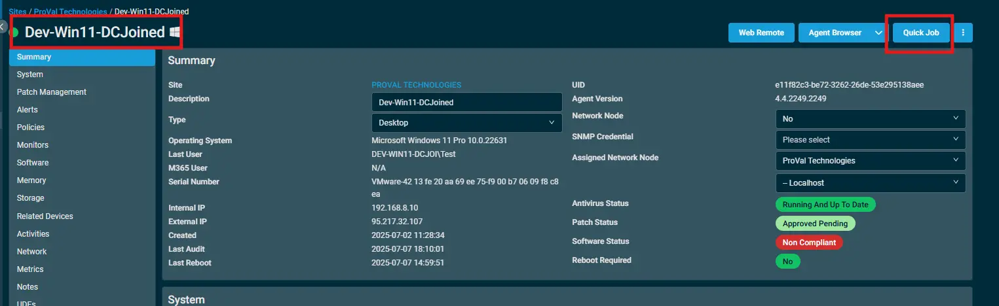
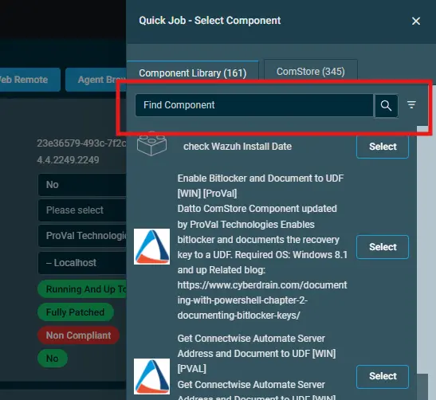
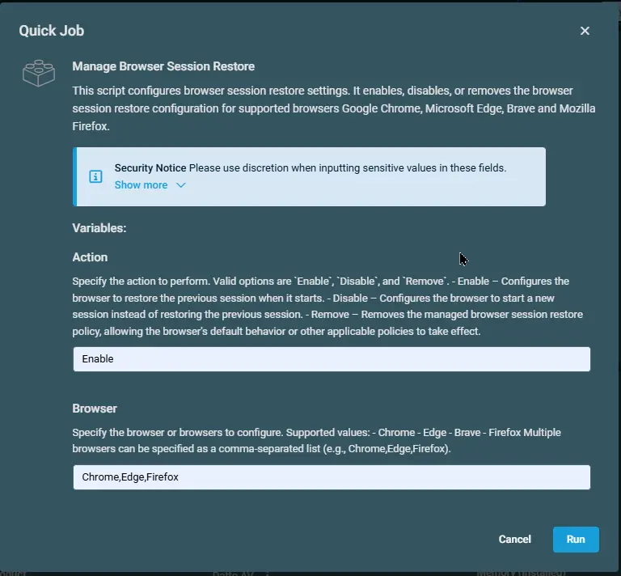

## Overview

This script configures browser session restore settings.  It enables, disables, or removes the browser session restore configuration for supported browsers Google Chrome, Microsoft Edge, Brave and Mozilla Firefox.

## Implementation  

1. Download the component from the [`datto-rmm` repository](https://github.com/ProVal-Tech/datto-rmm):
   [Manage Browser Session Restore](https://github.com/ProVal-Tech/datto-rmm/blob/main/components/manage-browser-session-restore.cpt)

2. After downloading the file, click on the `Import` button in the Datto RMM interface.

3. Select the component just downloaded and add it to the Datto RMM interface.  
  

4. After Importing the component to the Datto RMM, make sure to add the component to the `PVAL` Group always.  
    - Steps to Add the component under `PVAL` Group.  
    i. Click on `Drop Down Icon`.  
    ii. Click on `Add to Group`.  
      
    iii. Select the group as `PVAL`  
    

## Sample Run

To execute the `component` over a specific machine, follow these steps:  

1. Select the machine you want to run the `component` on from the Datto RMM.  

2. Click on the `Quick Job` button.  
  

3. Search the component `Manage Browser Session Restore` and click on `Select`
 

4.   

## Datto Variables

| Variable Name | Type | Default | Description |
| ------------- | ---- | ------- | ----------- |
| Action | String | - | Specify the action to perform. Valid options are `Enable`, `Disable`, and `Remove`. <ul><li>Enable – Configures the browser to restore the previous session when it starts.</li><li>Disable – Configures the browser to start a new session instead of restoring the previous session.</li><li>Remove – Removes the managed browser session restore policy, allowing the browser's default behavior or other applicable policies to take effect.</li></ul> |
| Browser | String | - | Specify the browser or browsers to configure. Supported values: <ul><li>Chrome</li><li>Edge</li><li>Brave</li><li>Firefox</li></ul>Multiple browsers can be specified as a comma-separated list (e.g., Chrome,Edge,Firefox). |

## Output

- stdOut  
- stdError  

## Attachments  

- [<Component Name>](https://github.com/ProVal-Tech/datto-rmm/blob/main/components/manage-browser-session-restore.cpt)

## Changelog
 
### 2026-10-09
 
- Initial version of the document
