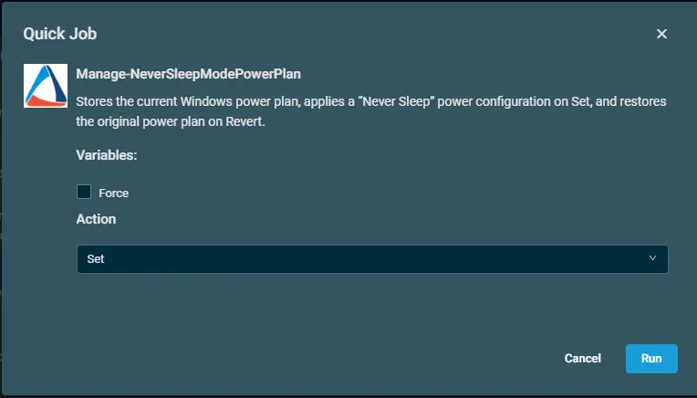
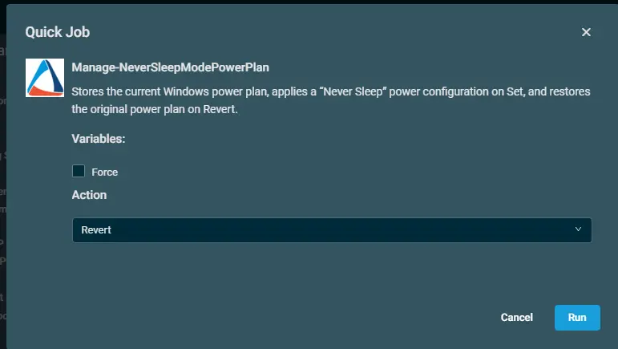
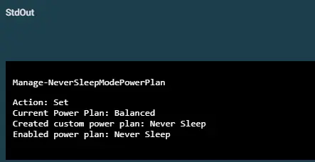
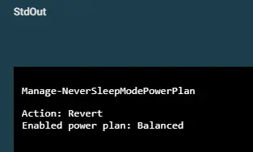

## Overview  
Stores the current Windows power plan, applies a “Never Sleep” power configuration on Set, and restores the original power plan on Revert.

## Implementation  

1. Download the component [Manage-NeverSleepModePowerPlan](../../../static/attachments/Manage-NeverSleepModePowerPlan.cpt) from the attachments.

2. After downloading the attached file, click on the `Import` button
3. Select the component just downloaded and add it to the Datto RMM interface.  
  

## Sample Run

To execute the `component` over a specific machine, follow these steps:  

1. Select the machine you want to run the `component` on from the Datto RMM.  

2. Click on the `Quick Job` button.  
  

3. Search the component `Manage-NeverSleepModePowerPlan` and click on `Select`
 

4. After selecting the component, below popup will be displayed.  
    i. Click on the Drop-Down to `Set` the power mode to never sleep.  
     
    ii. Now to revert it to previous power mode again, select the component again and select the `Revert` option through drop down.  
    

## Datto Variables

| Variable Name | Type | Default | Description |
| ------------- | ---- | ------- | ----------- |
|Force | Boolean | False|When true: Overwrites the previously saved plan reference during Set.      When false or unset: If a saved plan already exists, it is preserved and not overwritten during Set.|
|Action|Selection|Set|Set: Save the current plan (unless Force overwrites an existing save), clone it, apply “Never Sleep” settings, and activate it.  Revert: Restore the previously saved plan and deactivate the “Never Sleep” plan.
|
## Output  
1. Logs when Power plan is set.  

2. Logs when Power plan is reverted.  

## Attachments  
[Manage-NeverSleepModePowerPlan](../../../static/attachments/Manage-NeverSleepModePowerPlan.cpt)