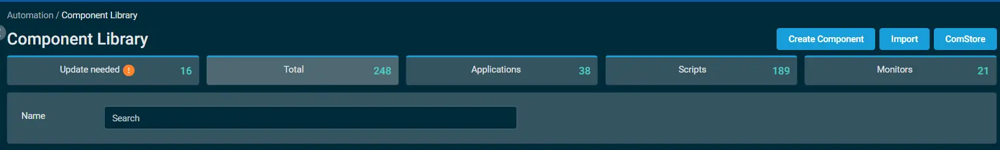
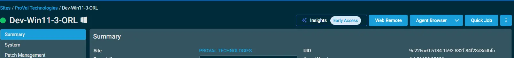
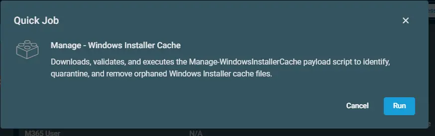

## Overview

This wrapper creates a working directory, downloads a signed payload script from a trusted repository, and validates its signature.  It then runs the payload in quarantine and deletion phases, logging results and verifying execution integrity.

## Dependencies

Agnostic Content: [Agnostic - Manage-WindowsInstallerCache](/docs/fb30b46a-ae2e-498f-b049-48f687fea928)

## Implementation

1. Download the component `Manage - Windows Installer Cache` from the attachments.

2. After downloading the attached file, click on the `Import` button
3. Select the component just downloaded and add it to the Datto RMM interface.  
  

## Sample Run

To execute the `component` over a specific machine, follow these steps:  

1. Select the machine you want to run the `component` on from the Datto RMM.  

2. Click on the `Quick Job` button.  
  

3. Search the component `<Name of the Component>` and click on `Select`
 

4. 

## Output

- Activity log
- C:\programdata\_automation\script\Manage-WindowsInstallerCache-log.txt
- C:\programdata\_automation\script\Manage-WindowsInstallerCache-error.txt

## Attachments  

[Manage-NeverSleepModePowerPlan](../../../static/attachments/Manage-WindowsInstallerCache.cpt)

## Changelog
 
### 2026-06-15
 
- Initial version of the document
