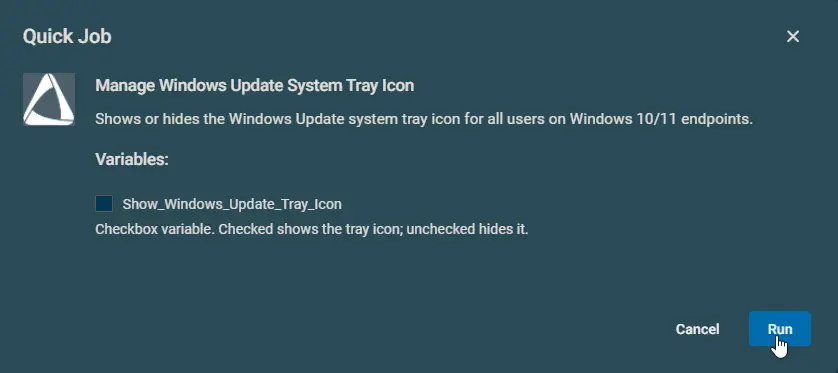

## Overview

This automation controls the Windows Update icon in the system tray for all users on Windows 10 and Windows 11 devices.

- By default, it hides the icon.
- Turn on `Show_Windows_Update_Tray_Icon` if you want to show the icon again.

## Implementation  

1. Download the `component` [Manage Windows Update System Tray Icon](../../../static/attachments/manage-windows-update-system-tray-icon.cpt) from the attachments.

2. After downloading the attached file, click on the `Import` button
3. Select the component just downloaded and add it to the Datto RMM interface.  
  

## Sample Run

## Datto Variables

| Variable Name | Type | Default | Description |
| ------------- | ---- | ------- | ----------- |
| `Show_Windows_Update_Tray_Icon` | `Boolean` | `False` | Check to show the tray icon. Leave unchecked to hide it. |

## Output

- stdOut
- stdError

## Attachments

[Manage Windows Update System Tray Icon](../../../static/attachments/manage-windows-update-system-tray-icon.cpt)

## Changelog

### 2026-04-13

- Changed the automation name from `Hide-Unhide Windows Update Systray Icon` to `Manage Windows Update System Tray Icon`.
- Added support for Windows 11 24H2 and newer devices.

### 2026-03-30

- Initial version of the document.
