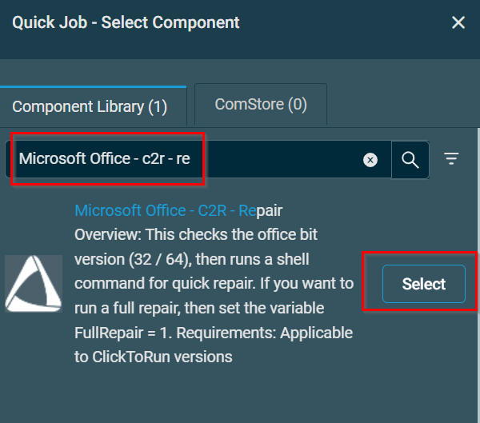
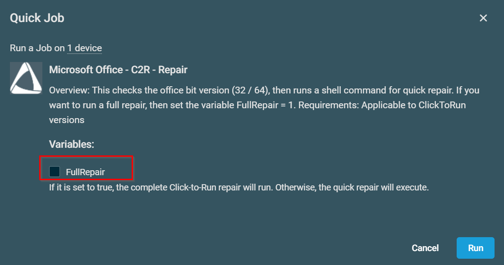

## Overview

This checks the office bit version (32 / 64), then runs a shell command for a quick repair. If you want to run a full repair, then set the variable FullRepair = 1.

## Implementation  

1. Download the component [Microsoft Office - C2R - Repair](../../../static/attachments/Microsoft-Office-C2R-Repair.cpt) from the attachments.

2. After downloading the attached file, click on the `Import` button
3. Select the component just downloaded and add it to the Datto RMM interface.  
  

## Sample Run

To execute the `component` over a specific machine, follow these steps:  

1. Select the machine you want to run the `component` on from the Datto RMM.  

2. Click on the `Quick Job` button.  
  

3. Search the component `Microsoft Office - C2R - Repair` and click on `Select`
    

    

    

## Datto Variables

| Variable Name | Type | Default | Description |
| ------------- | ---- | ------- | ----------- |
| FullRepair | Boolean | False | If it is set to `True` or checked, the full repair of Click-to-Run will run. Otherwise, the quick repair will execute. |

## Output

- stdout
- stderr
  
## Attachments

[Microsoft Office - C2R - Repair](../../../static/attachments/Microsoft-Office-C2R-Repair.cpt)

## Changelog

### 2026-01-30

- Initial version of the document
