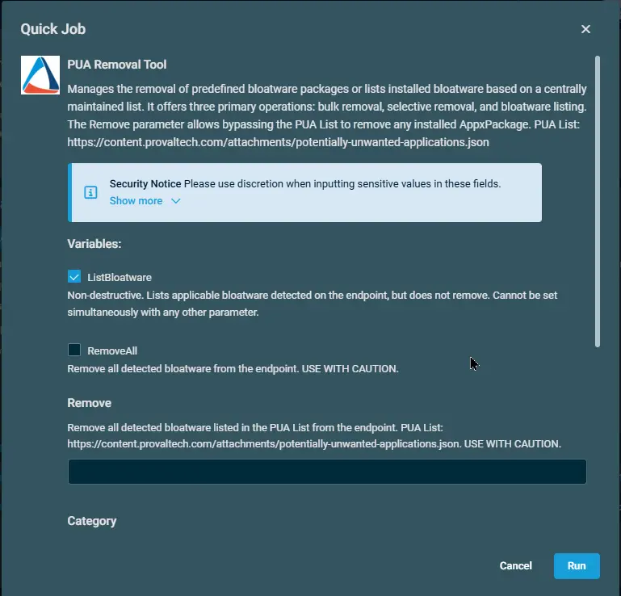

## Overview

Manages the removal of predefined bloatware packages or lists installed bloatware based on a centrally maintained list. It offers three primary operations: bulk removal, selective removal, and bloatware listing. The Remove parameter allows bypassing the PUA List to remove any installed AppxPackage.

**PUA List:** [PUA List](https://content.provaltech.com/attachments/potentially-unwanted-applications.json)

**EXERCISE EXTREME CAUTION - Removing system components may cause system instability.**

## Dependencies

- [Agnostic: Remove-PUA](/docs/fda5f79b-3e83-4561-af2b-2533f41c7443)

## Implementation

1. Download the component `PUA Removal Tool` from the attachments.

2. After downloading the attached file, click on the `Import` button

3. Select the component just downloaded and add it to the Datto RMM interface.  
 

4. After Importing the component to the Datto RMM, make sure to add the component to the `Proval` Group always.  
    - Steps to Add the component under `Proval` Group.  
    i. Click on `Drop Down Icon`.  
    ii. Click on `Add to Group`.  
      
    iii. Select the group as `Proval`  
    

## Sample Run

To execute the `PUA Removal Tool` over a specific machine, follow these steps:  

1. Select the machine you want to run the `PUA Removal Tool` on from the Datto RMM.  

2. Click on the `Quick Job` button.  
  

3. Search the component `PUA Removal Tool` and click on `Select`
 

4. Provide the desired value for the parameters and click on `Run`. Below will only list the installed Bloatware:  

## Datto Variables

| Variable Name   | Type      | Default | Description    |
| --------------- | --------- | ------- | ---------- |
| `ListBloatware` | `Boolean` | `True`  | Non-destructive. Lists applicable bloatware detected on the endpoint, but does not remove. Cannot be set simultaneously with any other parameter.`                                     |
| `RemoveAll`     | `Boolean` | `False` | Remove all detected bloatware listed in the PUA List from the endpoint. USE WITH CAUTION. |
| `Remove`        | `String`  |         | Remove the provided package(s) from the endpoint. Cannot be set simultaneously with 'RemoveAll'.                                                                                         |
| `Category`    | `String`  |         |Removes all detected bloatware in the specified categories. Requires the RemoveAll variable to be set to True. Valid Categories: 'MsftBloatApps', 'ThirdPartyBloatApps'                |
| `Except`    | `String`  |         | Exclude the provided package(s) from RemoveAll processing. Requires the RemoveAll variable to be set to True.                                                                          |
| `PUAListSource`  | `String` |  | Optional source for an alternate PUA list JSON. When provided, the script will use the specified local JSON file or downloadable URL instead of the default PUA list (https://content.provaltech.com/attachments/potentially-unwanted-applications.json). |

## Output

stdOut & stdError

## Attachments  

[PUA Removal Tool](https://github.com/ProVal-Tech/datto-rmm/blob/main/componenents/pua-removal-tool.cpt)

## Changelog

### 2026-08-24

- Added another parameter `PuaListSource`. Its an Optional source for an alternate PUA list JSON. When provided, the script will use the specified local JSON file or downloadable URL instead of the default PUA list.
- Updated the document as per our new standards.

### 2025-05-05

- Initial version of the document

### 2025-04-01

- Fixed the bug where the script contained several outdated and potentially incorrect AppxPackage IDs in the bloatware removal arrays. Some Microsoft apps have changed their package identifiers in newer Windows versions, and some third-party apps may have incorrect publisher IDs.
