## Overview

Manages and displays reboot prompts for Windows 10/11 systems based on pending reboot status or system uptime. The component runs once from Datto RMM — after that, the script manages itself automatically using scheduled tasks until the machine is rebooted. No recurring Datto jobs are needed.

The prompts support custom branding (icon and header image), localized messages (Dutch is auto-detected), and named substitution variables for dynamic content.

---

## How It Works

### What Happens When You Run the Component

1. **Datto evaluates conditions** — The wrapper checks if the machine actually needs a reboot (pending reboot + uptime threshold, or high uptime alone, or manual override).
2. **If conditions are met**, the wrapper downloads the agnostic prompting script and hands off control.
3. **The agnostic script takes over** — It creates scheduled tasks to manage the entire prompt lifecycle autonomously.
4. **You do not need to run the component again** — The script handles retries, postponements, reminders, and forced reboots on its own.

### Default Prompt Flow (5 prompts, 4 hours apart)

| Prompt | Type | User Options | What Happens If Ignored |
|--------|------|--------------|------------------------|
| 1st – 4th | Regular | `Postpone` or `Reboot Now` | Treated as postpone; script reschedules for next interval |
| 5th | Final (scheduling) | Date/time picker + `Schedule Reboot` | Reboot is forced after timeout (default 15 min) |

`Desktop_reboot_max_postpone` controls the **total** number of prompts in the cycle (regular + final). With the default of `5`: 4 regular prompts + 1 final = 5 total.

**After the final prompt:**

- If the user picks a time 15+ minutes in the future → reboot is scheduled, and a reminder appears 10 minutes before.
- If the user picks a time less than 15 minutes away → reboot is forced after the configured delay.
- If the prompt times out → reboot is forced immediately.

### Automatic Behaviours

| Scenario | What Happens |
|----------|--------------|
| **User reboots on their own** | On the next scheduled run, the script detects either fresh uptime (less than the interval) OR that `LastBootUpTime` is newer than the last prompt timestamp, cleans up all tasks and state, and exits. No further prompts. |
| **User reboots after reminder / during shutdown countdown** | Windows automatically cancels the pending `shutdown /r` timer. All tasks and state were already cleaned up when the shutdown was scheduled, so nothing remains to trigger a second reboot. |
| **Machine is locked** | Prompt is skipped; script reschedules for the next interval. |
| **No user logged in** | Prompt is skipped and rescheduled — unless `Reboot_if_not_logged_in` is enabled, in which case the machine reboots directly. |
| **No user + install in progress** | Even with auto-reboot enabled, the script defers if it detects an active installation (Windows Update, MSI, BITS, winget, etc.) and reschedules. |
| **Weekend** (when skip weekends is on) | Prompt is skipped; script reschedules. |
| **Suppress time window active** | Prompt is skipped; script reschedules. |
| **No internet** | Script reschedules itself rather than failing. |
| **Component run again while cycle is active** | Exits without changes unless `Desktop_reboot_force_reset` is set. |
| **Dutch-language user** | Prompts automatically appear in Dutch for `nl-NL` and `nl-BE` display languages. |
| **.NET Desktop Runtime 10 missing** | Automatically installed before the first prompt. |

---

## Dependencies

[Invoke-RebootWithPrompt](/docs/1ff05046-df36-4692-80a7-36458aa43392)

---

## Implementation

1. Download the component [Reboot Nag [Restart Alert] [Prompter]](../../../static/attachments/reboot-nag-restart-alert-prompter.cpt) from the attachments.

2. After downloading the attached file, click on the `Import` button.
3. Select the component just downloaded and add it to the Datto RMM interface.  

---

## Sample Run

To execute the component on a specific machine:

1. Select the machine you want to run the component on from Datto RMM.

2. Click on the `Quick Job` button.  

3. Search the component `Reboot Nag [Restart Alert] [Prompter]` and click on `Select`.  

4. After selecting the component, configure the variables as described below.

### Configuring the Variables

**Enablement & Overrides:**

5. Set `enable_reboot_nag` to `True` to bypass all enablement checks and immediately start prompting.  
6. Set `Desktop_reboot_force_reset` to `True` to clear stored state and scheduled tasks, then restart the prompt cycle from the beginning.  
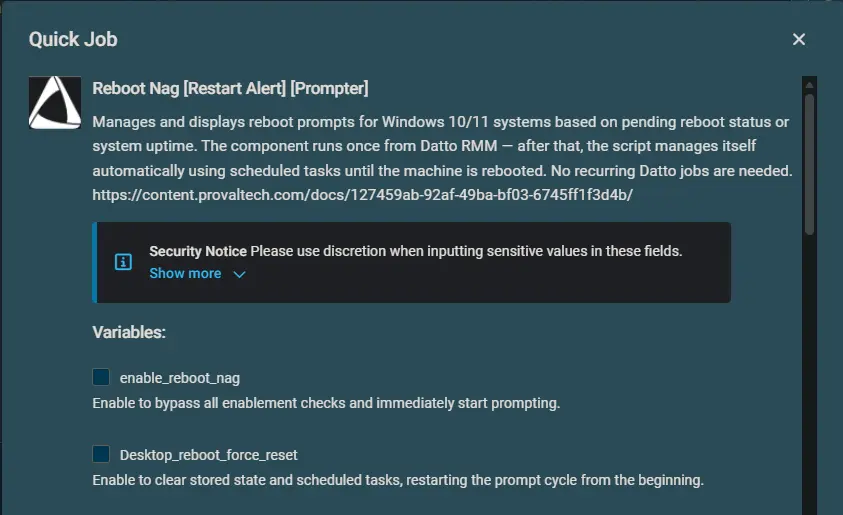

**Enablement Conditions:**

7. Set `Desktop_reboot_show_popup_if_pending_reboot_not_rebooted_days` — if a pending reboot is detected, prompts start after this many uptime days. Set to `0` to disable this condition.
8. Set `Desktop_reboot_show_popup_if_not_rebooted_days` — prompts start if uptime exceeds this many days, regardless of pending reboot. Set to `0` to disable this condition.  

**Prompt Scheduling:**

9. Set `Desktop_reboot_max_postpone` — total number of prompts in the cycle (regular + final). Regular prompts = value - 1.
10. Set `Desktop_reboot_popup_mins` — minutes between successive prompt attempts.
11. Set `Desktop_reboot_regular_prompt_timeout` — seconds before a regular prompt auto-closes (treated as postponed).
12. Set `Desktop_reboot_final_prompt_timeout` — seconds before the final scheduling prompt auto-closes (triggers reboot).
13. Set `Desktop_reboot_delay_after_final_prompt` — seconds to wait before rebooting when the user selects an invalid or too-soon time.  
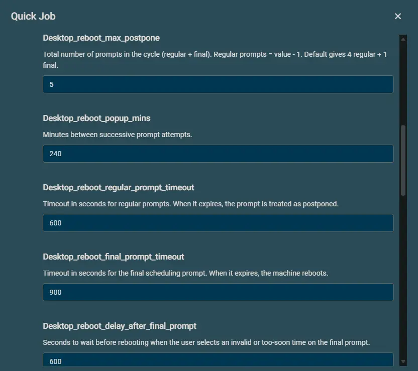

**Behaviour Switches:**

14. Set `Desktop_reboot_suppress_popup_time_windows` — time range when prompts are suppressed (for example, `1800-0900` for 6 PM to 9 AM).  
15. Set `Desktop_reboot_skip_weekends` to `True` to skip prompts on Saturdays and Sundays.
16. Set `Reboot_if_not_logged_in` to `True` to auto-reboot when no user is logged in (guarded by install-in-progress checks).  

**Branding:**

17. Set `Icon` — URL or local path for the prompt window icon.
18. Set `HeaderImage` — URL or local path for the prompt header image.
19. Set `Desktop_reboot_theme` — prompt window theme (`Dark` or `Light`). Default is `Dark`.  
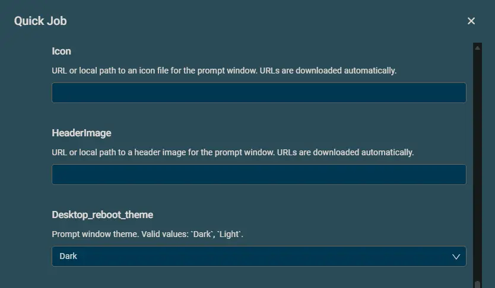

**Custom Messages (Optional):**

20. Set `Desktop_reboot_title` — custom window title (leave blank for language-appropriate default).
21. Set `Desktop_reboot_regular_prompt_message` — custom message for regular prompts.
22. Set `Desktop_reboot_final_prompt_message` — custom message for the final scheduling prompt.
23. Set `Desktop_reboot_reminder_title` — custom title for the reminder before a scheduled reboot.
24. Set `Desktop_reboot_reminder_message` — custom message for the reminder prompt.  

25. Click on `Run` to initiate the component.

### Sample Prompts (English)

**Regular prompt (Postpone or Reboot Now):**  
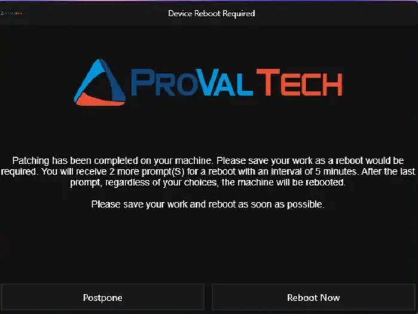

**Regular prompt (Postpone or Reboot Now):**  
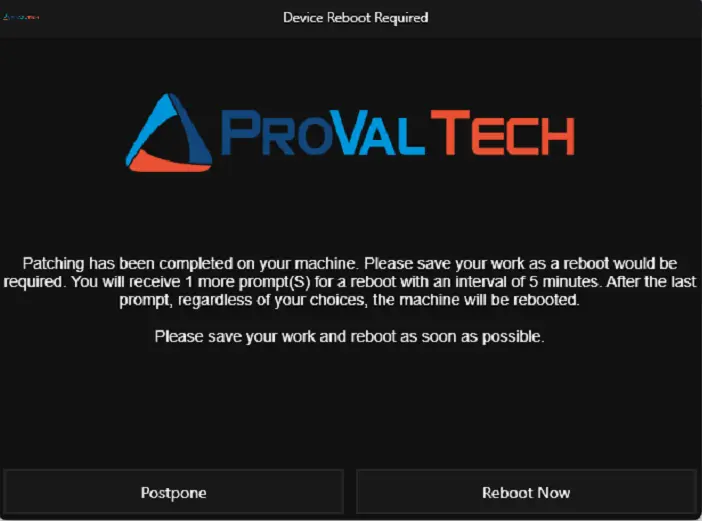

**Final scheduling prompt (date/time picker):**  
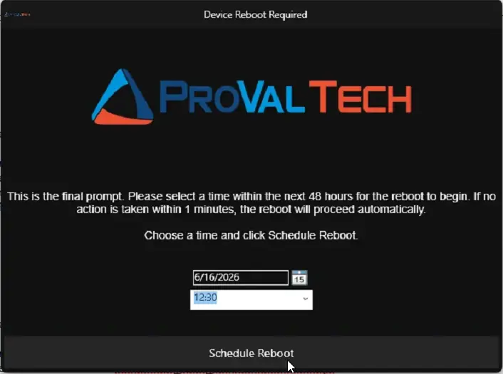

**Reminder prompt (10 minutes before scheduled reboot):**  
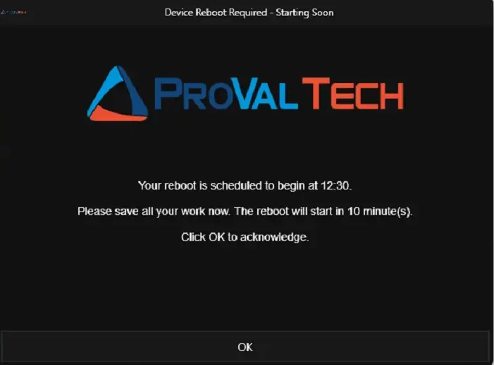

**Windows Shutdown Warning:**  
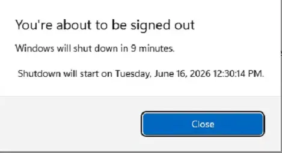

> **Note:** The Windows shutdown warning says **"shut down"** — this is standard Windows behavior. Despite the wording, the machine will **restart** (not power off) because the script uses `shutdown /r` (restart flag). This is a cosmetic quirk of the Windows notification and does not affect functionality.

### Sample Prompts (Dutch)

**Regular prompt (Postpone or Reboot Now):**  

**Regular prompt (Postpone or Reboot Now):**  
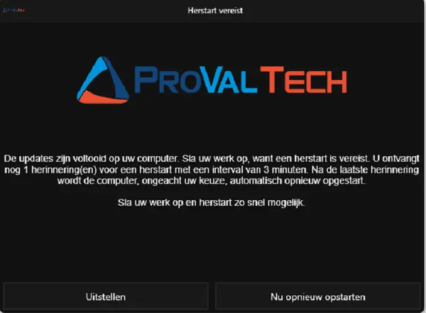

**Final scheduling prompt (date/time picker):**  
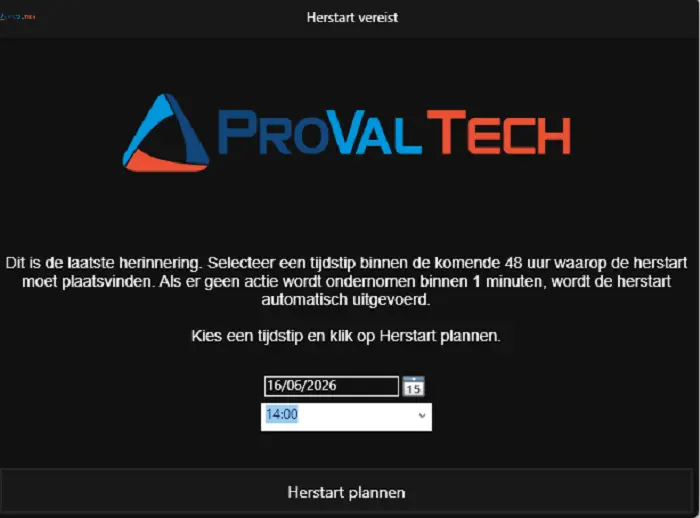

**Reminder prompt (10 minutes before scheduled reboot):**  

**Windows Shutdown Warning:**  
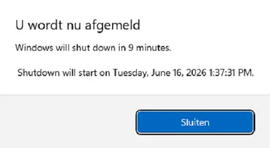

> **Note:** The Windows shutdown warning says **"shut down"** — this is standard Windows behavior. Despite the wording, the machine will **restart** (not power off) because the script uses `shutdown /r` (restart flag). This is a cosmetic quirk of the Windows notification and does not affect functionality.

---

## Datto Variables

### Enablement & Overrides

| Variable | Type | Default | Description |
|----------|------|---------|-------------|
| `enable_reboot_nag` | Boolean | `False` | Enable to bypass all enablement checks and immediately start prompting. |
| `Desktop_reboot_force_reset` | Boolean | `False` | Enable to clear stored state and scheduled tasks, restarting the prompt cycle from the beginning. |

### Enablement Conditions

| Variable | Type | Default | Description |
|----------|------|---------|-------------|
| `Desktop_reboot_show_popup_if_pending_reboot_not_rebooted_days` | String | `2` | If a pending reboot is detected (Windows Update or CBS registry keys), start prompting after this many days of uptime. Set to `0` to disable this condition. |
| `Desktop_reboot_show_popup_if_not_rebooted_days` | String | `30` | Start prompting if system uptime exceeds this many days, regardless of pending reboot status. Set to `0` to disable. |

### Prompt Scheduling

| Variable | Type | Default | Description |
|----------|------|---------|-------------|
| `Desktop_reboot_max_postpone` | String | `5` | Total number of prompts in the cycle (regular + final). Regular prompts = value - 1. Default gives 4 regular + 1 final. |
| `Desktop_reboot_popup_mins` | String | `240` | Minutes between successive prompt attempts. |
| `Desktop_reboot_regular_prompt_timeout` | String | `600` | Timeout in seconds for regular prompts. When it expires, the prompt is treated as postponed. |
| `Desktop_reboot_final_prompt_timeout` | String | `900` | Timeout in seconds for the final scheduling prompt. When it expires, the machine reboots. |
| `Desktop_reboot_delay_after_final_prompt` | String | `600` | Seconds to wait before rebooting when the user selects an invalid or too-soon time on the final prompt. |

### Behavior Switches

| Variable | Type | Default | Description |
|----------|------|---------|-------------|
| `Desktop_reboot_suppress_popup_time_windows` | String | *(not set)* | Time window during which prompts are suppressed, in `HHmm-HHmm` 24-hour format. Example: `1800-0900` suppresses from 6 PM to 9 AM. Spans midnight. |
| `Desktop_reboot_skip_weekends` | Boolean | `False` | Enable to skip prompts on Saturdays and Sundays. |
| `Reboot_if_not_logged_in` | Boolean | `False` | Enable to reboot immediately if no user is logged in. Guarded by install-in-progress check — if an update or installer is running, the reboot is deferred to the next interval. |

### Branding

| Variable | Type | Default | Description |
|----------|------|---------|-------------|
| `Icon` | String | *(not set)* | URL or local path to an icon file for the prompt window. URLs are downloaded automatically. |
| `HeaderImage` | String | *(not set)* | URL or local path to a header image for the prompt window. URLs are downloaded automatically. |
| `Desktop_reboot_theme` | Selection | `Dark` | Prompt window theme. Valid values: `Dark`, `Light`. |

### Custom Messages

All message variables support substitution variables (see table below) and `\n` for line breaks.

| Variable | Type | Default | Description |
|----------|------|---------|-------------|
| `Desktop_reboot_title` | String | *(language-appropriate default)* | Custom title for the prompt window (default is defined in the PowerShell script). |
| `Desktop_reboot_regular_prompt_message` | String | *(language-appropriate default)* | Message body for regular prompts (default is defined in the PowerShell script). |
| `Desktop_reboot_final_prompt_message` | String | *(language-appropriate default)* | Message body for the final scheduling prompt (default is defined in the PowerShell script). |
| `Desktop_reboot_reminder_title` | String | *(language-appropriate default)* | Title for the reminder shown 10 minutes before a scheduled reboot (default is defined in the PowerShell script). |
| `Desktop_reboot_reminder_message` | String | *(language-appropriate default)* | Message body for the reminder prompt (default is defined in the PowerShell script). |

---

## Substitution Variables

Use these in any custom message. They are replaced with live values when the prompt is displayed.

| Variable | Description | Example Value |
|----------|-------------|---------------|
| `%PromptsToSend%` | Total number of prompts the user will receive | `5` |
| `%PromptsSent%` | Number of prompts already shown | `2` |
| `%PromptsLeft%` | Remaining prompts before the final one | `3` |
| `%PromptIntervalMinutes%` | Interval between prompts in minutes | `240` |
| `%PromptIntervalHours%` | Same interval in hours | `4` |
| `%RegularTimeoutSeconds%` | Regular prompt timeout in seconds | `600` |
| `%RegularTimeoutMinutes%` | Same timeout in minutes | `10` |
| `%FinalTimeoutSeconds%` | Final prompt timeout in seconds | `900` |
| `%FinalTimeoutMinutes%` | Same timeout in minutes | `15` |
| `%DelayAfterFinalSeconds%` | Delay after final prompt in seconds | `600` |
| `%DelayAfterFinalMinutes%` | Same delay in minutes | `10` |
| `%ScheduledRebootTime%` | User-selected reboot time | `14:30` |
| `%MinutesUntilReboot%` | Minutes until scheduled reboot | `10` |
| `%ComputerName%` | Machine name | `PC-OFFICE-01` |
| `%UserName%` | Logged-in username | `jsmith` |

**Notes:**

- Variables that don't apply in a given context (e.g. `%ScheduledRebootTime%` during a regular prompt) are replaced with an empty string.
- Use `\n` in any message to insert a line break in the prompt.
- Unit conversion is automatic — `Desktop_reboot_popup_mins` is in minutes so `%PromptIntervalHours%` divides by 60; timeout/delay values are in seconds so the `Minutes` variants divide by 60.

---

## Default Messages

When no custom message is set via site variables, the component uses language-aware defaults. Language is auto-detected from the logged-on user's UI language or the system locale.

### Default English Messages

| Field | Default Text |
|-------|-------------|
| **Window Title** | `Device Reboot Required` |
| **Regular Prompt** | `Patching has been completed on your machine. Please save your work as a reboot would be required. You will receive %PromptsLeft% more prompt(S) for a reboot with an interval of %PromptIntervalMinutes% minutes. After the last prompt, regardless of your choices, the machine will be rebooted.\n\nPlease save your work and reboot as soon as possible.` |
| **Final Prompt** | `This is the final prompt. Please select a time within the next 48 hours for the reboot to begin. If no action is taken within %FinalTimeoutMinutes% minutes, the reboot will proceed automatically.\n\nChoose a time and click Schedule Reboot.` |
| **Reminder Title** | `Device Reboot Required - Starting Soon` |
| **Reminder Message** | `Your reboot is scheduled to begin at %ScheduledRebootTime%.\n\nPlease save all your work now. The reboot will start in %MinutesUntilReboot% minute(s).\n\nClick OK to acknowledge.` |

### Default Dutch Messages

Applied automatically when the user's UI language matches `nl-NL` or `nl-BE`.

| Field | Default Text |
|-------|-------------|
| **Window Title** | `Herstart vereist` |
| **Regular Prompt** | `De updates zijn voltooid op uw computer. Sla uw werk op, want een herstart is vereist. U ontvangt nog %PromptsLeft% herinnering(en) voor een herstart met een interval van %PromptIntervalMinutes% minuten. Na de laatste herinnering wordt de computer, ongeacht uw keuze, automatisch opnieuw opgestart.\n\nSla uw werk op en herstart zo snel mogelijk.` |
| **Final Prompt** | `Dit is de laatste herinnering. Selecteer een tijdstip binnen de komende 48 uur waarop de herstart moet plaatsvinden. Als er geen actie wordt ondernomen binnen %FinalTimeoutMinutes% minuten, wordt de herstart automatisch uitgevoerd.\n\nKies een tijdstip en klik op Herstart plannen.` |
| **Reminder Title** | `Herstart vereist - Start binnenkort` |
| **Reminder Message** | `Uw herstart staat gepland om te beginnen om %ScheduledRebootTime%.\n\nSla al uw werk nu op. De herstart begint over %MinutesUntilReboot% minuten.\n\nKlik op OK om te bevestigen.` |

---

## Real-Life Scenarios

### Scenario 1: Default Configuration

**Settings:** All defaults (5 total prompts, 4 hours apart, pending reboot + 2 days or 30 days uptime).

**What the user experiences:**

- Machine has a pending Windows Update reboot and has been up for 3 days.
- **9:00 AM** — Prompt 1 appears: "Please save your work... You will receive 3 more prompts." User clicks Postpone.
- **1:00 PM** — Prompt 2 appears. User clicks Postpone.
- **5:00 PM** — Prompt 3 appears. User clicks Reboot Now. Machine reboots. Cycle ends.

If the user had postponed all 4 regular prompts:

- **9:00 AM next day** — Prompt 5 (final) appears with a date/time picker.
- User selects tomorrow at 8:00 AM → reboot is scheduled.
- **7:50 AM next day** — Reminder appears: "Your reboot will start in 10 minutes."
- **8:00 AM** — Machine reboots automatically.

### Scenario 2: Quick Cycle for Critical Patches

**Settings:**

- `Desktop_reboot_max_postpone` = `2`
- `Desktop_reboot_popup_mins` = `60`
- `Desktop_reboot_final_prompt_timeout` = `600`
- `enable_reboot_nag` = `True`

**What the user experiences:**

- **10:00 AM** — Prompt 1 (regular) appears. User postpones.
- **11:00 AM** — Prompt 2 (final) appears with date/time picker. If ignored for 10 minutes, machine reboots at 11:10 AM.

### Scenario 3: Overnight Suppression with Weekend Skip

**Settings:**

- `Desktop_reboot_suppress_popup_time_windows` = `1800-0800`
- `Desktop_reboot_skip_weekends` = `True`

**What the user experiences:**

- Prompts only appear between 8:00 AM and 6:00 PM, Monday through Friday.
- If a prompt is due at 7:00 PM Friday, it is skipped and rescheduled. The user won't see it until Monday morning after 8:00 AM.

### Scenario 4: Unattended Machines (Kiosks, Shared PCs)

**Settings:**

- `Reboot_if_not_logged_in` = `True`
- `Desktop_reboot_popup_mins` = `120`

**What happens:**

- If no user is logged in when the script runs, the machine reboots immediately.
- **Exception:** If Windows Update, an MSI installer, winget, BITS transfer, or similar is actively running, the reboot is deferred by 2 hours and checked again.
- If a user IS logged in, the normal prompt flow is used.

### Scenario 5: User Reboots on Their Own

**Settings:** Any configuration.

**What happens:**

- Component runs at 10:00 AM. Prompt 1 shown. User postpones.
- User manually restarts the computer at 1:00 PM.
- Scheduled task fires at 2:00 PM. Script detects uptime (1 hour) is less than the interval (4 hours), concludes the machine was rebooted, removes all tasks and state, exits silently.
- **No further prompts are shown.**

### Scenario 6: Custom Messages with Substitution Variables

**Settings:**

- `Desktop_reboot_regular_prompt_message` = `Hi %UserName%, your PC %ComputerName% needs a restart.\n\nYou have %PromptsLeft% reminders left.\nNext reminder in %PromptIntervalHours% hours.`

**What the user sees:**

> Hi jsmith, your PC PC-OFFICE-01 needs a restart.
>
> You have 3 reminders left.
> Next reminder in 4 hours.

### Scenario 7: User Reboots After Reminder or During Shutdown Countdown

**Settings:** Any configuration. User received the final prompt and scheduled a reboot.

**What happens:**

- **7:50 AM** — Reminder prompt appears: "Your reboot will start in 10 minutes."
- Reminder task waits 60 seconds for the prompt to display, then issues `shutdown /r /f /t 540`.
- **7:55 AM** — User saves work and manually restarts before the countdown expires.
- Windows automatically cancels the pending shutdown timer.
- All scheduled tasks and state were already cleaned up when the shutdown was issued — nothing remains to trigger a second reboot.
- **Machine boots cleanly with no leftover artifacts.**

---

## Output

**StdOut**
A job status of `Success` is expected when conditions are met and the agnostic script launches successfully.  

If conditions are not met (machine doesn't need a reboot), the output will indicate:
> Reboot prompting conditions not met. Exiting without running the agnostic script.

This is normal behaviour — it means the machine is healthy and no prompt is needed.

**StdErr**
StdErr is not expected under normal operation. If present, it typically indicates a signature validation failure or download error.

---

## Artifacts Created

| Artifact | Path |
|----------|------|
| Prompter application | `C:\ProgramData\_Automation\App\Prompter\Prompter.exe` |
| Persisted script | `C:\ProgramData\_Automation\Script\Invoke-RebootPrompt\Invoke-RebootWithPrompt.ps1` |
| Log file | `C:\ProgramData\_Automation\Script\Invoke-RebootPrompt\Invoke-RebootPrompt-log.txt` |
| Error log | `C:\ProgramData\_Automation\Script\Invoke-RebootPrompt\Invoke-RebootPrompt-error.txt` |
| Scheduled task (main) | `Scheduled_Task_Invoke-RebootPrompt` |
| Scheduled task (reschedule) | `Scheduled_Task_Invoke-RebootPrompt_Reschedule` |
| Scheduled task (reminder) | `Scheduled_Task_Invoke-RebootPrompt_Reminder` |

---

## Attachments

[Reboot Nag [Restart Alert] [Prompter]](../../../static/attachments/reboot-nag-restart-alert-prompter.cpt)

---

## Changelog

### 2026-06-17

- Fixed double-reboot bug: script now tracks `LastPromptSentTime` and compares against `LastBootUpTime` to detect reboots that occurred after the most recent prompt (including reminder and final prompts)
- Replaced `Start-Sleep` + `Restart-Computer` in the reminder path with `shutdown /r /f /t 540` — Windows auto-cancels the pending shutdown if the user reboots manually, eliminating duplicate reboots
- Reminder task now waits 60 seconds for the prompt to display before issuing the shutdown command
- Corrected `Desktop_reboot_max_postpone` semantics: value is the total prompt count (regular + final), not just the regular count
- Added post-reboot detection: script now checks system uptime on rescheduled runs and cleans up automatically if the machine was already rebooted (no more unnecessary prompts after a manual reboot)
- Added install-in-progress guard: when no user is logged in and auto-reboot is enabled, the script checks for active installations (Windows Update, MSI, BITS, winget, etc.) and defers the reboot if one is found
- Added named substitution variables (`%PromptsLeft%`, `%PromptIntervalMinutes%`, `%ComputerName%`, etc.) for custom messages
- Added `\n` support for line breaks in all message strings
- Added `Desktop_reboot_delay_after_final_prompt` variable (seconds to wait before rebooting after invalid/too-soon time selection)
- Added `Desktop_reboot_title`, `Desktop_reboot_regular_prompt_message`, `Desktop_reboot_final_prompt_message`, `Desktop_reboot_reminder_title`, and `Desktop_reboot_reminder_message` variables for full message customization
- Added `enable_reboot_nag` variable to bypass all conditions and immediately start prompting
- Added `Desktop_reboot_force_reset` variable to clear state and restart the prompt cycle
- Upgraded from .NET 8 to .NET Desktop Runtime 10
- Replaced Strapper-based language detection in the wrapper with direct HKU registry lookup
- Moved enablement check before heavy operations (download, signature validation) for faster exit when conditions are not met
- Updated the script to use the agnostic script [Invoke-RebootWithPrompt](/docs/1ff05046-df36-4692-80a7-36458aa43392)

### 2026-03-23

- Code Signed the PowerShell script.
- Converted `Icon` and `HeaderImage` to run-time variables.
- Updated .Net8 Desktop Runtime installation logic to install the latest available version.

### 2026-03-17

- Initial version of the document
