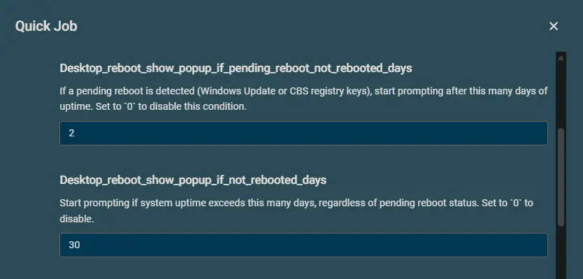
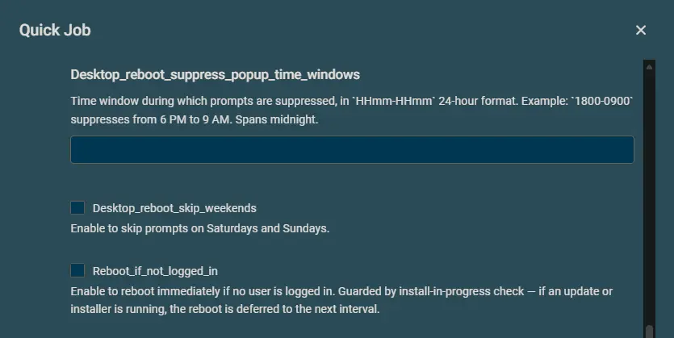
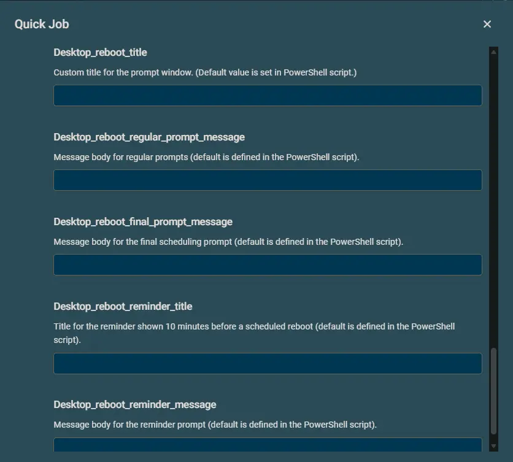
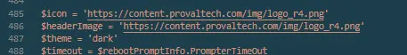
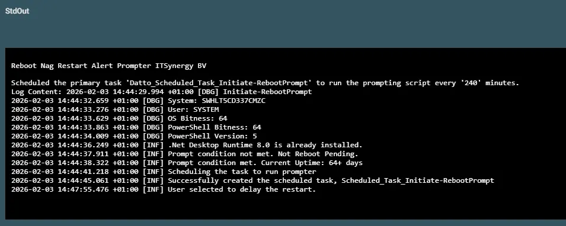

## Overview  
This script displays and manages reboot prompts for Windows systems after patching or based on system uptime and pending reboot status.

## Implementation  

1. Download the component [Reboot Nag[Restart Alert][Prompter]](../../../static/attachments/Reboot%20Nag%20Restart%20Alert%20Prompter.cpt) from the attachments.

2. After downloading the attached file, click on the `Import` button
3. Select the component just downloaded and add it to the Datto RMM interface.  
  

## Sample Run

To execute the `component` over a specific machine, follow these steps:  

1. Select the machine you want to run the `component` on from the Datto RMM.  

2. Click on the `Quick Job` button.  
  

3. Search the component `Reboot Nag[Restart Alert][Prompter]` and click on `Select`
 

4. After selecting the component, entering the values.  

  
5. Click on `Run` to initiate the component.  

## Important  
Before saving the component within the environment, make sure to change the branding of the `Nag` script.

## Datto Variables

| Variable Name | Type | Default | Description |
| ------------- | ---- | ------- | ----------- |
|Desktop_reboot_max_postpone|String|4|Number of times the user can postpone the reboot prompt. At 0, the popup is shown repeatedly with no countdown.|
|Desktop_reboot_popup_mins|String|240|Interval in minutes between reboot prompts.|
|Desktop_reboot_show_popup_if_pending_reboot_not_rebooted_days|String|1|Shows reboot popup if a reboot is pending and the system has not been rebooted for this many days. Set to 0 to disable.|
|Desktop_reboot_show_popup_if_not_rebooted_days|String|30|Shows reboot popup if the system has not been rebooted for this many days, regardless of pending reboot. Set to 0 to disable.|
|Desktop_reboot_regular_prompt_timeout|String|3600|Timeout in seconds for the regular prompt.|
|Desktop_reboot_final_prompt_timeout|String|10800|Time in seconds to wait before forcefully restarting the computer after the final prompt is missed.|
|Desktop_reboot_suppress_popup_time_windows|String|2100-0700|Time window(s) in 24-hour format (e.g., 1800-0900) during which prompts are suppressed.|
|Desktop_reboot_skip_weekends|Boolean|False| If set, prevents reboot prompts from being shown on Saturdays and Sundays.|
|Reboot_if_not_logged_in|Boolean|True| If set, forcefully restarts the computer if no user is logged in when prompting conditions are met.|
|Force|Boolean|False|Forcefully recreates the scheduled task if it already exists. Use this option when updating or modifying the task's arguments.|  

## Output  
StdOut  
`A job status of Success is expected.`  

StdErr  
`StdErr is not expected.`

## Attachments  
[Reboot Nag[Restart Alert][Prompter]](../../../static/attachments/Reboot%20Nag%20Restart%20Alert%20Prompter.cpt)