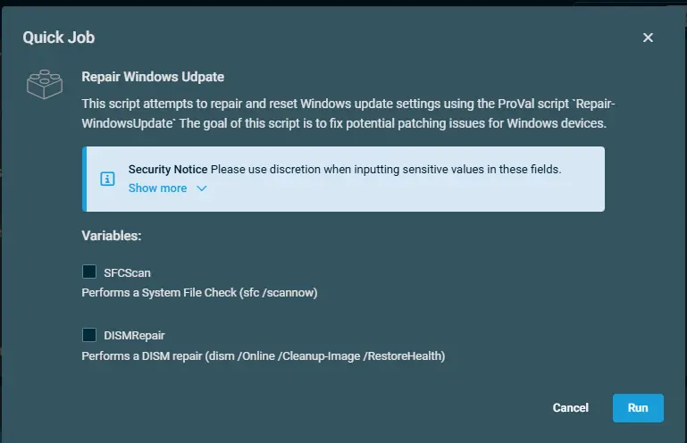

## Overview
This script attempts to repair and reset Windows update settings using the ProVal script: [Repair-WindowsUpdate](/docs/39345bfd-d9e2-4e68-9d7a-3e8b443140cc)  
The goal of this script is to fix potential patching issues for Windows devices.

## Dependencies

[Repair-WindowsUpdate](/docs/39345bfd-d9e2-4e68-9d7a-3e8b443140cc)

## Implementation  

1. Download the component [Repair Windows Update](../../../static/attachments/repair-windows-udpate.cpt) from the attachments.

2. After downloading the attached file, click on the `Import` button
3. Select the component just downloaded and add it to the Datto RMM interface.  
  

## Sample Run

To execute the `Repair Windows Update` over a specific machine, follow these steps:  

1. Select the machine you want to run the `Repair Windows Update` on from the Datto RMM.  

2. Click on the `Quick Job` button.  
  

3. Search the component `Repair Windows Update` and click on `Select`   
 

4. Select the desired action to perform and click Run   
 

## Datto Variables

| Variable Name | Type | Default | Description |
| ------------- | ---- | ------- | ----------- |
|SfcScan | Boolean|False|Performs a System File Check (sfc /scannow)|
|DISMRepair| Boolean|False|Performs a DISM repair (dism /Online /Cleanup-Image /RestoreHealth)|

## Output

- stdOut  
- stdError  

## Attachments  

[Repair Windows Update](../../../static/attachments/repair-windows-udpate.cpt)

## Changelog
 
### 2026-06-22

- Initial version of the document
