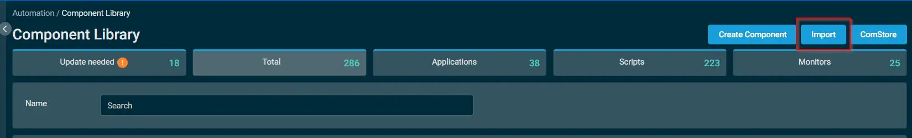
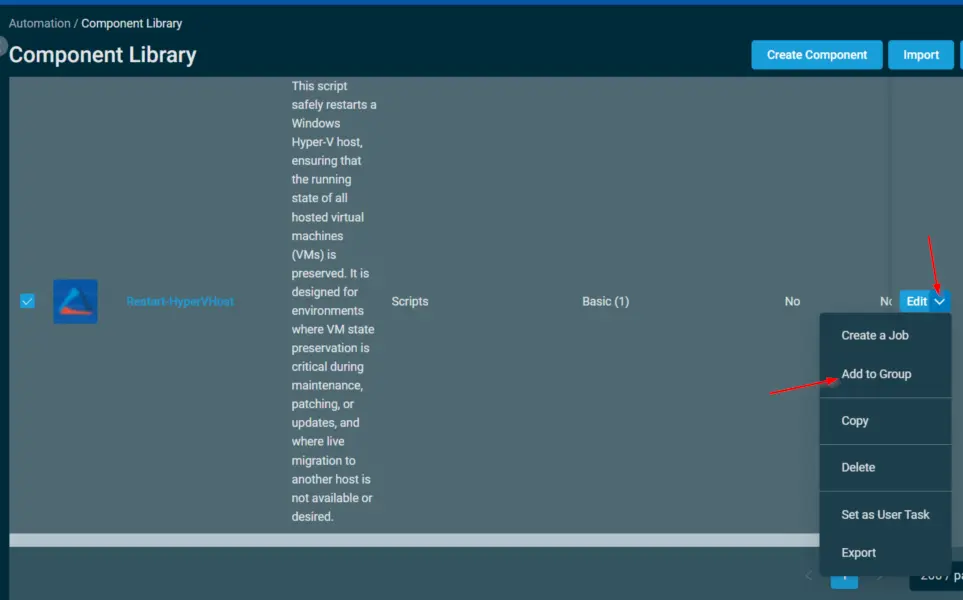
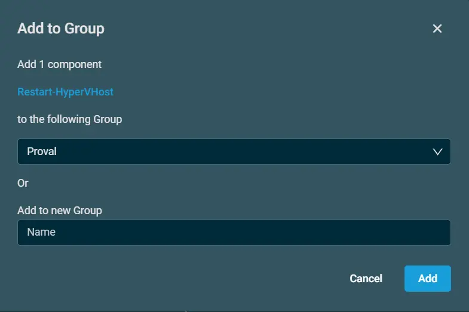
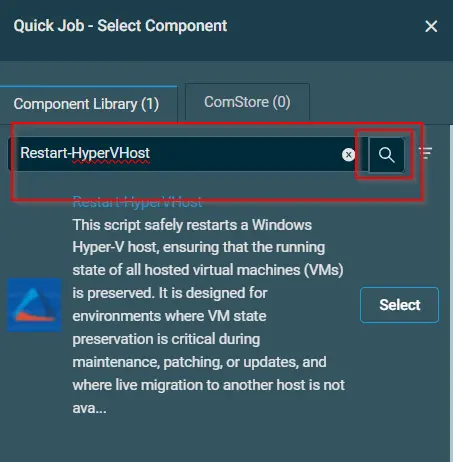
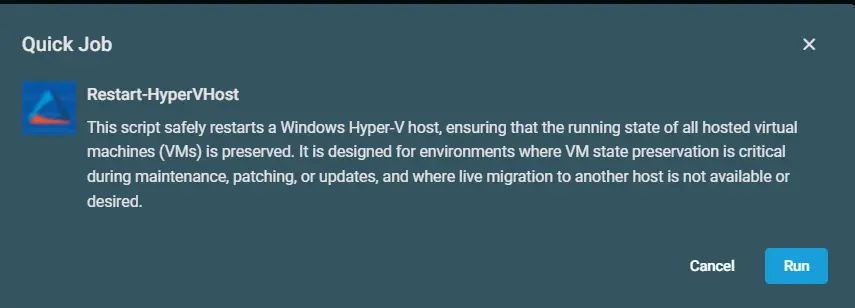

## Overview

This script uses the agnostic script [Restart-HyperVHost](/docs/6da0235c-ed6e-4a81-b085-411337706b36) to restarts a **Windows Hyper-V host**, ensuring that the running state of all hosted virtual machines (VMs) is preserved. It is designed for environments where VM state preservation is critical during maintenance, patching, or updates, and where live migration to another host is not available or desired.

## Dependencies

- [Agnostic: Restart-HyperVHost](/docs/6da0235c-ed6e-4a81-b085-411337706b36)

## Implementation  

1. Download the component `Restart-HyperVHost` from the attachments.

2. After downloading the attached file, click on the `Import` button
3. Select the component just downloaded and add it to the Datto RMM interface.  
  
4. After Importing the component to the Datto RMM, make sure to add the component to the `ProVal` Group always.  
    - Steps to Add the component under `ProVal` Group.  
    i. Click on `Drop Down Icon`.  
    ii. Click on `Add to Group`.  
      
    iii. Select the group as `Proval`  
    


## Sample Run

To execute the `Restart-HyperVHost` over a specific machine, follow these steps:  

1. Select the machine you want to run the `Restart-HyperVHost` on from the Datto RMM.  

2. Click on the `Quick Job` button.   
  

3. Search the component `Restart-HyperVHost` and click on `Select`
 

4. Click on `Run`  


## Output

- Activity

The main script and the post-reboot restore script both log via the `Strapper` module:

```text
.\Restart-HyperVHost-log.txt
.\Restart-HyperVHost-error.txt
C:\ProgramData\_Automation\Script\Set-VMState\Set-VMState-log.txt
C:\ProgramData\_Automation\Script\Set-VMState\Set-VMState-error.txt
```

## Attachments  

[Restart-HyperVHost](../../../static/attachments/restart-hypervhost.cpt)

## Changelog
 
### 2026-08-06
 
- Initial version of the document
