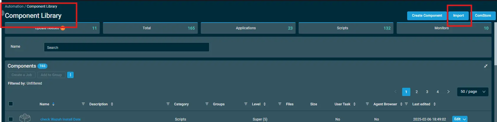
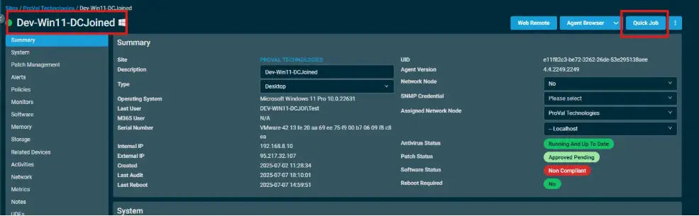
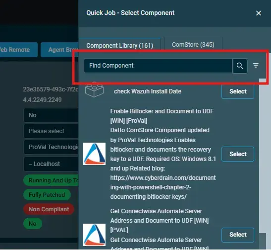

## Overview

This component creates a scheduled task `EnsureDattoServiceRunning` in Task Scheduler to ensure the Datto RMM service (CagService) starts automatically.

This component performs the following actions for DattoRMM Agent service:

- Verifies service exists on the system
- Sets the service startup type to Automatic
- Configures Windows Service Recovery settings to restart on failure
- Creates a monitoring script that checks service status and restarts if stopped.
- Registers a scheduled task to run the monitoring script at regular intervals (15 minutes for servers, 60 minutes for workstations)
- Attempts to start each service if it's not currently running
- Logs events to the Application event log for monitoring purposes

The script is designed to ensure the DattoRMM Agent service remains operational and automatically recovers from service failures.

## Implementation  

1. Download the component [Scheduled Task Creation - CagService](../../../static/attachments/schedule-task-creation-cagservice.cpt) from the attachments.

2. After downloading the attached file, click on the `Import` button

3. Select the component just downloaded and add it to the Datto RMM interface.  

## Sample Run

To execute the `component` over a specific machine, follow these steps:  

1. Select the machine you want to run the [Scheduled Task Creation - CagService](../../../static/attachments/schedule-task-creation-cagservice.cpt) on from the Datto RMM.  

2. Click on the `Quick Job` button.

  

3. Search the component name `Scheduled Task Creation - Cagservice` and click on `Select`

## Output

Activity Log

- stdOut
- stdError  

## Attachments

[Scheduled Task Creation - CagService](../../../static/attachments/schedule-task-creation-cagservice.cpt)

## Changelog

### 2026-03-25

  - Updated script to ensure continuous monitoring of the Datto Agent service (Cagservice) on both servers and workstations. The previous version only checked and started the service once at system startup.
  - This update introduces a scheduled self‑healing mechanism that checks the service at regular intervals (15 minutes for servers, 60 minutes for workstations).

### 2025-06-27

- Initial version of the document.
