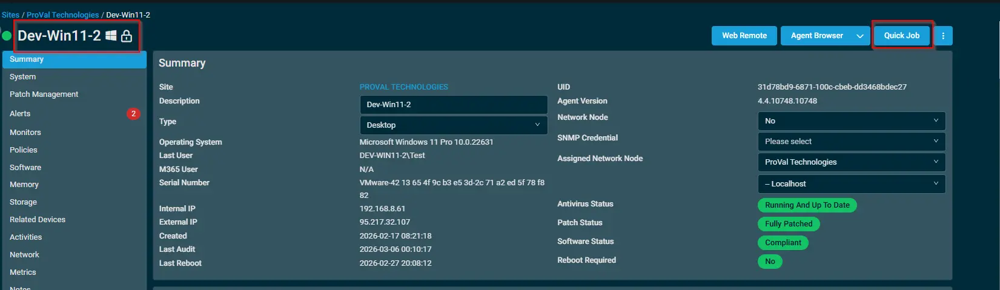
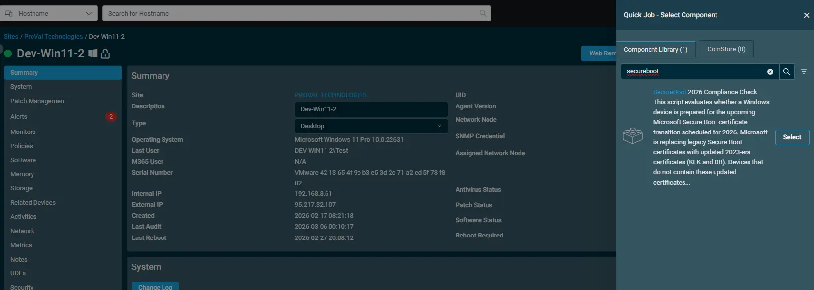
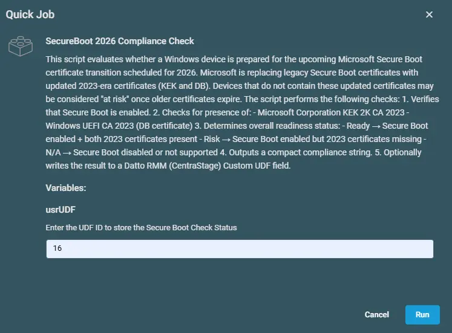
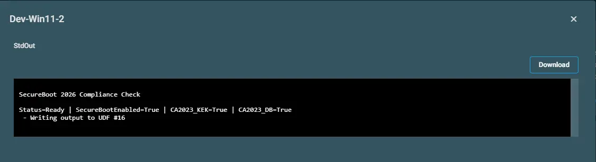
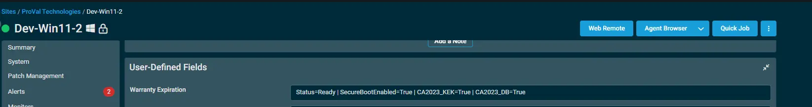

## Overview

This script evaluates whether a Windows device is prepared for the upcoming Microsoft Secure Boot certificate transition scheduled for 2026. Microsoft is replacing legacy Secure Boot certificates with updated 2023-era certificates (KEK and DB). Devices that do not contain these updated certificates may be considered at risk once older certificates expire.

The script performs the following checks:

- Verifies that Secure Boot is enabled.
- Checks for presence of:
  - Microsoft Corporation KEK 2K CA 2023
  - Windows UEFI CA 2023 (DB certificate)
- Determines overall readiness status:
  - Ready  → Secure Boot enabled + both 2023 certificates present
  - Risk   → Secure Boot enabled but 2023 certificates missing
  - N/A    → Secure Boot disabled or not supported
- Outputs a compact compliance string.
- Optionally writes the result to a Datto RMM (CentraStage) Custom UDF field.

## Implementation  

1. Download the component `SecureBoot 2026 Compliance Check` from the attachments.

2. After downloading the attached file, click on the `Import` button
3. Select the component just downloaded and add it to the Datto RMM interface.  
  

## Sample Run

To execute the `component` over a specific machine, follow these steps:  

1. Select the machine you want to run the `component` on from the Datto RMM.  

2. Click on the `Quick Job` button.  
  

3. Search the component `SecureBoot 2026 Compliance Check` and click on `Select`
 

4. Enter the UDF ID to store the Secure Boot Check Status

## Datto Variables

| Variable Name | Type | Default | Description |
| ------------- | ---- | ------- | ----------- |
| usrUDF | String | Enter the UDF number | Enter the UDF number to store the data. |

## Output

Activity Log

Custom Field

## Attachments

[SecureBoot 2026 Compliance Check](../../../static/attachments/SecureBoot-2026-Compliance-Check.cpt)

## Changelog

### 2026-03-12

- Initial version of the document
