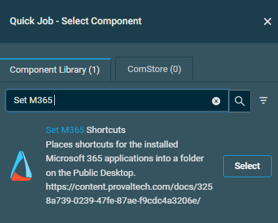

## Overview

Places shortcuts for the installed Microsoft 365 applications directly on the Public Desktop. Optionally, when a folder name is provided, gathers the shortcuts into a single folder on the Public Desktop instead.

## Implementation  

1. Import the [attached component](https://github.com/ProVal-Tech/datto-rmm/blob/main/components/set-m365-shortcuts.cpt)

## Sample Run

To execute the `component` over a specific machine, follow these steps:  

1. Select the machine you want to run the [Set M365 Shortcuts](https://github.com/ProVal-Tech/datto-rmm/blob/main/components/set-m365shortcuts.cpt) on from the Datto RMM.  

2. Click on the `Quick Job` button.  
  

3. Search the component `Set M365 Shortcuts` and click on `Select`

 

## Datto Variables

| Variable Name | Type | Default | Description |
| ------------- | ---- | ------- | ----------- |
| Application | String | `Word, Excel, PowerPoint, Outlook, OneNote, Access, Publisher, Project, Visio` | Limits the shortcuts to the named applications. When omitted, every supported application that is installed receives a shortcut. Valid values: 'Word', 'Excel', 'PowerPoint', 'Outlook', 'OneNote', 'Access', 'Publisher', 'Project', 'Visio'. |
| FolderName | String | *(Empty)* | The name of a folder to create on the Public Desktop to hold the shortcuts. When omitted, shortcuts are placed directly on the Public Desktop itself. |
| TimeoutMinutes | String | 45 | How long to wait for a Microsoft 365 install to appear and finish before giving up. Defaults to 45 minutes. Pass 0 to skip waiting entirely. |

## Output

Activity Log

- stdOut
- stdError  

## Attachments  

[Set M365 Shortcuts](https://github.com/ProVal-Tech/datto-rmm/blob/main/components/set-m365-shortcuts.cpt)

## Changelog

### 2026-09-02

- Shortcuts are now placed directly on the Public Desktop by default. The `FolderName` variable no longer has a default value and will only create a grouping folder when explicitly provided.

### 2026-08-20

- Initial version of the document
