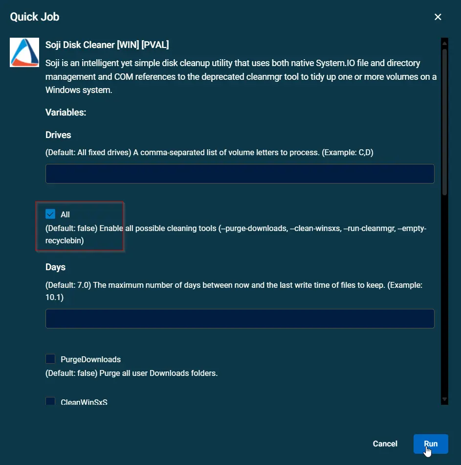
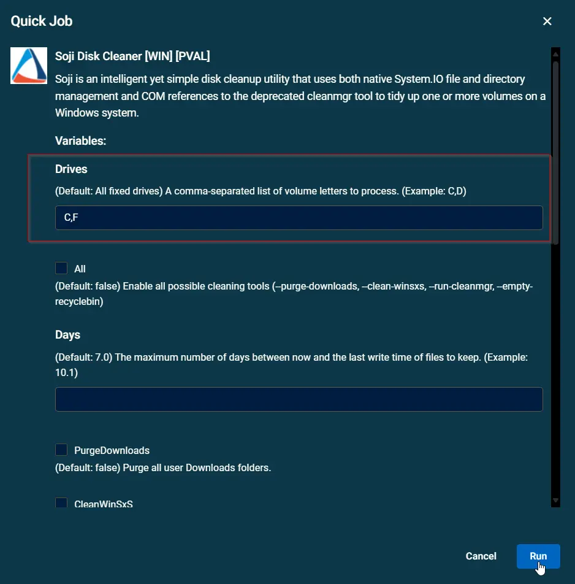
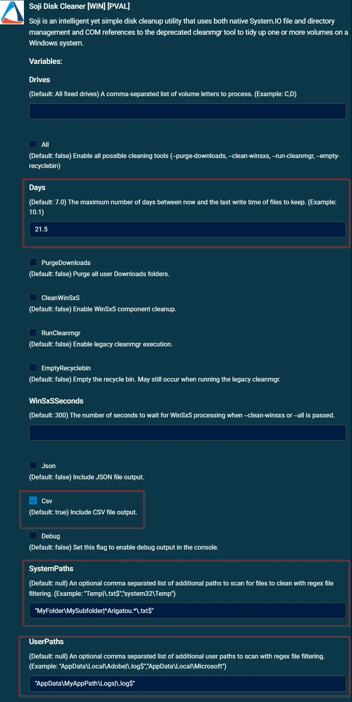

## Summary

Soji is an intelligent yet simple disk cleanup utility that uses both native System.IO file and directory management and COM references to the deprecated cleanmgr tool to tidy up one or more volumes on a Windows system. Datto RMM implementation of the agnostic content [Soji](/docs/c762e174-5262-44b9-a3e9-97ca9ff94afc)

## Dependencies

- [Soji](/docs/c762e174-5262-44b9-a3e9-97ca9ff94afc)

## Sample Run

### Example 1

**Clean all fixed drives with all available cleaners:**  

### Example 2

**Clean the C and F drives:**  

### Example 3

**Clean the C drive including all user Download directories in PowerShell:**  

## Example 4

**Clean all fixed drives with all available cleaners including the following:**  

1. All .txt files that start with "Arigatou" under ?:\MyFolder\MySubfolder
2. All .log files under the user paths ?:\Users\<Username>\AppData\MyAppPath\Logs
3. Any target files must have a last write time greater than 21.5 days.  

## Variables

| Name            | Example                                                                 | Type    | Default Value        | Description                                                                                                                        |
|-----------------|-------------------------------------------------------------------------|---------|---------------------|------------------------------------------------------------------------------------------------------------------------------------ |
| Drives          | C,D                                                                     | String  | All fixed Drives    | (Default: All fixed drives) A comma-separated list of volume letters to process. (Example: C,D)                                     |
| All             | True                                                                    | Boolean | False               | (Default: false) Enable all possible cleaning tools (`--purge-downloads`, `--clean-winsxs`, `--run-cleanmgr`, `--empty-recyclebin`)         |
| Days            | 10.1                                                                    | String  | 7.0                 | (Default: 7.0) The maximum number of days between now and the last write time of files to keep. (Example: 10.1)                     |
| PurgeDownloads | True                                                                    | Boolean | False               | (Default: false) Purge all user Downloads folders.                                                                                  |
| CleanWinSxS    | True                                                                    | Boolean | False               | (Default: false) Enable WinSxS component cleanup.                                                                                   |
| RunCleanmgr    | True                                                                    | Boolean | False               | (Default: false) Enable legacy cleanmgr execution.                                                                                  |
| EmptyRecyclebin| True                                                                    | Boolean | False               | (Default: false) Empty the recycle bin. May still occur when running the legacy cleanmgr.                                           |
| WinSxSSeconds  | 600                                                                     | Number  | 300                 | (Default: 300) The number of seconds to wait for WinSxS processing when `--clean-winsxs` or `--all` is passed.                          |
| Json            | True                                                                    | Boolean | False               | (Default: false) Include JSON file output.                                                                                          |
| Csv             | True                                                                    | Boolean | True                | (Default: true) Include CSV file output.                                                                                            |
| Debug           | True                                                                    | Boolean | False               | (Default: false) Set this flag to enable debug output in the console.                                                               |
| SystemPaths    | "Temp\|\.txt$","system32\Temp"                                          | String  | null                | (Default: null) An optional comma separated list of additional paths to scan for files to clean with regex file filtering.          |
| UserPaths      | "AppData\Local\Adobe\|\.log$","AppData\Local\Microsoft"                 | String  | null                | (Default: null) An optional comma separated list of additional user paths to scan with regex file filtering.                        |

## Implementation

Import the [attached component](<../../../static/attachments/itg/11821769/soji_disk_cleaner.cpt>) into Datto RMM.

## Output

- stdOut  
- stdError  
- ProgramData\_automation\app\soji\sojilogs\

## Attachments

[Soji_Disk_Cleaner.cpt](<../../../static/attachments/itg/11821769/soji_disk_cleaner.cpt>)
