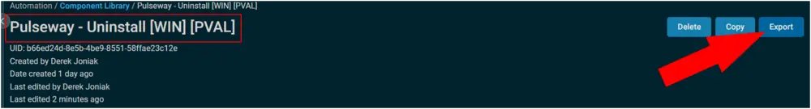
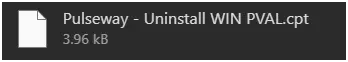
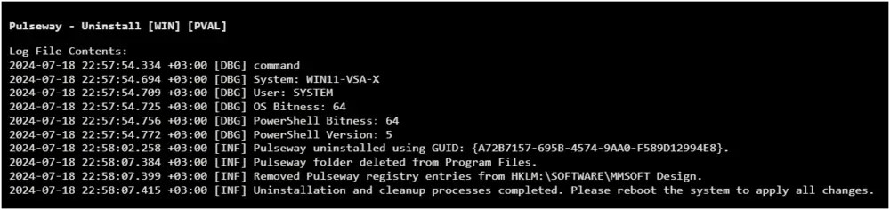

## Summary

This document describes the automated uninstallation of Pulseway, including additional cleanup steps.

## Implementation

1. Export the component from ProVal's Datto RMM instance  
   **Name:** Pulseway - Uninstall [WIN] [PVAL]  
     
   The export will download the necessary component (cpt) file.  
     
   
2. Import this component file into the partner's Datto RMM instance  
     

**Proval Plug & Play:** This component requires no configuration once imported.

## Output

A job status of **Success** is expected.  
  

**StdOut**  
  

**StdErr**  
StdErr is not expected.