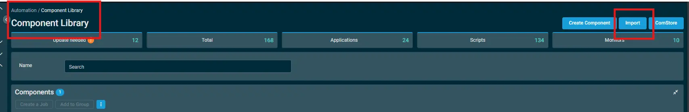
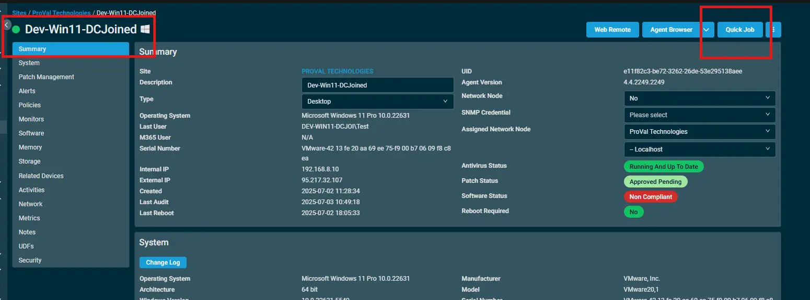
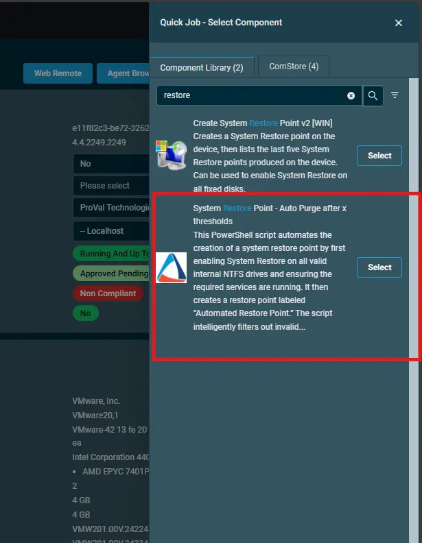
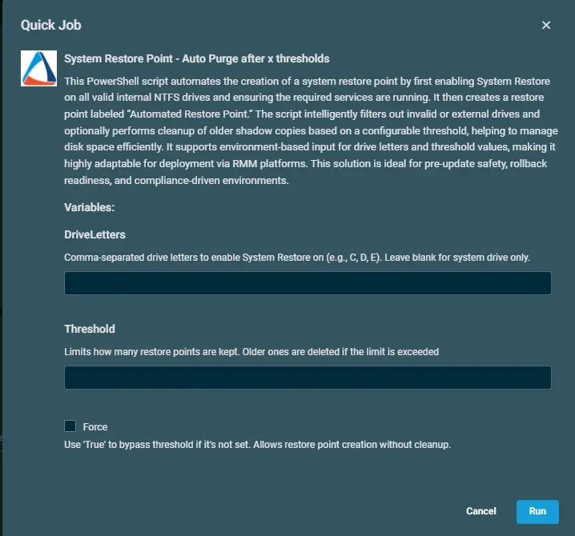
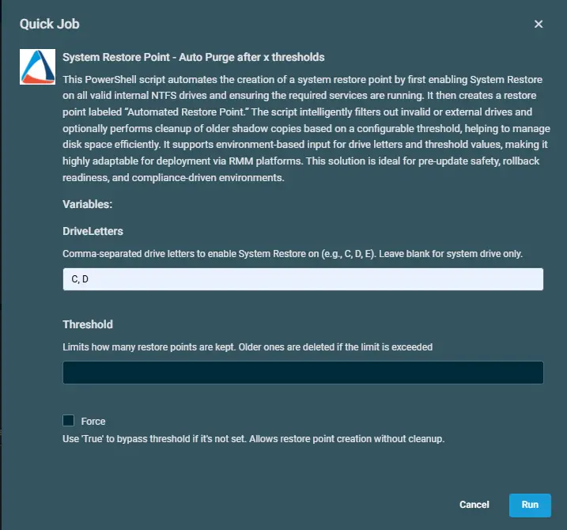
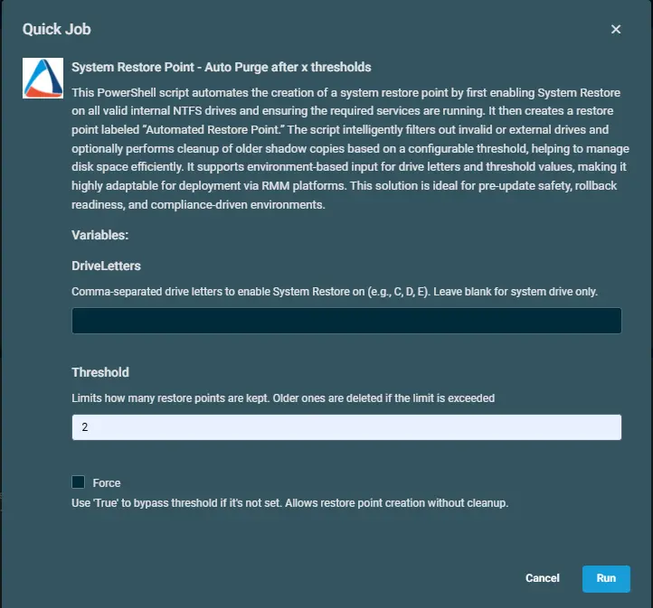
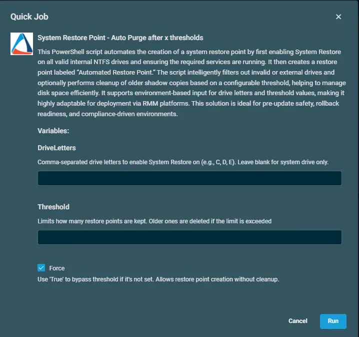

## Overview  

This PowerShell script automates the creation of a system restore point by first enabling System Restore on all valid internal NTFS drives and ensuring the required services are running. It then creates a restore point labeled Automated Restore Point.

The script intelligently filters out invalid or external drives and optionally performs cleanup of older shadow copies based on a configurable threshold, helping to manage disk space efficiently.

It supports environment-based input for drive letters and threshold values, making it highly adaptable for deployment via RMM platforms. This solution is ideal for pre-update safety, rollback readiness, and compliance-driven environments.

## Implementation
1. Import the `component` [System Restore Point - Auto Purge after x thresholds](../../../static/attachments/System%20Restore%20Point%20-%20Auto%20Purge%20after%20x%20thresholds.cpt)  

2. After downloading the attached file > Click on the `Import` button > Select the component to add to the Datto RMM interface. 

## Sample Run

To execute the `component` over a specific machine, follow these steps:  

1. Select the machine you want to run the `component` on from the Datto RMM.  

2. Click on the `Quick Job` button.  

  

3. Select the respective `component` from the list of available `components`.  

  

4. After selecting the `componenet`, you will see 3 variables : `DriveLetters`, `Threshold`, and `Force` checkbox.  

  

### DriveLetters  

-  This variable is used to specify the drive letters that you want to enable system restore point upon. You can enter multiple drive letters separated by a comma.  
- For example, `C,D,E`. 
- If you do not provide any specific driver letter, the `component` by default will create a restore over the `System Drive`.  

  

### Threshold  

- Limits how many restore points are kept. Older ones are deleted if the limit is exceeded.  
- For example, `2` as `Threshold` will create a new restore point and will only keep 2 latest restore points. Rest all will get deleted. 

  

### Force  

- This is a checkbox that you can use to force the creation of a restore point. 
- This can be helpful when you do not want to delete any older restore point then.
- By enabling `Force` option, the `component` will create a new restore point without purging any older ones.  

  

## Datto Variables

| Variable Name | Type | Default | Description |
| ------------- | ---- | ------- | ----------- |
|DriveLetters|String|`if no letter given, restore point will create on System Drive`|Comma-separated drive letters to enable System Restore on (e.g., C, D, E). Leave blank for system drive only.|
|Threshold|String|`set a value`|Limits how many restore points are kept. Older ones are deleted if the limit is exceeded|
|Force|Boolean|`False`|Use `True` to bypass threshold if it's not set. Allows restore point creation without cleanup.|
## Output

- stdOut  
- stdError  

## Attachments

[System Restore Point - Auto Purge after x thresholds](../../../static/attachments/System%20Restore%20Point%20-%20Auto%20Purge%20after%20x%20thresholds.cpt)
