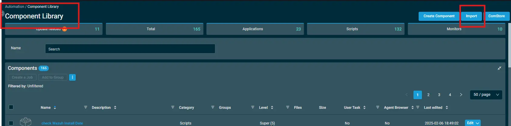
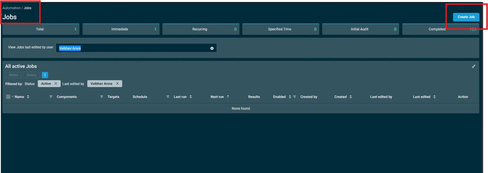
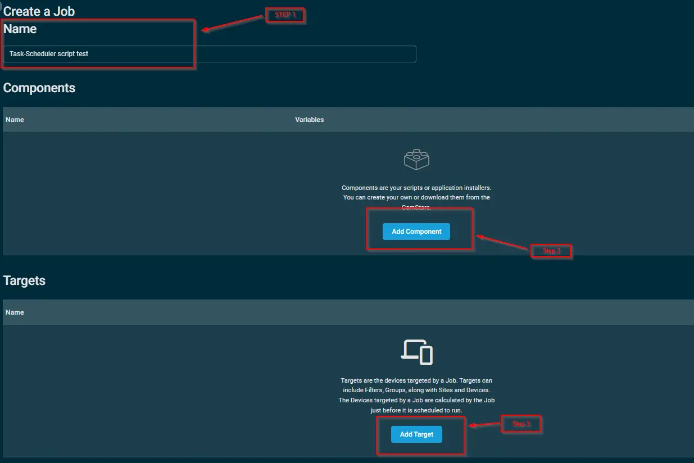
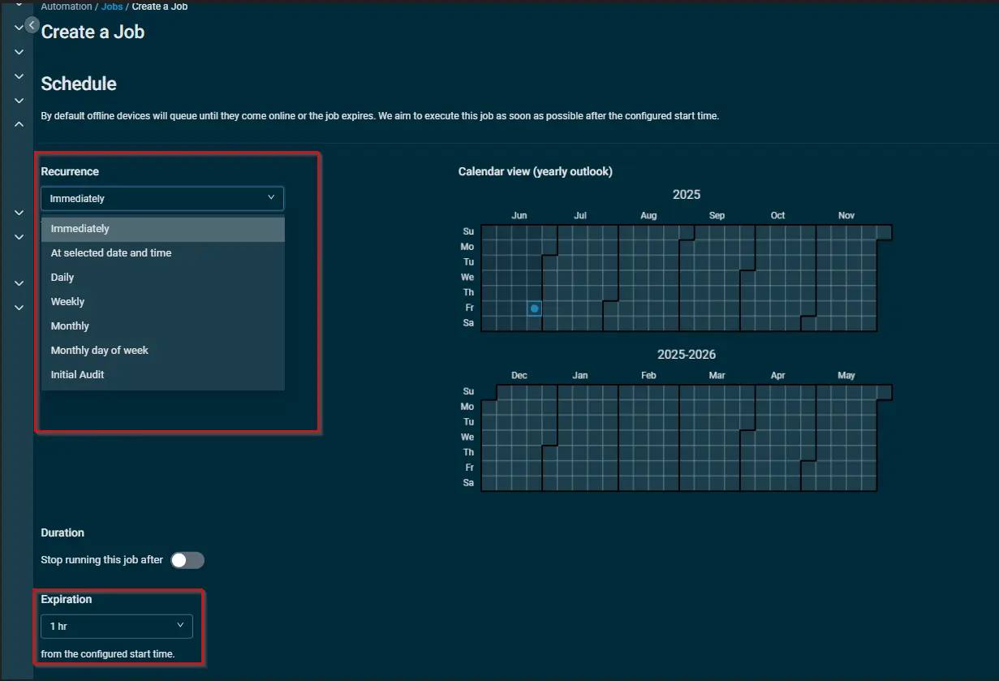
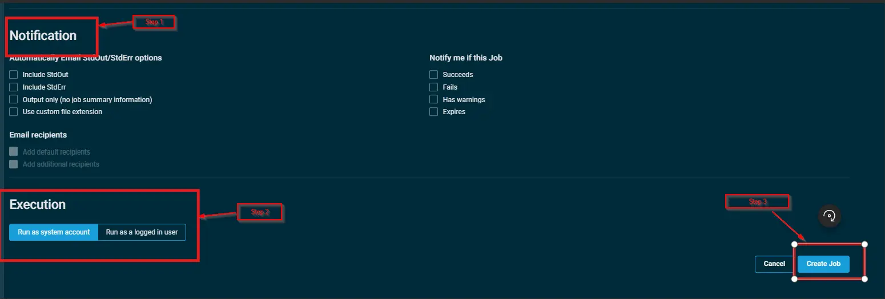

## Overview

This script creates a scheduled task to ensure the Datto RMM service (CagService) starts automatically on a daily basis.

## Implementation

Import the `Component` [Schedule Task Creation -  Cagservice](../../../static/attachments/schedule-task-creation-cagservice.cpt) into Datto RMM.  
Download the attached file > Click on the `Import` button > Select the component to add to the Datto RMM interface.  

## Sample Run

Go to `Automation`> `Jobs`> Click on `Create Job`.

Into the Job section:-  
- Step1: Specify the `Name` of the job.  
- Step2: Under the `Components` section, select the `Schedule Task Creation -  Cagservice` component using `Add Component` button.  
- Step3: Under the `Targets` section, click on `Add target` button to add device or groups as target.  

- `Schedule` the job at a particular time. Select `Immediately` from `Recurrence` dropdwon to execute it right now.  
- Set the `Expiration` to terminate the job after a certain time.  Select `Never` to run it indefinitely.  

After Scheduling and setting expiration:-   
- Step1: Set the `Notification` if required.  
- Step2: Set the `Execution` of the job as per the requirement.   
- Step3: Click on `Create job`.  

## Output

- stdOut  
- stdError  

## Attachments

[Schedule Task Creation -  Cagservice](../../../static/attachments/schedule-task-creation-cagservice.cpt)