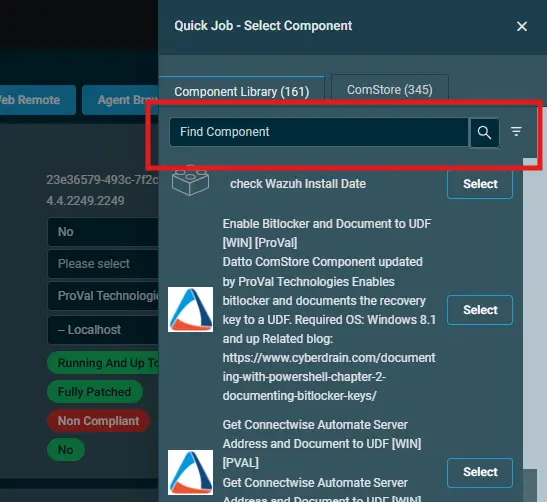

## Overview  
Cleans up temporary files and cache for the new Microsoft Teams client only  

## Implementation  

1. Download the component [Teams Temp Data Cleanup](../../../static/attachments/Teams%20Temp%20Data%20Cleanup.cpt) from the attachment.

2. After downloading the attached file, click on the `Import` button
3. Select the component just downloaded and add it to the Datto RMM interface.  
  

## Sample Run

To execute the `component` over a specific machine, follow these steps:  

1. Select the machine you want to run the `component` on from the Datto RMM.  

2. Click on the `Quick Job` button.  
  

3. Search the component `Teams Temp Data Cleanup` and click on `Select`
 

4. After clicking on `Select`, a below pop up window will open up and then click on `Run` to execute the component.
  

5. To view the results check the activity logs of the machine.

## Output  
- stdOut  
- stdError  

## Attachments  
[Teams Temp Data Cleanup](../../../static/attachments/Teams%20Temp%20Data%20Cleanup.cpt)